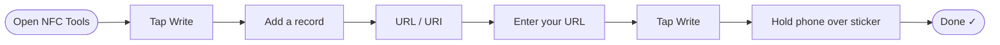

---

title: NFC Keyrings - An MVP Summit Side Project
authors: simonpainter
tags:
  - personal
  - making
  - nfc
date: 2026-03-29

---

[MVP Summit](/most-valuable-professional) is a lot. Hundreds of MVPs from all over the world descend on Redmond for a week, and within the first few hours you've already lost count of the people you've met. Business cards feel a bit old-fashioned, and in a room full of tech people I wanted something a bit more fun. So I made a small batch of 3D printed keyrings with NFC stickers on the back - tap one with a phone and you land straight on my [Linktree](https://linktr.ee/simonpainter).

I also encouraged everyone I gave one to to reprogramme it with their own details. That way it's not just a novelty - it becomes a useful thing they'll actually keep on their keys and use themselves. Here's how I made them.
<!-- truncate -->

## What You Need

The build is pretty simple. Three components:

- A 3D printed keyring body (STL file linked below)
- A [split ring for the keychain](https://www.amazon.co.uk/dp/B0F9KMFBS4)
- An [NFC sticker](https://www.amazon.co.uk/dp/B0F24L4GDM) for the back

The NFC stickers are the clever bit. They're tiny passive chips that store a small amount of data - in this case, a URL. No battery required. Any modern smartphone can read them just by holding it close.

## The 3D Print

I designed a small keyring fob with space on the back sized to fit the NFC sticker neatly. The STL is set up for a two-colour print - if you're using a Bambu printer, the pause to swap filament is already baked in at the right layer so the text comes out in a contrasting colour without any fiddling.

You can [download the 3MF file here](img/nfc-keyring/mvp-keyring.3mf). Drop it into your slicer and it should just work.

Once printed, press the split ring through the loop at the top and stick the NFC sticker into the recess on the back. A dot of super glue keeps it in place if needed.

## Programming the NFC Sticker

This is the easiest part. I used [NFC Tools](https://apps.apple.com/gb/app/nfc-tools/id1252962749) on my iPhone. It's free, straightforward, and does exactly what it says. When I say it's the easiest part, I mean it: I used the skills of my five year old to do it and they managed to program about a hundred of them for me.

Open the app, tap **Write**, then **Add a record**, and choose **URL/URI**. Enter whatever link you want - I used my [Linktree](https://linktr.ee/simonpainter) page which has links to my LinkedIn, GitHub, and blog. Hit write, hold the phone over the sticker, and you're done. Once you have set the URL you can write as many as you can by pressing the button and tapping the sticker - no need to re-enter the URL each time.

Once programmed, anyone with a modern iPhone or Android phone can tap the keyring and get straight to your link. No app required on their end - it just pops up as a notification.

## The Result

The total cost per keyring works out remarkably low. Here's the breakdown:

| Component | Cost |
|---|---|
| Filament | ~2p |
| Keychain ring (£6.99 for 150) | ~4.7p |
| NFC sticker (£6.99 for 50) | ~14p |
| **Total** | **~21p** |

Under 25p each, which makes them pretty guilt-free to hand out. I think 

They went down well at Summit. People enjoyed the novelty, but the bit that really landed was the idea that they could reprogramme it themselves. Hand someone a business card and it ends up in a drawer. Hand someone a keyring that becomes theirs, with their own link on it, and it's actually useful.

If you make your own, programme them with whatever URL makes sense for you - a LinkedIn profile, a personal site, a vCard link. And then tell the person you give it to that they can change it.
