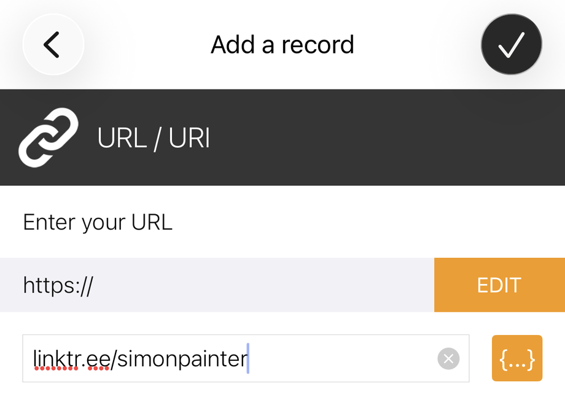

---

title: NFC Keyrings - An MVP Side Project
authors: simonpainter
tags:
  - personal
  - making
  - nfc
date: 2026-03-29

---

Since getting my [Microsoft MVP award](/most-valuable-professional) last year, I've been looking for a fun way to share my contact details at events. Business cards feel a bit old-fashioned, and I wanted something a bit more memorable. So I made a small batch of 3D printed keyrings with NFC stickers on the back - tap one with a phone and you land straight on my Linktree. Here's how I made them.

<!-- truncate -->

## What You Need

The build is pretty simple. Three components:

- A 3D printed keyring body (STL file linked below)
- A [split ring for the keychain](https://www.amazon.co.uk/dp/B0F9KMFBS4)
- An [NFC sticker](https://www.amazon.co.uk/dp/B0F24L4GDM) for the back

The NFC stickers are the clever bit. They're tiny passive chips that store a small amount of data - in this case, a URL. No battery required. Any modern smartphone can read them just by holding it close.

## The 3D Print

I designed a small keyring fob with a recess on the back sized to fit the NFC sticker neatly. The STL is set up for a two-colour print - if you're using a Bambu printer, the pause to swap filament is already baked in at the right layer so the text comes out in a contrasting colour without any fiddling.

You can [download the 3MF file here](img/nfc-keyring/mvp-keyring.3mf). Drop it into your slicer and it should just work.

Once printed, press the split ring through the loop at the top and stick the NFC sticker into the recess on the back. A dot of super glue keeps it in place if needed.

## Programming the NFC Sticker

This is the easiest part. I used [NFC Tools](https://apps.apple.com/gb/app/nfc-tools/id1252962749) on my iPhone. It's free, straightforward, and does exactly what it says.

Open the app, tap **Write**, then **Add a record**, and choose **URL/URI**. Enter whatever link you want - I used my [Linktree](https://linktr.ee) page which has links to my LinkedIn, GitHub, and blog. Hit write, hold the phone over the sticker, and you're done. The whole process takes about ten seconds per sticker.

```
open NFC Tools
tap Write > Add a record > URL/URI
enter your URL
tap Write
hold phone over sticker
done
```



Once programmed, anyone with a modern iPhone or Android phone can tap the keyring and get straight to your link. No app required on their end - it just pops up as a notification.

## The Result

The total cost per keyring is pretty low - the NFC stickers come in packs and the split rings even more so. The only real investment is the filament and print time, which is minimal given the size.

I've been giving them out at events and people seem to genuinely enjoy the novelty of tapping a keyring to get contact details. It's a much better conversation starter than handing over a bit of card, and they actually keep it because it's useful as a keyring.

If you make your own, you can programme them with any URL you like - a LinkedIn profile, a personal site, a vCard link, whatever makes sense for you.
