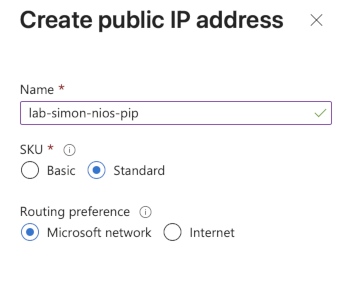

---

title: "Is this a bug in the Infoblox NIOS Azure Marketplace offering"
authors: simonpainter
tags:
  - networks
  - azure
  - dns
  - anycast
  - dhcp
date: 2025-11-11

---

I wanted to settle down today in a particularly dull meeting and have a go at setting up an Infobox NIOS instance in Azure using the Azure Marketplace offering. I have used Infoblox in anger before and I know it is a solid product so I was keen to get it up and running in the lab so that I could have a play with the Anycast DNS features with Azure Route Server.
<!-- truncate -->
The deployment failed while I was creating the resource with the following error:

```json
{
  "code": "IPv4BasicSkuPublicIpCountLimitReached",
  "message": "Cannot create more than 0 IPv4 Basic SKU public IP addresses 
    for this subscription in this region.",
  "details": []
}
```

The error itself made complete sense because since September 30th the [Basic SKU Public IP addresses are no more](https://azure.microsoft.com/en-gb/updates?id=upgrade-to-standard-sku-public-ip-addresses-in-azure-by-30-september-2025-basic-sku-will-be-retired); the thing that didn't make sense was that I was pretty sure I had selected a Standard SKU Public IP address in the deployment options.

I went back through the deployment steps to double check and sure enough the option for Standard SKU Public IP address was selected.



The deployment failed again, with the same error message.


I checked that the error was being generated by the same Public IP address resource that I had selected the Standard SKU option for, and sure enough it was.


It looks very much like a bug in the Infoblox NIOS Azure Marketplace offering where it is ignoring the Public IP SKU option selected during deployment and defaulting to Basic SKU which is no longer supported.
