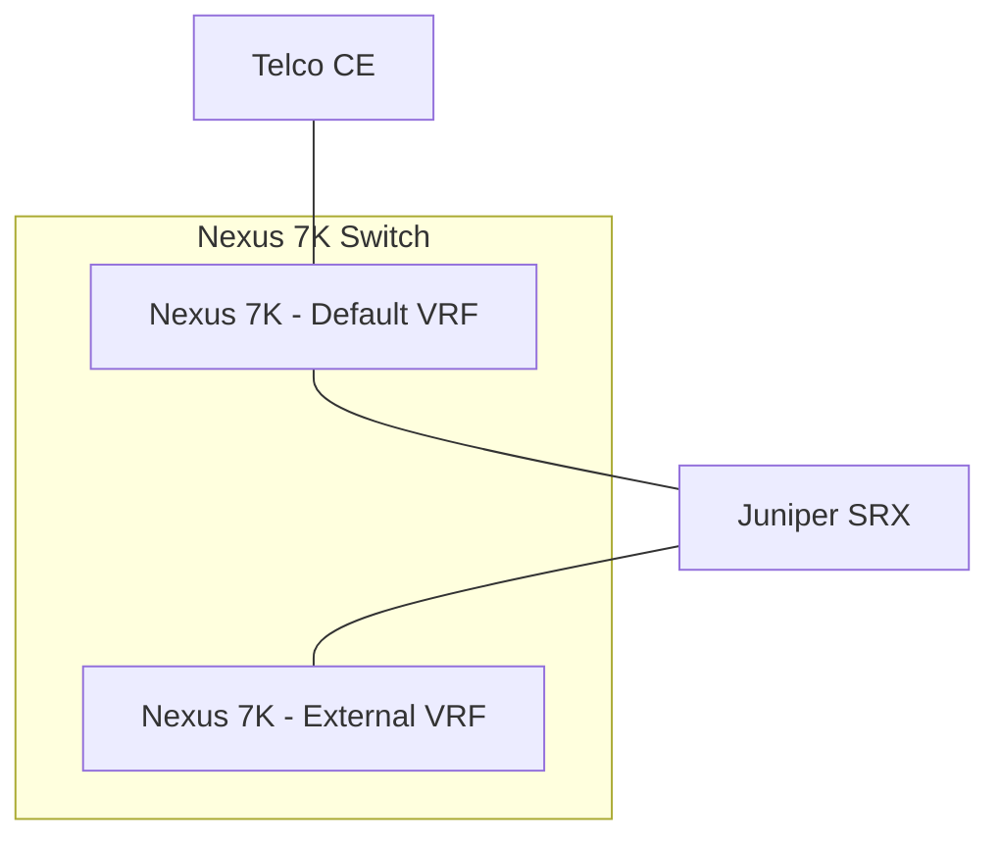

---

title: Of course it's MTU, but how is it MTU?
authors: simonpainter
tags:
  - network
  - ospf
date: 2025-05-12

---

Any time I have to do anything with [OSPF](/tags/ospf) I remind myself how it can be so damn awkward about MTU. A little while ago I was busy trying to integrate some Juniper SRX firewalls into a perimeter around some Cisco Nexus 7K and reached a problem that looked like MTU, smelled like MTU, quacked like MTU but we couldn't work out how it was MTU. Here's how it was MTU and what we learned.

<!--truncate-->

## What we were trying to do 

The objective was to insert some Juniper SRX firewalls into the traffic flow north/south out of a heritage Nexus 7K datacentre. The northbound connection was OSPF area zero up to some telco managed CE switches and the idea was to get everything up and running on the side before cutting the traffic flow over.



The idea was then, when routing was tested across the Junipers to move the interfaces connected to the CE from the default to the External vrf. Sounded like simple day to day stuff right?

## The curve balls

A couple of important requirements were:

- Jumbo Frames
- Vlan tagged interfaces (to allow for flexibility in future)

When we brought up the connections the OSPF adjacency between the default vrf and the SRX came up immediately but the connection to the external vrf got stuck on LOADING; this is a classic indicator of an MTU mismatch. This was a bit confusing because the L3 IP MTU was configured the same on the outside as on the inside and this was reflected on the SRX interfaces.

## Calculated MTU

At this point it's worth knowing that there are two places that MTU can be configured on Cisco kit and that differs slightly from how things work on Juniper kit. In Juniper world you configure the L2 MTU, in this case 9192, and the L3 interface MTU is calculated by taking off the 18 bytes of the ethernet header to get 9174. On the Cisco side you configure the L3 interface with 9174 to match and if it's a routed port that's all you need to do but if it's a vlan interface you need to ensure that the L2 switchport mtu is big enough.
The thing is, we didn't touch the L2 port MTU.
The [Cisco documentation](https://www.cisco.com/c/en/us/support/docs/switches/nexus-9000-series-switches/118994-config-nexus-00.html#toc-hId--643826306) clearly states that the default System Jumbo MTU is 9216. It does rather misleadingly say that you can check it using this command:

```text
Nexus# show running-config all | i jumbomtu
system jumbomtu 9216
```

This didn't actually work for us because if the default value is set then it doesn't appear in the config. What's even more confusing is the line `Note: Platforms that use Per-Port MTU Configuration L2 ports can only use the System Jumbo MTU configuration on the switch or 1500`. It is fairly reasonable to assume that if the system MTU defaults to 9216 then the interface MTU might also default to that.

## Anyway...

Anyway I digress. The inside OSPF neighbours had come up, the outside was stuck in LOADING. The config on the Juniper L2 interfaces configured at 9192 and the Cisco Vlan interface configured to 9174 to correspond to the same L3 MTU. We argued amongst ourselves that it all pointed to MTU but we couldn't figure out the inconsistency. We found through methodical troubleshooting that if we shut down the inside interfaces and flushed the ospf database on the inside we could get the adjacency up on the outside but it didn't load all the routes when we brought up the inside adjacency.

After a bit of desperation we had Juniper and Cisco on a call together to troubleshoot and one of the Juniper engineers realised that he couldn't ping 1501 bytes from the SRX to the N7K vlan interface. This had us arguing even more because perhaps it was a bug preventing the MTU configuration applying. I was at this point that I had a dim and distant memory that in fact the default interface MTU was in fact 1500 despite the default system MTU being 9216. That still didn't really explain why it came up consistently on the inside but not on the outside. Or did it?

The SRXs were matching the L3 MTUs and bringing up the neighbour on the inside. The Cisco switches were sending all the LSUs and because they are small they were getting through the L2 interface because they were less than 1500 bytes. The Juniper was then doing the same with the outside VRF which matched the L3 MTU but because the Juniper packages a load of LSUs up together some of them weren't under the 1500 bytes and were not getting through, this caused the adjacency to get stuck in LOADING state. This behaviour also explained why taking down the inside adjacency allowed the outside adjacency to come up; there were no routes in the SRX database other than its own connected interfaces so the LSUs to the outside vrf were under the 1500 byte L2 MTU and got through OK.

Adding `mtu 9216` caused the adjacencies to come up immediately and about half a dozen engineers from across three companies to kick themselves for what felt like a lot of wasted time.