---

title: "CIDR ranges in AWS and Azure"
authors: simonpainter
tags:
  - aws
  - azure
  - networks
date: 2025-02-17
---

When you create a VNet in Azure or a VPC in AWS you have to allocate a CIDR range from which you subnets will be allocated. There are some nuances between the different service providers as you try to expand your networks which can lead to some challenges. Knowing the different rules from the start can help you plan your CIDR ranges appropriately. We'll start with what's the same across AWS and Azure and then look at the differences.
<!-- truncate -->
## The similarities

AWS and Azure share fundamental networking principles that form the foundation of their virtual network offerings. Both platforms allow you to create isolated network environments using your own private IP address schemas and both have logical constructs (VPCs and VNets) which form the building blocks of those private networks. Both require a CIDR range from which subnets can be allocated and both allow their network logical constructs to be peered together provided the CIDR ranges in both networks do not overlap.

### Peering

It's worth remembering that it's the CIDR that is checked for overlaps, particularly relevant in [Azure Subnet Peering](subnet-peering.md), not the subnets within that CIDR. The example diagram below applies equally to VPC in AWS as it does in VNets in Azure.

```mermaid
graph LR
    subgraph VNet1[VNet1 CIDR: 10.0.0.0/16]
        direction TB
        Subnet1[Subnet1: 10.0.1.0/24]
    end
    
    subgraph VNet2[VNet2 CIDR: 10.0.0.0/16]
        direction TB
        Subnet2[Subnet2: 10.0.2.0/24]
    end
    
    X{{"❌ Peering Not Allowed</br>CIDRs Overlap: 10.0.0.0/16"}}
    
    VNet1 --- X --- VNet2
    
    style VNet1 fill:#e6f3ff,stroke:#0088ff
    style VNet2 fill:#e6f3ff,stroke:#0088ff
    style Subnet1 fill:#cce5ff
    style Subnet2 fill:#cce5ff
    style X fill:#ffebee,stroke:#ff0000
```

When peering you can selectivitely add routes across VPC peerings in AWS using the route tables. In Azure the default is to add routes for the whole CIDR however the slighly misleadingly named [Subnet Peering](subnet-peering.md) can be used to selectively allow specific subnet routes across VNet peering.

### Prefix Advertisements via BGP

As with the overlap checking, BGP route advertisements via VPN gateways, ExpressRoute Gateways, and Direct Connect Gateways are based on the CIDR summaries not the individual subnets. By default all CIDR ranges in a VNet or VPC are advertised.

## The differences

AWS has less flexibility compared to Azure around CIDR range creation, and more importantly deletion. There are also some significant differences around sizing which need to be taken into account when planning your network: make your CIDR too small and you have to add additional ones later, perhaps without the ability to summarise, but make them too big and you cannot easily reclaim unused IP address space.

### CIDR sizing with IPv4

#### AWS VPC

- VPC CIDR size: /16 to /28 (65,536 down to 16 IPs)
- Subnet size: /16 to /28 (must be within VPC CIDR)
- Primary CIDR cannot be changed after creation
- Up to 5 secondary CIDRs allowed (this is a soft limit that can be increased)

#### Azure VNet

- VNet address space: /2 to /29 (enormous down to 8 IPs)
- Subnet size: /2 to /29 (must be within VNet address space)
- Address spaces can be modified after creation including deleting the first one
- Multiple address spaces allowed per VNet

### Reserved IPs

Within each Azure or AWS subnet there are reserved IPs - although the numbers in documentation are different they are actually the same because AWS does not count the broadcast address as reserved. In both AWS and Azure (and pretty much every other network except [the magical /31](https://datatracker.ietf.org/doc/html/rfc3021)) the network address and broadcast address are unusable. They both allocate the first usable address (`network +1`) as the default gateway for the subnet and then a further two IPs are reserved (`network +2` and `network +3`); in Azure those are the two DNS IPs for the subnet.

> `Network +2` is the network address plus two. Remember that [an IP is just a 32 bit integer](how-the-internet-works.md#finding-the-router) despite how we like to present it
> as dotted decimal. If the subnet is 192.168.0.0/24 then the network address is 192.168.0.0 and `network +2` is 192.168.0.2. If
> the subnet is 192.168.0.128/25 then the network address is 192.168.0.128 and `network +2` would be 192.168.0.130.

AWS reserved IPs `network +2` and `network +3` is a bit weird. I would love to know what the AWS engineers were on when they came up with this. `Network +3` is reserved in every subnet and unusable. It's reserved for future use but as we are quite a long way into the future since it was first reserved we can probably assum they haven't thought of a good use for it yet. The `network +2` IP of the primary CIDR is used for that CIDR as the DNS IP address however the `network +2` IP is also reserved in each subnet, even though it won't always be the same IP as the CIDR DNS server IP. It gets even weirder when you consider that 169.254.169.253 exists as a mythical beast that responds to DNS queries within your VPCs as well.

### CIDR flexibility

When you create an Azure VNet you are encouraged to create an IP range and a subnet within it. These can be deleted or resized. When you create a VPC in Azure you are required to create a primary CIDR which cannot be deleted or resized.

> You can expand or shrink an Azure CIDR address space in a VNet, including shrinking a CIDR that contains a subnet (so long as
> the new size still contains all the subnets in that CIDR). You can expand and shrink an Azure Subnet provided there are no
> VMs or other services runnng in that subnet. You will need to force VNet peerings to resync though if you make changes to
> peered VNets. At the time of writing there is a public preview of [multiple prefixes on a single subnet](https://learn.microsoft.com/en-us/azure/virtual-network/how-to-multiple-prefixes-subnet)
> which allows you to add prefixes to a subnet that already has resources in it while the resources are still in there. This
> has particular benefits when you want to expand a scale set that is in use.

You can add and remove CIDR blocks in Azure pretty much however you like whereas the primary AWS CIDR for a VPC is fixed and cannot be changed. You can add more non overlapping CIDRs and those can be deleted later if necessary.

### Routing

AWS and Azure handle routing within their virtual networks quite differently. In AWS VPCs, every subnet must have an associated route table (either explicitly associated or using the main route table by default). While local routes within the VPC are automatically created, they can be overridden by more specific routes in the route table, giving administrators granular control over internal traffic flows.
Azure uses a system routes approach, where built-in system routes handle traffic flow within the VNet and to the internet. While these system routes cannot be deleted, they can be overridden using User-Defined Routes (UDRs). Azure implements a clear routing precedence: custom routes take precedence over system routes, and routes learned through [virtual network peering](subnet-peering.md) take precedence over routes learned through VPN gateways. This hierarchy gives network administrators control over traffic flow while maintaining predictable fallback behavior.

### IPv6

IPv6 implementation differs slightly between AWS and Azure, though both platforms maintain most common constraints. Both providers enforce /64 subnet sizes and require dual-stack IPv6 deployments - you cannot run IPv6-only networks in either cloud. AWS allows you to work with IPv6 CIDRs ranging from /28 to /64 at the VPC level, while Azure bizarely allows you to create CIDRs from /7 down to /128 but still enforces the /64 size for subnets. AWS's approach to IPv6 is more permanent: once created on a VPC it cannot be changed, while Azure offers more flexibility by allowing IPv6 to be both enabled and disabled on VNets after creation.
