```mermaid
graph LR
    subgraph VNet1[VNet1 CIDR: 10.0.0.0/16]
        direction TB
        Subnet1[Subnet1: 10.0.1.0/24]
    end
    
    subgraph VNet2[VNet2 CIDR: 10.0.0.0/16]
        direction TB
        Subnet2[Subnet2: 10.0.2.0/24]
    end
    
    X{{"❌ Peering Not Allowed</br>CIDRs Overlap: 10.0.0.0/16"}}
    
    VNet1 --- X --- VNet2
    
    style VNet1 fill:#e6f3ff,stroke:#0088ff
    style VNet2 fill:#e6f3ff,stroke:#0088ff
    style Subnet1 fill:#cce5ff
    style Subnet2 fill:#cce5ff
    style X fill:#ffebee,stroke:#ff0000
```

---

title: "CIDR ranges in AWS and Azure"
authors:
  - simonpainter
  - zainkhan
tags:
  - aws
  - azure
  - networks
  - cloud
  - educational
date: 2025-02-17
---

When you create a VNet in Azure or a VPC in AWS, you need to allocate a CIDR range for your subnets. There are key differences between these cloud providers when expanding networks, which can create challenges. Knowing these rules from the start helps you plan your CIDR ranges better. I'll start with what's similar across AWS and Azure, then look at the differences.
<!-- truncate -->
## The similarities

AWS and Azure share basic networking principles that shape their virtual network offerings. Both let you build isolated network environments with your own private IP address schemas. They both use logical building blocks (VPCs and VNets) for these private networks. Both need a CIDR range to create subnets, and both let you connect these networks through peering as long as the CIDR ranges don't overlap.

### Peering

Remember that when checking for overlaps, particularly in [Azure Subnet Peering](subnet-peering.md), the system looks at the entire CIDR range, not individual subnets within it. The diagram below shows this concept for both AWS VPCs and Azure VNets.

With AWS, you can selectively add routes across VPC peerings using route tables. Azure's default is to add routes for the entire CIDR, but you can use the somewhat misleadingly named [Subnet Peering](subnet-peering.md) to selectively allow specific subnet routes across VNet peering.

### Prefix Advertisements via BGP

Similar to overlap checking, BGP route advertisements through VPN gateways, ExpressRoute Gateways, and Direct Connect Gateways use CIDR summaries rather than individual subnets. By default, both cloud providers advertise all CIDR ranges in a VNet or VPC.

## The differences

AWS offers less flexibility than Azure for creating and especially deleting CIDR ranges. There are also important sizing differences to consider when planning your network. If you make your CIDR too small, you'll need to add more ranges later (possibly without the ability to summarize them). Make them too big, and you'll have wasted IP address space that's difficult to reclaim.

### CIDR sizing with IPv4

#### AWS VPC

- VPC CIDR size: /16 to /28 (65,536 down to 16 IPs)
- Subnet size: /16 to /28 (must be within VPC CIDR)
- Primary CIDR cannot be changed after creation
- Up to 5 secondary CIDRs allowed (this is a soft limit that can be increased)

#### Azure VNet

- VNet address space: /2 to /29 (enormous down to 8 IPs)
- Subnet size: /2 to /29 (must be within VNet address space)
- Address spaces can be modified after creation including deleting the first one
- Multiple address spaces allowed per VNet

### Reserved IPs

Both Azure and AWS reserve certain IPs in each subnet, though their documentation shows different numbers because AWS doesn't count the broadcast address as reserved. In both clouds (like nearly all networks except [the magical /31](https://datatracker.ietf.org/doc/html/rfc3021)), you can't use the network or broadcast addresses. 

Both providers reserve the first usable address (`network +1`) as the default gateway. They also reserve two more addresses (`network +2` and `network +3`). In Azure, these are used for DNS.

> `Network +2` simply means "network address plus two." Remember that [an IP address is just a 32-bit integer](how-the-internet-works.md#finding-the-router), 
> though we usually write it in dotted decimal. For example, in a 192.168.0.0/24 subnet, the network address is 192.168.0.0 
> and `network +2` is 192.168.0.2. In a 192.168.0.128/25 subnet, the network address is 192.168.0.128, making 
> `network +2` 192.168.0.130.

AWS's handling of reserved IPs at `network +2` and `network +3` is quite strange. I often wonder what inspired the AWS engineers who created this system. `Network +3` is reserved in every subnet but unusable - supposedly for "future use," though it's been reserved for so long that I suspect they haven't found a good use for it yet.

The `network +2` IP of the primary CIDR serves as the DNS IP address for that CIDR. However, the `network +2` IP is also reserved in each subnet, even when it's not the same as the CIDR DNS server IP. Things get even stranger when you consider that 169.254.169.253 also exists as a magical address that responds to DNS queries within your VPCs.

### CIDR flexibility

When creating an Azure VNet, you're prompted to set up an IP range and a subnet within it. Later, you can delete or resize these as needed. With AWS, you must create a primary CIDR for your VPC - and once created, you can't delete or resize it.

> Azure lets you expand or shrink CIDR address spaces in a VNet, even ones containing subnets (as long as the 
> new size still contains all those subnets). You can also resize Azure subnets if they don't contain VMs or other 
> services. Keep in mind that after making changes to peered VNets, you'll need to force VNet peerings to resync.
> 
> At the time of writing, Azure offers a public preview of [multiple prefixes on a single subnet](https://learn.microsoft.com/en-us/azure/virtual-network/how-to-multiple-prefixes-subnet). 
> This feature lets you add address ranges to subnets that are already in use - particularly helpful when you need 
> to expand a scale set without disruption.

In Azure, you can add and remove CIDR blocks with great flexibility. In AWS, while the primary VPC CIDR is fixed, you can add additional non-overlapping CIDRs and delete those secondary ones if needed.

### Routing

AWS and Azure take very different approaches to virtual network routing.

In AWS VPCs, each subnet must have an associated route table (either explicitly assigned or using the default main table). While the system automatically creates local routes within the VPC, you can override these with more specific routes, giving you fine-grained control over internal traffic flows.

Azure uses a "system routes" approach. Built-in system routes manage traffic flow within the VNet and to the internet. You can't delete these system routes, but you can override them with User-Defined Routes (UDRs). Azure has a clear routing precedence: custom routes trump system routes, and routes learned through [virtual network peering](subnet-peering.md) take precedence over those learned through VPN gateways. This structure gives you control while maintaining predictable fallback behavior.

### IPv6

AWS and Azure implement IPv6 somewhat differently, though they share major constraints. Both enforce /64 subnet sizes and require dual-stack IPv6 deployments - you can't run IPv6-only networks in either cloud.

AWS lets you work with IPv6 CIDRs from /28 to /64 at the VPC level. Once you enable IPv6 on a VPC, you can't change or remove it.

Azure bizarrely allows you to create IPv6 CIDRs from /7 all the way down to /128, but still enforces the standard /64 size for subnets. Unlike AWS, Azure lets you enable and disable IPv6 on VNets after creation, giving you more flexibility.
