If you create a private endpoint for an Azure storage account and then poke at the DNS, you'll notice something that looks like a loose end. The public name `myexampleblob.blob.core.windows.net` becomes a CNAME to `myexampleblob.privatelink.blob.core.windows.net`, and inside your VNet both names resolve to the same private IP. They are, for all resolution purposes, the same endpoint. But if you try to actually connect to the privatelink name over HTTPS, TLS validation fails, because the certificate the storage front end presents is for `*.blob.core.windows.net` and nothing else.

That feels like a miss. There are perfectly reasonable use cases where you'd want to scope allowed traffic to internal endpoints only - an egress firewall rule that permits `*.privatelink.blob.core.windows.net` and nothing else looks like a neat way to say "storage traffic may only go over Private Link". Microsoft could trivially issue certificates covering the privatelink namespace; they own the zone. They have deliberately chosen not to, across every Private Link enabled service, for years, despite a steady stream of people filing it as a bug.

This post is about why. The short version: the privatelink name is DNS plumbing, not an endpoint identity, and the certificate mismatch is one of the things keeping it that way. The longer version involves a wildcard matching rule from the TLS RFCs, a split-horizon design decision, and a security invariant that would quietly break if the certificate ever did match.

<!-- truncate -->

## The plumbing first

When you create a private endpoint for blob storage, three things happen in DNS. [Microsoft's storage private endpoint documentation](https://learn.microsoft.com/en-us/azure/storage/common/storage-private-endpoints) lays these out, but it's worth walking the chain because the design intent lives in the details.

First, in **public** DNS, the account's CNAME is updated to insert the privatelink label:

```text
myexampleblob.blob.core.windows.net. CNAME myexampleblob.privatelink.blob.core.windows.net.
myexampleblob.privatelink.blob.core.windows.net. CNAME blob.lon25prdstr02a.store.core.windows.net.
blob.lon25prdstr02a.store.core.windows.net. A 20.x.x.x
```

Note what that second line is doing. The privatelink name exists in public DNS, and in public DNS it resolves onward to the ordinary public storage cluster endpoint. Hold onto that; it matters later.

Second, a private DNS zone called `privatelink.blob.core.windows.net` is created (or you bring your own) and linked to your VNet, containing an A record:

```text
myexampleblob.privatelink.blob.core.windows.net. A 10.1.2.5
```

> **"Or you bring your own" is doing a lot of work in that sentence.** The portal's default is to create a fresh `privatelink.blob.core.windows.net` zone alongside the private endpoint, which is fine for a lab and a mess at scale - you end up with a zone per resource group, and duplicate zones with the same name don't merge; each one answers only for the VNets it's linked to. Enterprise estates instead pre-create a single central zone in the connectivity subscription, link it to the hub and relevant spokes, and use [DNS zone groups](https://learn.microsoft.com/en-us/azure/private-link/private-endpoint-dns-integration#private-dns-zone-group) plus Azure Policy to register every new private endpoint's A record into it automatically - the [Cloud Adoption Framework Private Link and DNS at scale](https://learn.microsoft.com/en-us/azure/cloud-adoption-framework/ready/azure-best-practices/private-link-and-dns-integration-at-scale) pattern. A third option is hosting the zone on your own DNS estate entirely - Windows DNS, BIND, Infoblox - and managing the A records yourself, trading the zone-group automation for consistency with an existing DDI investment. Whichever you pick, pick one: split-brain between duplicate zones is where the "resolves from the hub, NXDOMAIN from the spoke" tickets come from.

Third, nothing at all changes about the certificate. The storage front end keeps presenting `*.blob.core.windows.net`.

The result is classic split-horizon resolution on a single connection string:

```mermaid
flowchart TD
 subgraph pub["Client outside the VNet"]
 A1["myexampleblob.blob.core.windows.net"] -->|CNAME public DNS| B1["myexampleblob.privatelink.blob.core.windows.net"]
 B1 -->|CNAME public DNS| C1["blob.lon25prdstr02a.store.core.windows.net"]
 C1 -->|A record| D1["20.x.x.x public endpoint"]
 end
 subgraph priv["Client inside the VNet"]
 A2["myexampleblob.blob.core.windows.net"] -->|CNAME public DNS| B2["myexampleblob.privatelink.blob.core.windows.net"]
 B2 -->|A record private zone override| D2["10.1.2.5 private endpoint NIC"]
 end
```



Inside the VNet, Azure DNS answers the second hop from the private zone. Outside, public DNS answers it with the public path. Same FQDN, same connection string, different destination depending on where you're standing. The [private endpoint DNS integration scenarios](https://learn.microsoft.com/en-us/azure/private-link/private-endpoint-dns-integration) document builds every hybrid pattern - forwarder VMs, Private Resolver, conditional forwarders from on-prem - on top of this one mechanism.

## What happens when you try the privatelink name

Resolution works fine. The connection attempt does not:

```text
$ curl https://myexampleblob.privatelink.blob.core.windows.net/
curl: (60) SSL: no alternative certificate subject name matches
target host name 'myexampleblob.privatelink.blob.core.windows.net'
```

Pull the certificate apart and the SANs are `*.blob.core.windows.net` plus the sibling wildcards for the other cluster domains. No privatelink entries. This is not specific to storage - the identical x509 failure shows up against [ACR](https://github.com/Azure/acr/issues/360) (`certificate is valid for *.azurecr.io, not acr.privatelink.azurecr.io`), [Key Vault](https://journeyofthegeek.com/2020/03/06/azure-private-link-and-dns-part-2/), [Log Analytics](https://learn.microsoft.com/en-us/answers/questions/1643711/how-to-add-ssl-certificate-to-azure-private-endpoi), [Redis](https://learn.microsoft.com/en-us/answers/a/722104), [AI Search](https://learn.microsoft.com/en-us/answers/questions/2129874/azure-private-endponit-and-private-dns-zone-not-wo), and [Azure OpenAI](https://learn.microsoft.com/en-us/answers/questions/2154760/cant-connect-to-azure-openai-service-via-private-e). Every Private Link service, same behaviour, going back to the ACR issue in March 2020.

## Why the existing wildcard can't cover it

There's a small standards point here that catches people out. A wildcard certificate for `*.blob.core.windows.net` does not cover `myexampleblob.privatelink.blob.core.windows.net`, and it never could. The TLS server identity rules - [RFC 6125](https://datatracker.ietf.org/doc/html/rfc6125), now refreshed as [RFC 9525](https://datatracker.ietf.org/doc/html/rfc9525) - say a wildcard matches exactly one label. `*.blob.core.windows.net` matches `myexampleblob.blob.core.windows.net`; it does not match anything with `.privatelink.` in the middle, because that's two labels deep.

So covering the privatelink namespace isn't a matter of a slightly broader wildcard. Microsoft would have to add a second SAN, `*.privatelink.blob.core.windows.net`, to the certificates on every storage front end, and equivalents for every other Private Link service. Entirely doable. Microsoft controls `privatelink.blob.core.windows.net` as a public zone, so any public CA would issue it tomorrow. Which makes the omission a decision, not a constraint.

## The official position: don't connect to the privatelink name

The documentation is unambiguous, and the same "Important" box is stamped across service after service. From the [storage docs](https://learn.microsoft.com/en-us/azure/storage/common/storage-private-endpoints):

> Use the same connection string to connect to the storage account using private endpoints as you'd use otherwise. Don't connect to the storage account using its `privatelink` subdomain URL.

[Azure Data Explorer](https://learn.microsoft.com/en-us/azure/data-explorer/security-network-private-endpoint) carries the identical wording. When a Redis customer [reported the missing SAN as a certificate bug](https://learn.microsoft.com/en-us/answers/a/722104), the Microsoft response was to point at the DNS documentation, restate that the public hostname is what belongs in connection strings, and note that the private DNS zone "is vital for TLS communication and should not be removed" - which is a nicely compressed way of saying the whole design assumes the public name is the only name clients ever see.

So Microsoft's answer to "why doesn't the cert cover privatelink" is essentially "you were never meant to be there". Fine, but *why* were you never meant to be there? The docs don't spell out the rationale in one place, so here it is assembled from the design.

## Reason one: the privatelink name is an indirection layer, not an endpoint

The CNAME hop through `privatelink` exists to solve two DNS problems simultaneously, and both solutions depend on clients not caring that the name exists.

**Same connection string everywhere.** An application configured with `myexampleblob.blob.core.windows.net` works from inside the VNet (private IP), from on-prem via a forwarder (private IP), and from anywhere else (public IP, subject to the storage firewall). Move the workload, and nothing in its configuration changes. The moment applications start hardcoding privatelink names, that portability dies - the app now only works where the private zone is visible, and only against services that tolerate the privatelink hostname.

**Narrow override, broad forwarder.** This is the one your on-prem DNS admins should appreciate. The private override stays narrow on the Azure side: the Private DNS zone only answers for `privatelink.blob.core.windows.net`. But on-prem conditional forwarders should target the public parent zone (`blob.core.windows.net`, not `privatelink.blob.core.windows.net`) and send that to your Azure resolver, matching Microsoft's guidance in both private endpoint DNS docs. That resolver can then return private answers for accounts with private endpoints and recurse publicly for everything else, so you don't have to override public DNS on-prem. If you forward only `privatelink.*`, the first query for `myexampleblob.blob.core.windows.net` often completes on the default internet path and gets cached with the public A record; whether your resolver ever re-queries `privatelink.*` then depends on implementation details. Even on resolvers that restart at the CNAME target, independent TTL expiry on the cached CNAME and A records can skew answers between private and public paths until caches settle. The CNAME indirection is what makes those two scopes safe to keep different. I covered the resolver mechanics in more detail in [Hybrid Cloud Reference Architectures](https://www.simonpainter.com/hybrid-cloud-dns).

**Clean lifecycle.** The privatelink CNAME is inserted when the first private endpoint is created and removed when the last one goes. Delete your private endpoints and the public name goes back to resolving directly. Clients using the public name never notice either transition. Clients using the privatelink name would break on deletion. The alias is Azure's to manage; treating it as your endpoint means building on ground that the platform reserves the right to move.

Add a valid certificate to the privatelink name and every one of those properties erodes, because people will use what works. The certificate mismatch is the enforcement mechanism for "this name is plumbing".

## Reason two: the privatelink name never guaranteed a private path anyway

This is the part that actually answers the use case in question, and it's the bit I find genuinely interesting.

The instinct is: if I scope my egress policy to `*.privatelink.blob.core.windows.net`, I've guaranteed that storage traffic can only flow over Private Link. Internal endpoints only, by construction.

Except - go back to that first dig output. `myexampleblob.privatelink.blob.core.windows.net` is publicly resolvable, and in public DNS it's a CNAME straight to the public storage cluster. The privatelink zone in public DNS is a real, delegated, Microsoft-operated zone whose job is to hand off-net clients the public path. That's what makes the fallback behaviour work: a client that can't see your private zone still gets a working answer for the public name.

Which means that if Microsoft *did* put `*.privatelink.blob.core.windows.net` in the certificate, an internet client anywhere in the world could resolve the privatelink name via public DNS, land on the **public** endpoint, and pass TLS validation cleanly. Your firewall rule matching the privatelink hostname would happily permit that flow, because SNI and hostname filters match names, not paths. The rule would assert "this traffic is on Private Link" while proving nothing of the sort.

The uncomfortable but correct conclusion: **the hostname never determines the path; the resolution context does.** "Privateness" in the Private Link model is a property of which A record answered the query and which IP the packets went to, not of which name was in the SNI. A hostname-based control scoped to privatelink names is a category error - it feels like a network control but it's actually a naming convention. Arguably the certificate mismatch is doing security work here: it prevents the privatelink namespace from becoming a plausible-looking but false signal that traffic went the private way.

If you want to see the two names genuinely hit the same endpoint, you can - the [Key Vault private link diagnostics guide](https://learn.microsoft.com/en-us/azure/key-vault/general/private-link-diagnostics) shows the technique of hitting the private IP directly with certificate validation disabled to confirm the data plane is the same service. Useful for diagnostics, and a good demonstration that the front end doesn't much care what name you arrived with; it's the client-side validation that draws the line.

## So what does give you "internal endpoints only"?

If the goal is to ensure a workload can only reach storage over the private path, the controls that actually deliver it are ordered roughly by strength:

1. **Disable public network access on the storage account.** The authoritative control. `publicNetworkAccess: Disabled` kills the public data path at the service regardless of what any client resolves or any firewall permits. If the requirement is "this account is internal only", this is the requirement stated directly rather than approximated through DNS.
2. **Network Security Perimeter.** The fleet-scale version of the same idea - a perimeter around a set of PaaS resources with explicit access rules, for when you're enforcing "private only" across hundreds of accounts rather than configuring each one.
3. **Azure Firewall FQDN rules with DNS proxy enabled.** This is the interesting one for the egress-scoping use case, because it inverts the problem. With [DNS proxy](https://learn.microsoft.com/en-us/azure/firewall/dns-settings) on and the firewall resolving via the same private zones your clients use, an application rule permitting `myexampleblob.blob.core.windows.net` - the *public* name - only ever resolves to and permits the private IP. You get hostname-granular egress control that genuinely follows the private path, without touching the privatelink name at all. I went deeper on the general mechanism in [FQDN Filtering](https://www.simonpainter.com/fqdn-deep-dive) and [More on FQDN Filtering](https://www.simonpainter.com/fqdn-filtering).
4. **NSGs against the private endpoint subnet.** Coarse, IP-based, but honest: an allow rule to the private endpoint's address range is a statement about the actual path, which is more than a privatelink hostname match can claim.

The pattern across all four: enforce on the path or on the service, not on the name.

## The exceptions, because there are always exceptions

"Never use the privatelink FQDN" is Microsoft's rule and Microsoft breaks it in a couple of places. Azure Bot Service's Direct Line channel is the notorious one - with a private endpoint enabled, the public name [stops resolving entirely and the guidance is to use the privatelink name internally](https://learn.microsoft.com/en-us/answers/questions/2282125/why-does-azure-bots-directline-botframework-com-dn), certificate arrangements and all. A handful of services also add secondary FQDNs beyond the simple one-CNAME pattern (Data Explorer sprouts a family of blob, table, and queue names per endpoint; geo-redundant storage wants separate private endpoints per instance). None of this changes the general rule, but it's worth a footnote so nobody quotes the rule at a Bot Service deployment and loses an afternoon.

## Final thought

The certificate gap looks like an oversight until you see what it's protecting. The privatelink subdomain is a routing construct: it exists so one FQDN can mean two different paths, and so your DNS estate can intercept exactly one narrow namespace instead of the whole of `blob.core.windows.net`. It was never an endpoint, and the publicly resolvable privatelink CNAME means it was never a private-path guarantee either. Fixing the certificate wouldn't give you the control you wanted; it would give you a control that lies.

If you remember one thing, make it this: **in Private Link, the name doesn't tell you where the traffic went. The resolution context does - so enforce on the path, not the label.**

## References

- [Microsoft Learn - Use private endpoints for Azure Storage](https://learn.microsoft.com/en-us/azure/storage/common/storage-private-endpoints)
- [Microsoft Learn - Azure Private Endpoint private DNS zone values](https://learn.microsoft.com/en-us/azure/private-link/private-endpoint-dns)
- [Microsoft Learn - Azure Private Endpoint DNS integration scenarios](https://learn.microsoft.com/en-us/azure/private-link/private-endpoint-dns-integration)
- [Microsoft Learn - Private endpoints for Azure Data Explorer](https://learn.microsoft.com/en-us/azure/data-explorer/security-network-private-endpoint)
- [Microsoft Learn - Diagnose private links configuration issues on Azure Key Vault](https://learn.microsoft.com/en-us/azure/key-vault/general/private-link-diagnostics)
- [Microsoft Learn - Azure Firewall DNS settings](https://learn.microsoft.com/en-us/azure/firewall/dns-settings)
- [Microsoft Q&A - Incorrect SSL certificate for Redis cache with private endpoint (MSFT response)](https://learn.microsoft.com/en-us/answers/a/722104)
- [Microsoft Q&A - How to add SSL certificate to private endpoint of Log Analytics](https://learn.microsoft.com/en-us/answers/questions/1643711/how-to-add-ssl-certificate-to-azure-private-endpoi)
- [Microsoft Q&A - AI Search privatelink SSL hostname mismatch](https://learn.microsoft.com/en-us/answers/questions/2129874/azure-private-endponit-and-private-dns-zone-not-wo)
- [Microsoft Q&A - Azure OpenAI private endpoint certificate mismatch](https://learn.microsoft.com/en-us/answers/questions/2154760/cant-connect-to-azure-openai-service-via-private-e)
- [Microsoft Q&A - Bot Service Direct Line privatelink resolution behaviour](https://learn.microsoft.com/en-us/answers/questions/2282125/why-does-azure-bots-directline-botframework-com-dn)
- [GitHub - Azure/acr issue #360: Private Link certificate mismatch](https://github.com/Azure/acr/issues/360)
- [Journey of the Geek - DNS in Microsoft Azure Part 5: PrivateLink Endpoints and Private DNS](https://journeyofthegeek.com/2020/03/06/azure-private-link-and-dns-part-2/)
- [RFC 6125 - Representation and Verification of Domain-Based Application Service Identity](https://datatracker.ietf.org/doc/html/rfc6125)
- [RFC 9525 - Service Identity in TLS (obsoletes RFC 6125)](https://datatracker.ietf.org/doc/html/rfc9525)
