Route Maps for Azure Route Server is now in public preview. If you've been waiting for the feature to land before building it into your hybrid networking designs, now's the time to kick the tyres.

The [preview announcement](/updates/in-preview-public-preview-route-maps-for-azure-route-server) has the short version. This post is the longer look: a lab setup, some real output, and the gotchas I ran into.

<!-- truncate -->

## This was overdue

[Virtual WAN got Route Maps first](https://learn.microsoft.com/en-us/azure/virtual-wan/route-maps-about), in April 2025, and at the time I said on LinkedIn that it would be strange if Microsoft didn't bring the same capability to Azure Route Server. The two products occupy different parts of the networking stack: vWAN is the managed, opinionated hub-and-spoke fabric; Route Server is the DIY BGP integration layer for when you're running your own NVAs.

But the routing policy problem they solve is identical. If you can filter and modify BGP attributes on a vWAN virtual hub, there's no good reason you shouldn't be able to do the same on a standalone Route Server. I also have a theory that Route Server shares much of the underlying codebase with vWAN: you can more or less recreate the best bits of vWAN with a Route Server, some NVAs, and a bit of determination.

It took a little while, but here we are.


## What Route Maps does

Azure Route Server handles BGP route exchange between your NVAs, ExpressRoute and VPN gateways, and the rest of your virtual network. Before Route Maps, you didn't have much influence over what went in or came out of that exchange. You took what your BGP peers gave you and hoped for the best.

Route Maps adds a policy layer on top of that exchange. You define an ordered list of rules, each with match conditions and actions. When a route matches, you can drop it, aggregate it, or modify its BGP attributes before it continues. You apply these in the inbound direction (routes arriving at Route Server) or outbound direction (routes leaving Route Server), one route map per direction per connection.

The three things you can do are:

**Route filtering**: drop specific prefixes so they never propagate. Useful when an NVA is learning routes you don't want in your virtual network routing table.

**BGP attribute modification**: prepend ASNs to influence path selection, or tag routes with BGP communities for easier management downstream.

**Route summarisation**: replace a group of specific prefixes with a single aggregate. Fifty /24s become one /16 at the Route Server boundary.


## Lab topology

To make the examples concrete, here's the setup I used. Two BIRD NVAs peering with both Route Server instances, each advertising a spread of prefixes across different mask lengths, useful for testing Route Maps filters later. `branch_to_branch_traffic_enabled = true` so each NVA sees the other's routes via Route Server.

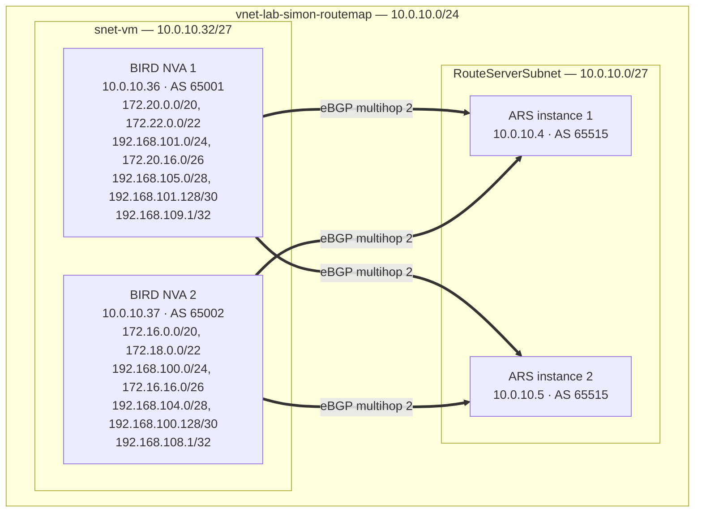

> **`branch_to_branch_traffic_enabled`** tells Route Server to re-advertise routes it learns from one BGP peer to all its other BGP peers. With it on, VM1 sees VM2's routes and vice versa, even though the two NVAs have no direct peering. Without it, each NVA only sees routes from its own VNet. This is where Route Maps becomes interesting: you can apply an inbound or outbound policy on a per-peer basis to control exactly what gets re-advertised. Worth noting that Azure deliberately blocks onward propagation of branch-to-branch routes out to ExpressRoute and VPN gateways to prevent transit routing across the Microsoft backbone; I wrote about that mechanism in detail in [this transit route prevention post](/transit-route-prevention/).

Each NVA uses a simple BIRD config that exports only static blackhole routes to the Route Server and imports everything back. Here's NVA 1 (the pattern for NVA 2 is identical, just with different prefixes and AS 65002):

```
router id 10.0.10.36;

log syslog all;

protocol device {
  scan time 10;
}

protocol kernel {
  ipv4 {
    import none;
    export none;
  };
  learn;
}

protocol static {
  ipv4;
  route 172.20.0.0/20 blackhole;
  route 172.22.0.0/22 blackhole;
  route 192.168.101.0/24 blackhole;
  route 172.20.16.0/26 blackhole;
  route 192.168.105.0/28 blackhole;
  route 192.168.101.128/30 blackhole;
  route 192.168.109.1/32 blackhole;
}

protocol bgp rs1 {
  local 10.0.10.36 as 65001;
  neighbor 10.0.10.4 as 65515;
  multihop 2;
  ipv4 {
    import all;
    export where source = RTS_STATIC;
  };
}

protocol bgp rs2 {
  local 10.0.10.36 as 65001;
  neighbor 10.0.10.5 as 65515;
  multihop 2;
  ipv4 {
    import all;
    export where source = RTS_STATIC;
  };
}
```

With branch-to-branch on, NVA 2's RIB shows its own locally originated routes as `blackhole` and NVA 1's routes arriving via Route Server as `unreachable`:

```
$ sudo birdc show route
Table master4:
192.168.100.0/24  blackhole   [static1] * (200)
192.168.101.0/24  unreachable [rs2 from 10.0.10.5] * (100) [AS65001i]
172.18.0.0/22     blackhole   [static1] * (200)
172.20.16.0/26    unreachable [rs2 from 10.0.10.5] * (100) [AS65001i]
172.16.0.0/20     blackhole   [static1] * (200)
192.168.101.128/30 unreachable [rs2 from 10.0.10.5] * (100) [AS65001i]
192.168.100.128/30 blackhole  [static1] * (200)
172.22.0.0/22     unreachable [rs2 from 10.0.10.5] * (100) [AS65001i]
10.0.10.0/24      unreachable [rs2 from 10.0.10.5] * (100) [AS65515i]
172.16.16.0/26    blackhole   [static1] * (200)
192.168.108.1/32  blackhole   [static1] * (200)
192.168.104.0/28  blackhole   [static1] * (200)
192.168.109.1/32  unreachable [rs2 from 10.0.10.5] * (100) [AS65001i]
192.168.105.0/28  unreachable [rs2 from 10.0.10.5] * (100) [AS65001i]
172.20.0.0/20     unreachable [rs2 from 10.0.10.5] * (100) [AS65001i]
```

The `/20`, `/22`, `/24`, `/26`, `/28`, `/30`, and `/32` spread is deliberate: it gives a good mix of prefix lengths to filter on when testing Route Maps rules.

You can cross-check what Route Server has actually learned under **Settings > Effective Routes** in the portal. It's one of those tabs that's surprisingly easy to find, and it lines up exactly with what BIRD is reporting, which is always reassuring.

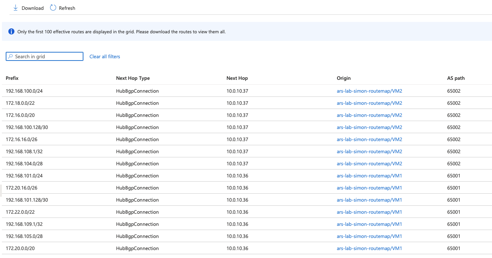

## The prefix limit connection

If you've read my earlier post on [how Azure Route Server counts the prefix limit](/route-server-prefix-limit/), you'll know there's a sharp edge there. The limit is 1,000 routes per BGP peer, but the count includes both currently learned routes and incoming routes in a BGP update. Advertise 501 routes and then update all 501 of them at once, and Route Server sees that as 1,002 routes and tears down the peering.

Route Maps gives you a practical mitigation for this. If you're running an SD-WAN or any scenario where many prefixes flow through Route Server, outbound summarisation can collapse those individual routes into aggregates before they hit the limit. You're not reducing what's real in your network; you're reducing what Azure propagates.

It's not a silver bullet. Summarisation strips BGP Community and AS-PATH attributes from the resulting aggregate, so if downstream systems rely on those, you'll need to think carefully about where you apply it. But for organisations that have been managing a careful head count of their routes to stay clear of that 1,000 route limit, this is genuinely useful.

## Applying route maps to a peering

One thing worth calling out: the **Add Peer** panel in the portal now surfaces inbound and outbound route map fields directly when you're creating a new BGP peering. You don't have to go hunting through settings after the fact.

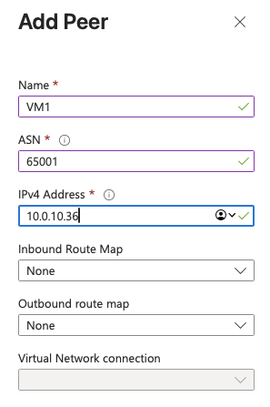

> The fact that route map options appear right there in the core peering workflow might make you think this feature is generally available. It isn't: it's still public preview and the preview terms apply. Don't let the polished portal experience catch you out in a production change window.

One workflow that worked well in the lab was this: create empty route maps first, then edit peers and attach them later. I created four empty maps (`rm-vm1-in`, `rm-vm1-out`, `rm-vm2-in`, `rm-vm2-out`) and then applied one inbound and one outbound map per peer.

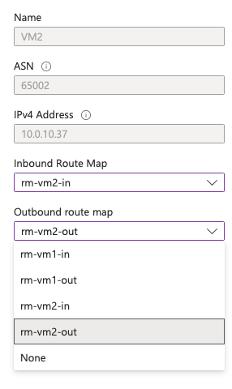

I also checked BIRD immediately after applying the maps to make sure this was non-disruptive. Both sessions stayed established with their original uptime:

```
rs1 BGP --- up 18:50:47.662 Established
rs2 BGP --- up 18:56:27.227 Established
```

It does take a few minutes to apply the route maps. It's definitely not instantaneous, but I would rather wait a few minutes than have a peering flap. The portal shows the peer in an updating state while the route map is being applied. As this is a blank route map at this stage there is no change to the routing table.

## Actually changing some routes

So what can you actually match on and change? The [public preview documentation](https://learn.microsoft.com/en-gb/azure/route-server/route-maps-about) is unusually thorough for a preview.

### Match conditions

You can match on route prefix, either as an exact match of a specified prefix or all subnets underneath it with longer prefix lengths. Unfortunately for **real** network engineers out there you'll be disappointed that you can't match on prefix length, so you can't say "match all /32s" or "match anything longer than a /20" which are common use cases.
The Community and AS-Path match conditions are, in my opinion, badly labeled. Both match with an _Equals_ or a _Contains_ option which act more a logical AND and an OR respectively.

Here's the extract from the [documentation](https://learn.microsoft.com/en-gb/azure/route-server/route-maps-about#match-conditions-1) and you can see that _Equals_ matches all conditions, while _Contains_ matches one or more of the conditions. 

| Property | Criterion | Value (example) | Interpretation |
|---|---|---|---|
| Route-prefix | Equals | 10.1.0.0/16, 10.2.0.0/16, 10.3.0.0/16 | Matches these routes only. Specific prefixes underneath these routes aren't matched. |
| Route-prefix | Contains | 10.1.0.0/16, 192.168.16.0/24 | Matches all specified routes and all prefixes underneath them. For example, 10.1.5.0/24 is underneath 10.1.0.0/16. |
| Community | Equals | 65001:100, 65001:200 | The route's Community property must have both communities. Order isn't relevant. |
| Community | Contains | 65001:100, 65001:200 | The route's Community property can have one or more of the specified communities. |
| AS-Path | Equals | 65001, 65002, 65003 | AS-PATH of the routes must have ASNs listed in the specified order. |
| AS-Path | Contains | 65001, 65002, 65003 | AS-PATH in the routes can contain one or more of the ASNs listed. Order isn't relevant. |

### Modification actions

You can drop a matched prefix, that's pretty straightforward. Again, it's a pain the match criteria do not allow prefix length but I'll live with that. You can also replace a matched prefix with a new prefix.

I started with a simple 1:1 replacement; `192.168.100.0/24` became `192.168.102.0/24`. It feels dangerous and fairly useless in most real designs, but it worked exactly as expected:

```
192.168.102.0/24 unreachable [rs1 20:35:14.540 from 10.0.10.4] * (100) [AS65515i]
```

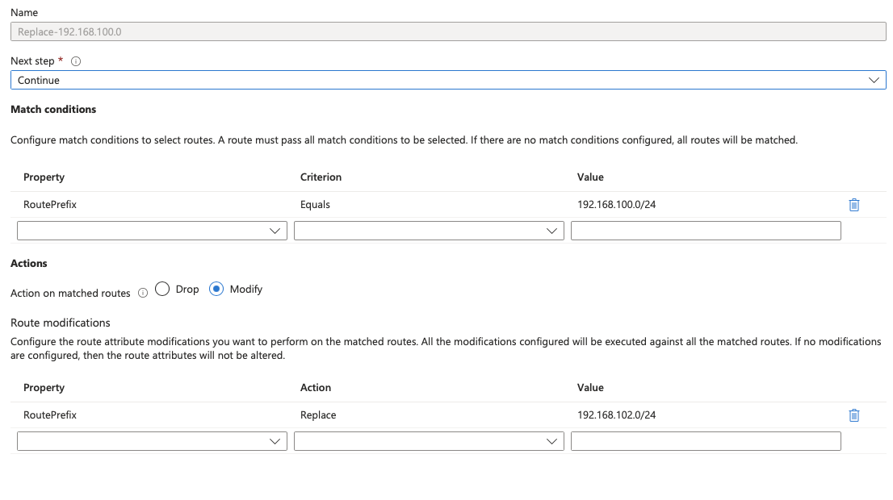

Then I used the same mechanism for summarisation: match routes contained in `172.16.0.0/12` and replace them with `172.16.0.0/12`.

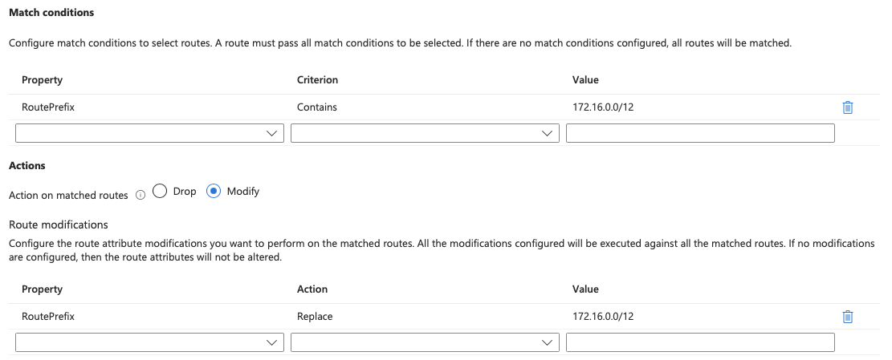

```
172.16.0.0/12 unreachable [rs1 20:41:03.671 from 10.0.10.4] * (100) [AS65515i]
```

Route summarisation is incredibly useful, but I treat it with care: a single `/32` can hold up a large summary. I once had a failover break because of one loopback.


| Property | Action | Value | Interpretation |
|---|---|---|---|
| Route-prefix | Drop | 10.3.0.0/8, 10.4.0.0/8 | The routes specified in the rule are dropped. |
| Route-prefix | Replace | 10.0.0.0/8, 192.168.0.0/16 | Replace all the matched routes with the routes specified in the rule. |
| AS-Path | Add | 64580, 64581 | Prepend AS-PATH with the list of ASNs specified in the rule. These ASNs are applied in the same order for the matched routes. |
| AS-Path | Replace | 65004, 65005 | AS-PATH is set to this list in the same order for every matched route. See key considerations for reserved AS numbers. |
| AS-Path | Replace | (no value specified) | Remove all ASNs in the AS-PATH in the matched routes. |
| Community | Add | 64580:300, 64581:300 | Add all the listed communities to all the matched routes' Community attribute. |
| Community | Replace | 64580:300, 64581:300 | Replace Community attribute for all the matched routes with the list provided. |
| Community | Replace | (no value specified) | Remove Community attribute from all the matched routes. |
| Community | Remove | 65001:100, 65001:200 | Remove any of the listed communities that are present in the matched routes' Community attribute. |

Adding AS-PATH prepends is a useful tool, and one most network engineers already know well. Replacing or removing AS-PATH values is more niche, unless you're stripping private ASNs from a path that will be advertised to the internet.

Adding, changing, and removing community values are all common operations in day-to-day routing policy work; in my lab, they behaved exactly as expected and exactly as documented.

## Things to watch out for

The first time you create a route map on a Route Server, the service runs a one-time upgrade that takes around 30 minutes. Existing traffic keeps flowing; this isn't a cut-over. But you can't create or delete any VPN connections, ExpressRoute connections, or BGP peers until the provisioning state shows **Succeeded**. That includes all three connection types, so if you have a busy Route Server with active ER and VPN gateways alongside your NVA peers, you need to pick your moment.

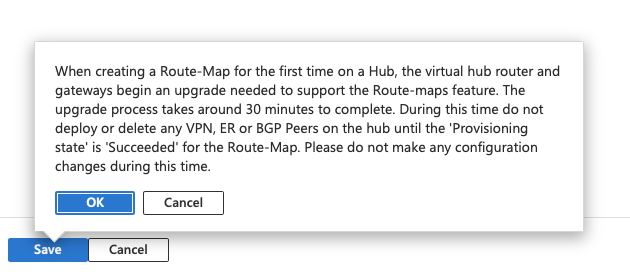

Once you click OK you get a second reality check from the portal: the 30 minutes quoted in the first dialog is apparently optimistic.

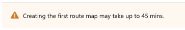

And then you wait. This is 23 minutes in, still running.

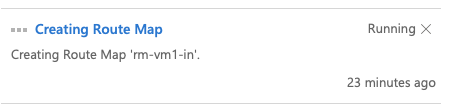

In the end it took 26 minutes, well within the 45-minute ceiling, but long enough to make you question your life choices.

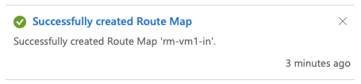

One thing that caught me out: the upgrade triggers the moment you **create the route map itself**, not when you apply it to a peer. So if you create a blank route map to configure first and apply later, the clock starts immediately. Don't save a blank route map and then try to make other changes while you finish building the rules.

I also hit a second gotcha straight after creating `rm-vm1-in`: when I tried to create another blank map (`rm-vm1-out`), the portal threw an API-version error. I had to pop out to walk my dog so left it alone for about half an hour, came back, and it worked without any changes. This seems to be something you have to be patient with.

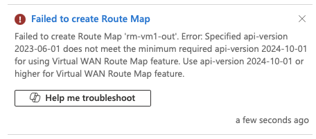

A few limits worth knowing about:

- 2-byte ASNs only (up to 65535). 4-byte ASNs aren't supported in route map actions.
- Don't use reserved ASNs for prepending: 8074, 8075, 12076, or the private range 65515–65520.
- Don't remove BGP communities in the 65517:\* and 65518:\* ranges; those are Azure-internal.
- Route Maps adds extra cost on top of standard Route Server pricing; check the [Azure Route Server pricing page](https://azure.microsoft.com/pricing/details/route-server/) before rolling it out at scale. Pricing during public preview may differ, so check the current rates rather than assuming.
- As a public preview feature, the [Supplemental Terms of Use for Microsoft Azure Previews](https://azure.microsoft.com/support/legal/preview-supplemental-terms/) apply rather than standard SLAs.

## Quick takeaway

Route Maps fills a real gap in Azure Route Server. It brings the same routing policy capability that Virtual WAN has had for a while, and it works exactly how you'd expect if you've ever configured route maps on traditional networking kit: ordered rules, match conditions, and actions.

The public preview is worth exploring, especially if you're managing hybrid connectivity where prefix scale, path selection, or NVA route hygiene have become friction points. Run it on a non-production Route Server first, plan around that 45-minute upgrade window, and don't save a blank route map and walk away.
