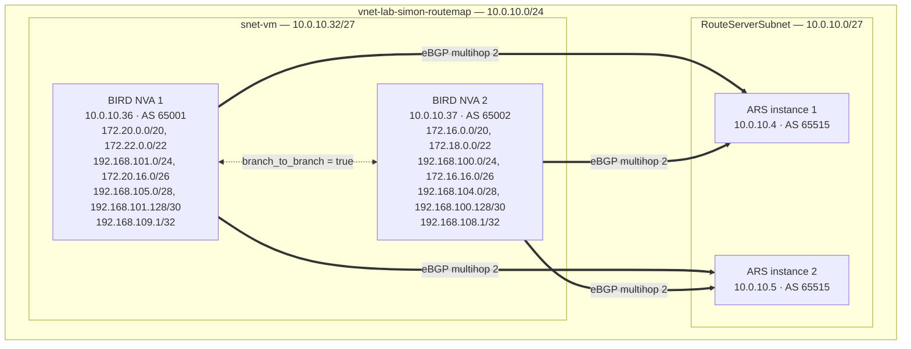

Route Maps for Azure Route Server is now in public preview. If you've been waiting for the feature to land before building it into your hybrid networking designs, now's the time to kick the tyres.

I [covered the preview announcement](/updates/in-preview-public-preview-route-maps-for-azure-route-server) when it landed, so this is a good moment to take stock of what the feature actually gives you and why it matters for real hybrid networking deployments.

## This was overdue

[Virtual WAN got Route Maps first](https://learn.microsoft.com/en-us/azure/virtual-wan/route-maps-about), and at the time I said on LinkedIn that it would be strange if Microsoft didn't bring the same capability to Azure Route Server. The two products occupy different parts of the networking stack — vWAN is the managed, opinionated hub-and-spoke fabric; Route Server is the DIY BGP integration layer for when you're running your own NVAs. But the routing policy problem they solve is identical. If you can filter and modify BGP attributes on a vWAN virtual hub, there's no good reason you shouldn't be able to do the same on a standalone Route Server.

It took a while, but here we are.

<!-- truncate -->

## What Route Maps does

Azure Route Server handles BGP route exchange between your NVAs, ExpressRoute and VPN gateways, and the rest of your virtual network. Before Route Maps, you didn't have much influence over what went in or came out of that exchange. You took what your BGP peers gave you and hoped for the best.

Route Maps adds a policy layer on top of that exchange. You define an ordered list of rules, each with match conditions and actions. When a route matches, you can drop it, aggregate it, or modify its BGP attributes before it continues. You apply these in the inbound direction (routes arriving at Route Server) or outbound direction (routes leaving Route Server), one route map per direction per connection.

The three things you can do are:

**Route filtering** — drop specific prefixes so they never propagate. Useful when an NVA is learning routes you don't want in your virtual network routing table.

**BGP attribute modification** — prepend ASNs to influence path selection, or tag routes with BGP communities for easier management downstream.

**Route summarisation** — replace a group of specific prefixes with a single aggregate. Fifty /24s become one /16 at the Route Server boundary.


## Lab topology

To make the examples concrete, here's the setup I used. Two BIRD NVAs peering with both Route Server instances, each advertising a spread of prefixes across different mask lengths — useful for testing Route Maps filters later. `branch_to_branch_traffic_enabled = true` so each NVA sees the other's routes via Route Server.



> **`branch_to_branch_traffic_enabled`** tells Route Server to re-advertise routes it learns from one BGP peer to all its other BGP peers. With it on, VM1 sees VM2's routes and vice versa — even though the two NVAs have no direct peering. Without it, each NVA only sees routes from its own VNet. This is where Route Maps becomes interesting: you can apply an inbound or outbound policy on a per-peer basis to control exactly what gets re-advertised. Worth noting that Azure deliberately blocks onward propagation of branch-to-branch routes out to ExpressRoute and VPN gateways to prevent transit routing across the Microsoft backbone — I wrote about that mechanism in detail in [this transit route prevention post](/transit-route-prevention/).

Each NVA uses a simple BIRD config that exports only static blackhole routes to the Route Server and imports everything back. Here's NVA 1 (the pattern for NVA 2 is identical, just with different prefixes and AS 65002):

```
router id 10.0.10.36;

log syslog all;

protocol device {
  scan time 10;
}

protocol kernel {
  ipv4 {
    import none;
    export none;
  };
  learn;
}

protocol static {
  ipv4;
  route 172.20.0.0/20 blackhole;
  route 172.22.0.0/22 blackhole;
  route 192.168.101.0/24 blackhole;
  route 172.20.16.0/26 blackhole;
  route 192.168.105.0/28 blackhole;
  route 192.168.101.128/30 blackhole;
  route 192.168.109.1/32 blackhole;
}

protocol bgp rs1 {
  local 10.0.10.36 as 65001;
  neighbor 10.0.10.4 as 65515;
  multihop 2;
  ipv4 {
    import all;
    export where source = RTS_STATIC;
  };
}

protocol bgp rs2 {
  local 10.0.10.36 as 65001;
  neighbor 10.0.10.5 as 65515;
  multihop 2;
  ipv4 {
    import all;
    export where source = RTS_STATIC;
  };
}
```

With branch-to-branch on, NVA 2's RIB shows its own locally originated routes as `blackhole` and NVA 1's routes arriving via Route Server as `unreachable`:

```
$ sudo birdc show route
Table master4:
192.168.100.0/24  blackhole   [static1] * (200)
192.168.101.0/24  unreachable [rs2 from 10.0.10.5] * (100) [AS65001i]
172.18.0.0/22     blackhole   [static1] * (200)
172.20.16.0/26    unreachable [rs2 from 10.0.10.5] * (100) [AS65001i]
172.16.0.0/20     blackhole   [static1] * (200)
192.168.101.128/30 unreachable [rs2 from 10.0.10.5] * (100) [AS65001i]
192.168.100.128/30 blackhole  [static1] * (200)
172.22.0.0/22     unreachable [rs2 from 10.0.10.5] * (100) [AS65001i]
10.0.10.0/24      unreachable [rs2 from 10.0.10.5] * (100) [AS65515i]
172.16.16.0/26    blackhole   [static1] * (200)
192.168.108.1/32  blackhole   [static1] * (200)
192.168.104.0/28  blackhole   [static1] * (200)
192.168.109.1/32  unreachable [rs2 from 10.0.10.5] * (100) [AS65001i]
192.168.105.0/28  unreachable [rs2 from 10.0.10.5] * (100) [AS65001i]
172.20.0.0/20     unreachable [rs2 from 10.0.10.5] * (100) [AS65001i]
```

The `/20`, `/22`, `/24`, `/26`, `/28`, `/30`, and `/32` spread is deliberate — it gives a good mix of prefix lengths to filter on when testing Route Maps rules.

You can cross-check what Route Server has actually learned under **Settings > Effective Routes** in the portal. It's one of those tabs that's surprisingly easy to find — and it lines up exactly with what BIRD is reporting, which is always reassuring.


## The prefix limit connection

If you've read my earlier post on [how Azure Route Server counts the prefix limit](/route-server-prefix-limit/), you'll know there's a sharp edge there. The limit is 1,000 routes per BGP peer, but the count includes both currently learned routes and incoming routes in a BGP update. Advertise 501 routes and then update all 501 of them at once, and Route Server sees that as 1,002 routes and tears down the peering.

Route Maps gives you a practical mitigation for this. If you're running an SD-WAN or any scenario where many prefixes flow through Route Server, outbound summarisation can collapse those individual routes into aggregates before they hit the limit. You're not reducing what's real in your network — you're reducing what Azure propagates.

It's not a silver bullet. Summarisation strips BGP Community and AS-PATH attributes from the resulting aggregate, so if downstream systems rely on those, you'll need to think carefully about where you apply it. But for organisations that have been managing a careful head count of their routes to stay clear of that 1,000 route limit, this is genuinely useful.

## Applying route maps to a peering

> One other thing worth noting with this public preview: the **Add Peer** panel in the portal now surfaces inbound and outbound route map fields directly when you're creating a new BGP peering. You don't have to go hunting through settings after the fact.


If you already have existing peerings you can still edit them and assign a route map after the fact — you don't need to tear down and recreate the peering.

## Things to watch out for

The first time you create a route map on a Route Server, the service runs a one-time upgrade that takes around 30 minutes. Existing traffic keeps flowing — this isn't a cut-over — but you can't create or delete any VPN connections, ExpressRoute connections, or BGP peers until the provisioning state shows **Succeeded**. That includes all three connection types, so if you have a busy Route Server with active ER and VPN gateways alongside your NVA peers, you need to pick your moment.


Once you click OK you get a second reality check from the portal — the 30 minutes quoted in the first dialog is apparently optimistic.


One thing that caught me out: the upgrade triggers the moment you **create the route map itself**, not when you apply it to a peer. So if you create a blank route map to configure first and apply later, the clock starts immediately. Don't save a blank route map and then try to make other changes while you finish building the rules.

A few limits worth knowing about:

- 2-byte ASNs only (up to 65535). 4-byte ASNs aren't supported in route map actions.
- Don't use reserved ASNs for prepending: 8074, 8075, 12076, or the private range 65515–65520.
- Don't remove BGP communities in the 65517:\* and 65518:\* ranges — those are Azure-internal.
- Route Maps adds extra cost on top of standard Route Server pricing. Check the [Azure Route Server pricing page](https://azure.microsoft.com/pricing/details/route-server/) before rolling it out at scale.

