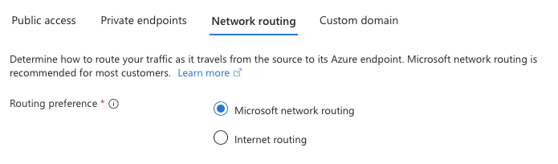

---

title: Service Endpoints. Not as good as a Private Endpoint, but better than nothing.
authors: simonpainter
tags:
  - networks
  - azure
  - security
  - private-link
date: 2025-11-05

---

Services like Azure Storage are really great, and they are super secure, but they seem to make infosec people a bit nervous. The idea of data being secured by identity rules only and not behind a firewall feels a bit too open for some people. I am a big fan of the zero trust security model but that puts all the [trust into your identity provider and the way you manage identities](not-just-ztna.md) and that is a big ask for some organisations.
<!-- truncate -->

The obvious answer to this is to use Private Endpoints, which bring the service into your VNet and allow you to apply all the network security controls you want. But Private Endpoints are not always an option. For organisations that need an alternative, Service Endpoints are a good compromise because although they still use the public service endpoints, they allow you to lock down access to only come from your VNet.

## Service Endpoints vs Private Endpoints

Private Endpoints link a private IP in your VNet to the service, effectively bringing the service into your network. This means that all traffic to the service stays within your network and can be controlled using network security groups (NSGs) and other network security controls. Private Endpoints are arguably more secure than Service Endpoints because they eliminate exposure to the public internet, but they can be more complex to manage and more expensive. The biggest downside is that they require DNS changes to work properly, which can be a challenge in some environments where hybrid DNS is not well designed or managed.

Service Endpoints, on the other hand, do not bring the service into your VNet. Instead, they allow you to secure the service to only accept traffic from your VNet. This means that traffic to the service still goes over the public internet, but it is restricted to only come from your VNet. Service Endpoints are easier to set up and manage than Private Endpoints and do not require DNS changes. However, they do not provide the same level of security as Private Endpoints because the traffic still traverses the public internet.

## Internet bad?

The thing to remember with both is that the traffic is still encrypted using TLS, so even though Service Endpoints use the public internet, the data is still secure in transit.

You can also configure affinity settings for Service Endpoints to ensure that the traffic to the service is either routed via the Microsoft backbone network or via the internet. By default, traffic to the service is routed via the Microsoft backbone network, which provides better performance and security. This will be the right answer for pretty much everyone. However, if you have specific requirements to route traffic via the internet, you can configure the affinity settings accordingly.

There are some reasons why you might choose Service Endpoints or Private Endpoints over just allowing the traffic to go via the internet. One of those is that you might not want any other internet egress for your VNet, or you might use a firewall for the egress and not want to put all your private storage traffic through that and incur the extra processing costs.

## So what does it look like?

Ever since Azure announced that [default internet egress is going away](azure-private-subnet.md), we've all been throwing in firewalls and NAT gateways to ensure we have a valid path for outbound internet traffic. Fortunately Service Endpoints ignore your UDRs for the services they are protecting and insert a route directly into the routing table for the service prefix, pointing it to the Service Endpoint.

It's worth pointing out that these routes are only added in the selected subnets where the Service Endpoint is enabled, they are not transitive inside the VNet and certainly not across peering connections. This means you may have to provision Service Endpoints in multiple subnets if you have workloads in different subnets that need access to the service. This is where Private Endpoints have the advantage because they are available as IPs anywhere in the VNet and across peering connections.

## Conclusion

Service Endpoints are a good compromise for organisations that need to secure access to Azure services but cannot use Private Endpoints. While they do not provide the same level of security or flexibility as Private Endpoints, they are easier to set up and manage and do not require DNS changes.
