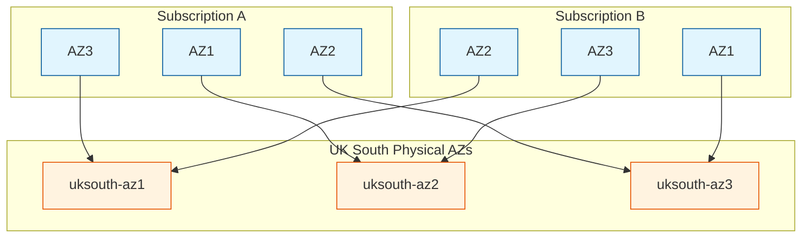

I had a conversation today about sharding in Azure. It's a fairly well-known thing in AWS but it's employed in Azure as well and has some important implications for workload placement in a few specific use cases. In this post, I'll explore the concept of AZ sharding, its implications for cross-subscription services, and techniques for mapping physical AZs to achieve optimal performance.
<!-- truncate -->
## What is AZ Sharding?

Azure Availability Zones are physically separate datacenters within a region, each with independent power, cooling, and networking infrastructure. However, the mapping between logical AZ numbers (1, 2, 3) and physical datacenters isn't static - it's sharded across subscriptions. This means that AZ1 in one subscription might map to a different physical datacenter than AZ1 in another subscription.



The primary reasons for AZ sharding include:

- Load Distribution: By randomising AZ assignments across subscriptions, Azure prevents customers from consistently choosing "AZ1" as their primary zone, which would lead to uneven resource distribution.
- Failure Domain Isolation: Sharding helps ensure that correlated failures don't impact all services that chose the same logical AZ number.
- Security: The abstraction makes it harder for malicious actors to target specific physical infrastructure.

> Microsoft is a little vague about how far apart their AZs are within a
> region. In fact, some regions may not have AZs within the definition that we
> have come to accept it now. I've been told that the physical distance between each
> AZ is somewhere between 10 miles and 100 miles, but in reality, there are AZs which share 
> the same campus, even though they don't share power, cooling, connectivity, etc.

While AZ sharding provides important benefits, there are legitimate scenarios where services in different subscriptions need to be co-located in the same physical AZ:

### High-Frequency Trading

In financial services, particularly high-frequency trading, microseconds matter. When two companies need to interact with trading systems or market data providers, having their services in the same physical AZ can significantly reduce latency. This latency reduction can be the difference between a profitable trade and a missed opportunity. I've seen betting and gaming providers that have similar requirements for low latency data exchange across subscriptions.

### Multi Subscription Microservices

It's fairly common to have complex application ecosystems within an organisation that are segregated into separate subscriptions for organisational reasons, yet which require low latency communication.

## Building Your Own AZ Map in a Subscription

As the sharding is done on a subscription by subscription basis, you need to query each subscription using the `/locations` API endpoint as below. Note that you would of course need to replace `{SubscriptionId}` with the subscription you're querying. The command below extracts the UK South information as an example.

```powershell
simon [ ~ ]$ az rest 
            --method get 
            --uri '/subscriptions/{SubscriptionId}/locations?api-version=2022-12-01'  
            --query 'value' |jq -c '[ .[] | select( .name == "uksouth")]'
```

The rather verbose response for the above would look something like this. 

```json
[{"availabilityZoneMappings":
    [{"logicalZone":"1","physicalZone":"uksouth-az2"},
    {"logicalZone":"2","physicalZone":"uksouth-az3"},
    {"logicalZone":"3","physicalZone":"uksouth-az1"}],
    "displayName":"UK South","id":"/subscriptions/{SubscriptionId}/locations/uksouth",
    "metadata":{"geography":"United Kingdom","geographyGroup":"Europe","latitude":"50.941","longitude":"-0.799",
    "pairedRegion":[{"id":"/subscriptions/{SubscriptionId}/locations/ukwest","name":"ukwest"}],
    "physicalLocation":"London",
    "regionCategory":"Recommended",
    "regionType":"Physical"},
    "name":"uksouth",
    "regionalDisplayName":"(Europe) UK South",
    "type":"Region"}]
```

As you can see in this subscription, what looks like AZ 1 is actually mapped to the physical uksouth-az2. Provided you have access to this information for both subscriptions, you can plan your deployments to place services in the same physical AZ where required.

But what if you don't have access to that information? How do you make sure that you're as close to a resource in Azure as possible without knowing what physical AZ they're in? A novel approach I heard about from someone in the gaming industry is to spin up many hundreds of VMs across all AZs and then test the latency to the target. By keeping the instances that have the lowest latency to the target service and destroying those that don't, you can ensure that you're getting the best performance.

Have you encountered scenarios where AZ sharding has impacted your application performance? I'd love to hear about your experiences with mapping physical AZs and any creative solutions you've developed.