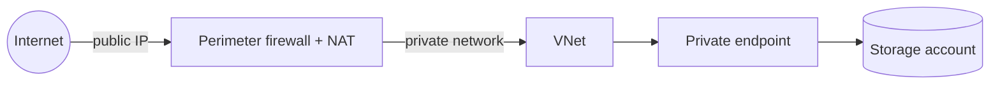
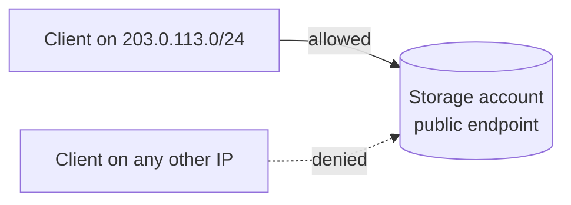
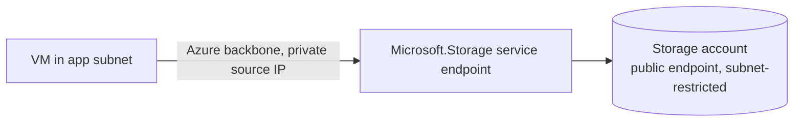
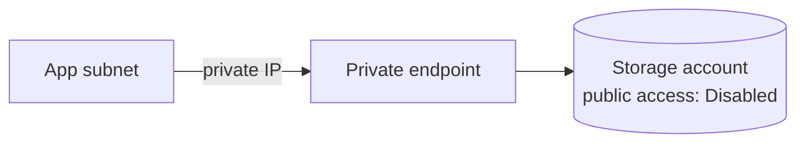
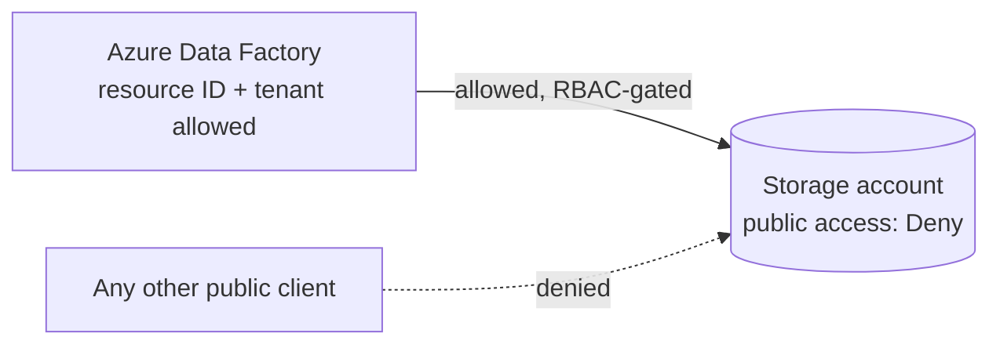
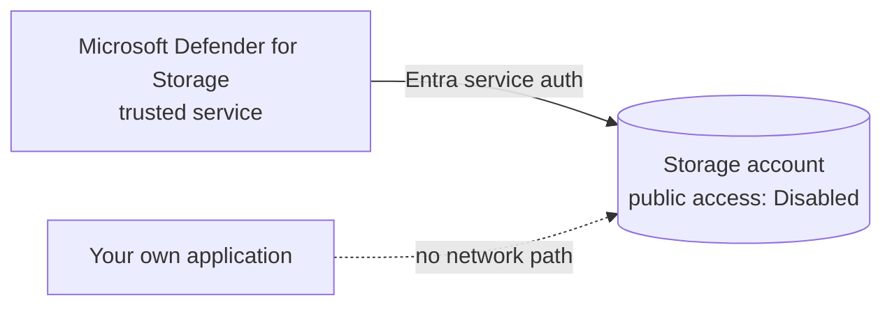

---

title: "Stop hairpinning storage traffic through your firewall"
authors: simonpainter
tags:
  - azure
  - private-link
  - firewall
date: 2025-03-14

---

I am rarely surprised with the misunderstandings and mistakes I seen in customer architectures but I am consistently frustrated by the same recurring pattern when it does exactly the opposite of the goal it sets out to achieve.

I recently saw a customer architecture that was such an anomaly that I spent some time with someone senior at Microsoft trying to understand the reasoning behind it. We both had to draw a blank in the end. The pattern is as follows: a storage account gets a private endpoint so it "isn't public any more", but the public endpoint is still open behind a perimeter firewall, with associated NAT, and internet traffic is deliberately routed in through that firewall, onto the private network, and across to the storage account's private IP. Internet in, through a firewall with all the charges that incurs, into a VNet, out to a SaaS control plane. That's not zero trust, it's a very expensive game of pass the parcel.
<!-- truncate -->



The appeal is obvious. Everyone's used to "the firewall is where security happens", and many infosec teams (even in largeer companies) have failed miserably at keeping up. This creates a false sense of security, so routing storage traffic through it feels like due diligence. But Azure Storage has its own firewall, its own private connectivity model, and several finer-grained native controls that do the job with fewer moving parts, less latency, and no NVA consuming compute resources and firewall vendor licensing. Here's each option, what it actually buys you, and when to reach for it.

> The whole idea behind modern zero trust networking principles is you stop implicitly trusting somethng because it resides within your network perimeter. Even with the best NAC (Network Access Control) solution on the planet, and the best team feeding and watering it, you'll end up with baddies on your network eventually, and relying solely on a perimeter firewall will not protect you from them. Zero trust means verifying every request, regardless of its origin, and applying the principle of least privilege consistently.

### Storage firewall with IP rules

The simplest fix for "random bits of the internet can reach my storage account" is the storage account's own firewall. You set the default action to `Deny` and then allow specific public IP ranges, no perimeter appliance required.

```bash
az storage account update \
  --resource-group myresourcegroup \
  --name mystorageaccount \
  --default-action Deny

az storage account network-rule add \
  --resource-group myresourcegroup \
  --account-name mystorageaccount \
  --ip-address 203.0.113.0/24
```



**Pros**: no infrastructure to build, no latency penalty, works in minutes, and it's enforced by Microsoft on the storage control plane rather than something you have to patch and scale.

**Cons**: it only accepts public internet ranges - RFC 1918 addresses are rejected outright, so you can't use it to describe your own private network. Rules max out at 400 per account, and /31 or /32 prefixes aren't supported (use individual host rules instead). It also has no effect on traffic from the same Azure region as the storage account, so it won't protect you from another workload sat next to you in the same region. That's what your authentication and authorization controls are for.

**Use it when**: a known, stable set of external IPs - an office, an on-premises NAT range, a partner's egress IP - needs access to a storage account that otherwise has no business being internet-facing. This is the direct replacement for "put it behind the firewall", minus the firewall.

### Virtual network rules and service endpoints

If the traffic is coming from inside Azure, IP rules are the wrong tool anyway - same-region traffic routes over the Azure backbone and never shows the IP you'd expect. Virtual network rules solve this by trusting a specific subnet instead of an address range. You enable a service endpoint (`Microsoft.Storage` for same-region, `Microsoft.Storage.Global` for cross-region) on the subnet, then add a network rule for it.

```bash
az network vnet subnet update \
  --resource-group myresourcegroup \
  --vnet-name myvnet \
  --name myappsubnet \
  --service-endpoints Microsoft.Storage

az storage account network-rule add \
  --resource-group myresourcegroup \
  --account-name mystorageaccount \
  --vnet-name myvnet \
  --subnet myappsubnet
```



**Pros**: traffic still goes over the Microsoft backbone rather than the public internet, there's no NVA in the path, and it supports up to 400 rules per account across any subscription in your tenant.

**Cons**: the storage account's public endpoint is still technically public, just restricted - it's "allow from this subnet", not "unreachable from outside Azure". Deleting and recreating a subnet with the same name silently drops its access, which catches people out during VNet rebuilds. And a service endpoint is an all-or-nothing switch per subnet; you can't scope it to just one storage account from the subnet side.

**Use it when**: application VMs or App Service instances already live in a VNet and just need to reach a storage account without their traffic ever touching the internet, but you don't need the stronger guarantee of a private IP for the storage account itself.

> OK, see? I did it myself: the language I used made it seem like a private IP was inherently more secure than a public IP. It's not. Security comes from proper authentication, authorization, and network controls, not the mere presence of a private IP. Firewalls have public IPs too, but that doesn't make everything behind it less secure.

### Private endpoints, done properly

This is the one that's being misused. A private endpoint gives the storage account an actual private IP address inside your VNet - no more public endpoint traffic at all, once you turn public access off. Done right, there's no firewall backhaul because there's nothing coming from the internet to backhaul: the storage account simply isn't reachable from outside your network.



There are some reasons why you might want to have a public and a private endpoint simultaneously. Mostly though you'll just want to turn that off. There is a cost associated with maintaining the private IP for your storage account vs using a service endpoint or relying on public access, so weigh that against what problem you are actually trying to solve.

**Pros**: the strongest isolation on offer - the storage account has no routable public IP at all, so there's no internet-facing attack surface to filter in the first place. It also plays nicely with on-premises access over ExpressRoute or VPN, since the private endpoint is just another IP in your routable space.

> Again, network controls aside all of these configurations are on top of a solid foundation of authentication and authorization. The main justification for some of the more bonkers versions of this setup are either the misuse of the term 'defence in depth' or a misunderstanding of where real security comes from. With many recent attacks targetting identity providers and credentials it's good to have some sort of multi-layered approach, but the layers need to be meaningful and not just for show. If an attacker has got control of your identity provider then they can potentially bypass many of these network controls anyway so focus on the fundamentals of good identity managmement rather than hoping the network will bail you out of a compromise.

**Cons**: you need [private DNS zone configuration wired up correctly](azure-dns-zone-locality.md), or clients will resolve to the public endpoint and fail (or worse, succeed over a path you thought was closed). It's one private endpoint per storage account (per sub-resource, for multi-service accounts), so at scale you're managing a lot of DNS records. And some tooling - certain SaaS integrations, some CI/CD runners - doesn't live inside your VNet and can't reach a private endpoint without a jump box or VPN of its own.

**Use it when**: the storage account holds sensitive data and all legitimate consumers already live inside, or are reachable from, your private network. This is the correct replacement for "private endpoint plus firewall", with the firewall part simply deleted.

### Resource instance rules

Some first-party Azure resources - an Azure Data Factory, a Logic App, an API Management instance - can't be placed inside a subnet, so neither IP rules nor VNet rules apply to them. Resource instance rules let you allow a specific resource instance by its resource ID instead, scoped by Entra role assignment rather than by network location.

```bash
az storage account network-rule add \
  --resource-group myresourcegroup \
  --account-name mystorageaccount \
  --resource-id "/subscriptions/<sub-id>/resourceGroups/myrg/providers/Microsoft.DataFactory/factories/myadf" \
  --tenant-id "<tenant-id>"
```



**Pros**: lets you keep public access locked down (`Deny` by default) while still allowing a named PaaS resource through, without opening a whole IP range or standing up a private endpoint for a service that will only ever touch the account occasionally.

**Cons**: the resource must be in the same Entra tenant as the storage account (any subscription within it is fine), and only a specific set of resource types support this - it isn't a general-purpose allowlist mechanism. Access is still gated by the resource's actual role assignment on the storage account, so this is additive to RBAC, not a replacement for it.

**Use it when**: a managed Azure service needs occasional, auditable access to a storage account that's otherwise locked down, and a private endpoint would be overkill for the volume of traffic involved.

### Trusted service exceptions

A handful of Azure platform services - Azure Monitor writing diagnostic logs, Microsoft Defender for Cloud doing a malware scan, Azure Backup - genuinely operate outside any network boundary you control. Trusted service exceptions let these through using Entra-based service authentication rather than network location, so you don't have to guess their IP ranges.



**Pros**: zero IP management, and it's the only sane way to let a platform service like Defender for Storage read your logs when you've denied all other public traffic.

**Cons**: by design, trusted service access takes precedence over everything else, including a fully disabled public endpoint. If you forget you enabled an exception, it stays active even after you lock the account down further, which is a common source of "why can this still read my data" surprises during audits.

**Use it when**: a first-party Azure platform capability (not your own application) needs to reach the storage account and the service is on the [trusted services list](https://learn.microsoft.com/en-us/azure/storage/common/storage-network-security-trusted-azure-services).

### Picking the right one

There's no right answer, but plenty of wrong ones. The key is to understand what you're trying to secure and how each control affects your threat model. It may also make a difference what data type your protecting and who is using it. Consider the trade-offs between manageability, security, and cost for each approach before making a decision.

The tell that you've over-built this is a diagram where storage traffic enters through a firewall and then is routed on to a private endpoint. If both exist, one of them is redundant - decide whether the account needs to be privately reachable at all, and pick the matching control from this list instead of stacking all of them for reassurance.
