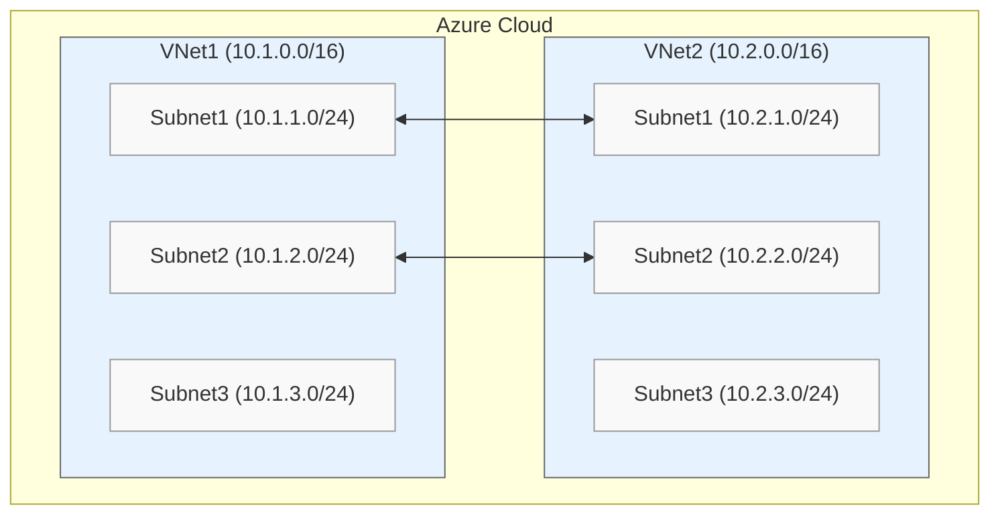
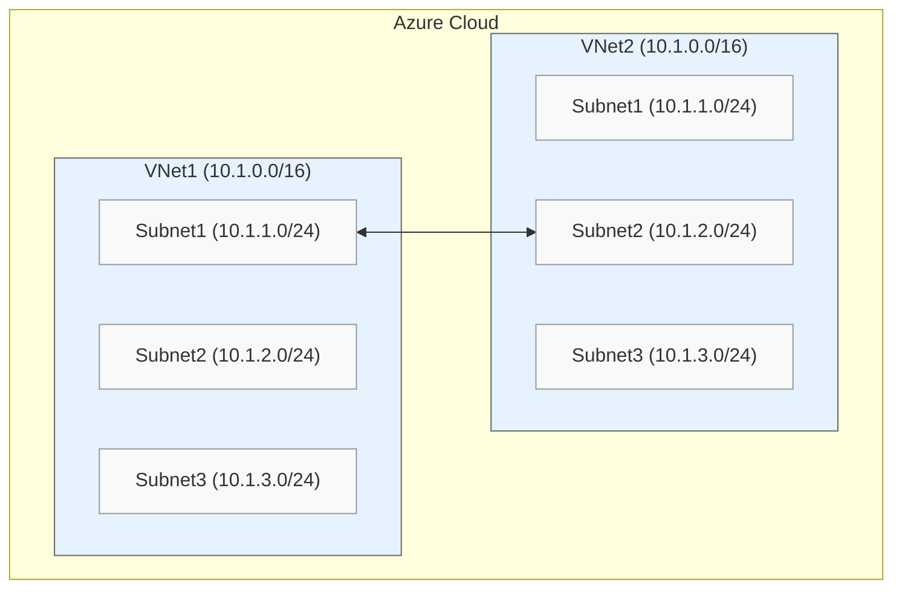

---

title: Azure Subnet Peering Part 2
authors: 
  - simonpainter
tags:
  - azure
  - networks
date: 2025-04-04

---

I had a look recently at [Azure Subnet Peering](subnet-peering.md) which was mostly undocumented at the time except for a [blog post](https://blog.cloudtrooper.net/2024/10/01/azure-subnet-peering/) by Jose Moreno, one of the gurus of [Azure Networking](https://www.amazon.co.uk/Azure-Networking-Understand-networking-architectures/dp/9365897394/).
<!-- truncate -->
Back then, it was just the equivalent of a prefix list on a normal VNet peering. Things have moved on since January though, and it's [now a documented feature](https://learn.microsoft.com/en-us/azure/virtual-network/how-to-configure-subnet-peering), so I thought it was worth another look.

> For a quick recap of my previous post, the two main problems I had were that
> I couldn't create more than one peering at a time on the same VNet, and it
> didn't handle overlapping IP addresses well.

## Revisiting lab 1

My first test last time was creating multiple peerings. Here's what I'm trying to achieve - Subnet 1 in VNet 1 should reach Subnet 1 in VNet 2, and Subnet 2 in VNet 1 should reach Subnet 2 in VNet 2.



Last time, I managed to create the first peering successfully, but the second one failed. Let's try again:

```powershell

az network vnet peering create --name vnet-1_to_vnet-2_subnet_1
                               --resource-group vnet-demo-rg
                               --vnet-name vnet1
                               --remote-vnet vnet2
                               --allow-forwarded-traffic 
                               --allow-gateway-transit
                               --allow-vnet-access
                               --peer-complete-vnet false
                               --local-subnet-names subnet1
                               --remote-subnet-names subnet1

az network vnet peering create --name vnet-2_to_vnet-1_subnet_1
                               --resource-group vnet-demo-rg
                               --vnet-name vnet2
                               --remote-vnet vnet1
                               --allow-forwarded-traffic
                               --allow-gateway-transit
                               --allow-vnet-access
                               --peer-complete-vnet false
                               --local-subnet-names subnet1
                               --remote-subnet-names subnet1

```

So far so good! I can see my local VNet in the routing table and the specific subnet I've peered with. This is exactly what I got last time.

```powershell
PS /home/simon> az network nic show-effective-route-table -n vm1-nic -g vnet-demo-rg -o table                                                        
Source    State    Address Prefix    Next Hop Type    Next Hop IP
--------  -------  ----------------  ---------------  -------------
Default   Active   10.1.0.0/16       VnetLocal
Default   Active   10.2.1.0/24       VNetPeering
Default   Active   0.0.0.0/0         Internet
...
```

Now let's add the second peering:

```powershell

az network vnet peering create --name vnet-1_to_vnet-2_subnet_2
                               --resource-group vnet-demo-rg
                               --vnet-name vnet1
                               --remote-vnet vnet2
                               --allow-forwarded-traffic 
                               --allow-gateway-transit
                               --allow-vnet-access
                               --peer-complete-vnet false
                               --local-subnet-names subnet2
                               --remote-subnet-names subnet2

az network vnet peering create --name vnet-2_to_vnet-1_subnet_2
                               --resource-group vnet-demo-rg
                               --vnet-name vnet2
                               --remote-vnet vnet1
                               --allow-forwarded-traffic
                               --allow-gateway-transit
                               --allow-vnet-access
                               --peer-complete-vnet false
                               --local-subnet-names subnet2
                               --remote-subnet-names subnet2

```

This failed just like last time. It looks like it's the same feature, just with some added documentation. I'm pretty confident it's still just a VNet peering with route filtering rather than true subnet-to-subnet peering. To be more useful and live up to its name, we'd need to create multiple subnet peerings between VNets.

## Revisiting lab 2

In lab 2, I looked at overlapping CIDR ranges (or IP address ranges in Azure speak).

> Sorry, my AWS is showing again. I recently picked up the [AWS Advanced Networking](https://www.credly.com/earner/earned/badge/5b413a12-1d38-4487-b36c-2fa470771a70) certification, so I've still got AWS terminology on the brain.

The lab setup is similar to lab 1 but with overlapping IP ranges. Remember, you can't create VNet peerings when there are overlapping IP ranges in the two VNets. This failed last time around.



Even though the overall IP ranges overlap, I'll try again to peer two subnets that don't overlap from within those ranges.

```powershell

az network vnet peering create --name vnet-1_to_vnet-2_subnet_1
                               --resource-group vnet-demo-rg
                               --vnet-name vnet1
                               --remote-vnet vnet2
                               --allow-forwarded-traffic 
                               --allow-gateway-transit
                               --allow-vnet-access
                               --peer-complete-vnet false
                               --local-subnet-names subnet1
                               --remote-subnet-names subnet2

az network vnet peering create --name vnet-2_to_vnet-1_subnet_2
                               --resource-group vnet-demo-rg
                               --vnet-name vnet2
                               --remote-vnet vnet1
                               --allow-forwarded-traffic
                               --allow-gateway-transit
                               --allow-vnet-access
                               --peer-complete-vnet false
                               --local-subnet-names subnet2
                               --remote-subnet-names subnet1

```

Same result. The overlap check stops you from creating this peering because it's checking the entire IP range for overlaps, not just the individual subnets you're trying to peer. This is more evidence that it's VNet peering (or maybe IP range peering) with prefix filtering.

```powershell
(VnetAddressSpacesOverlap) Cannot create or update peering
...
cannot be peered because their address spaces overlap. 
Overlapping address prefixes: 10.1.1.0/24, 10.1.2.0/24

```

The absurdity of this error message probably won't be lost on you.

## Conclusion

It's basically the same behavior I saw back in January, which suggests it's just a prefix filter capability on VNet peering rather than true subnet-to-subnet peering. It's still useful for some scenarios, but it doesn't live up to what the name promises.
