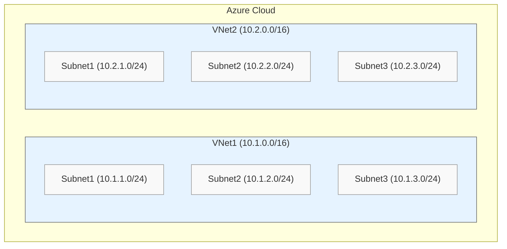
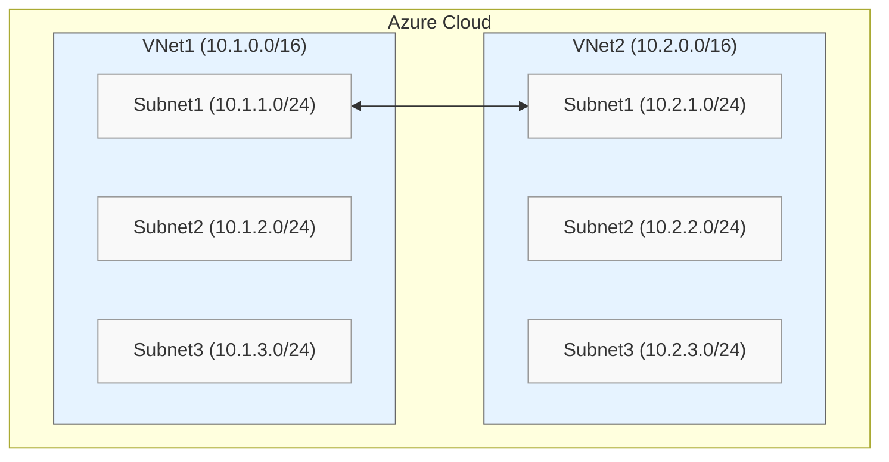
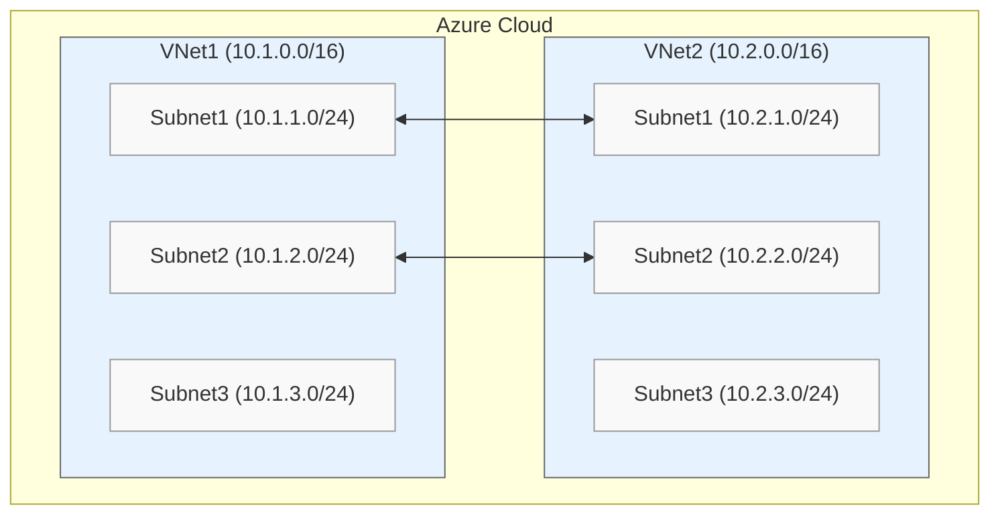
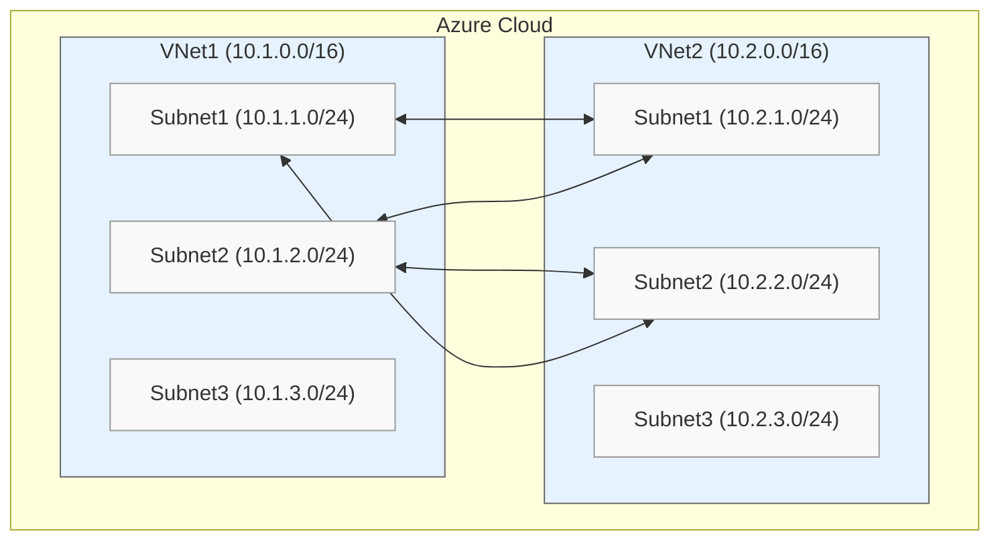
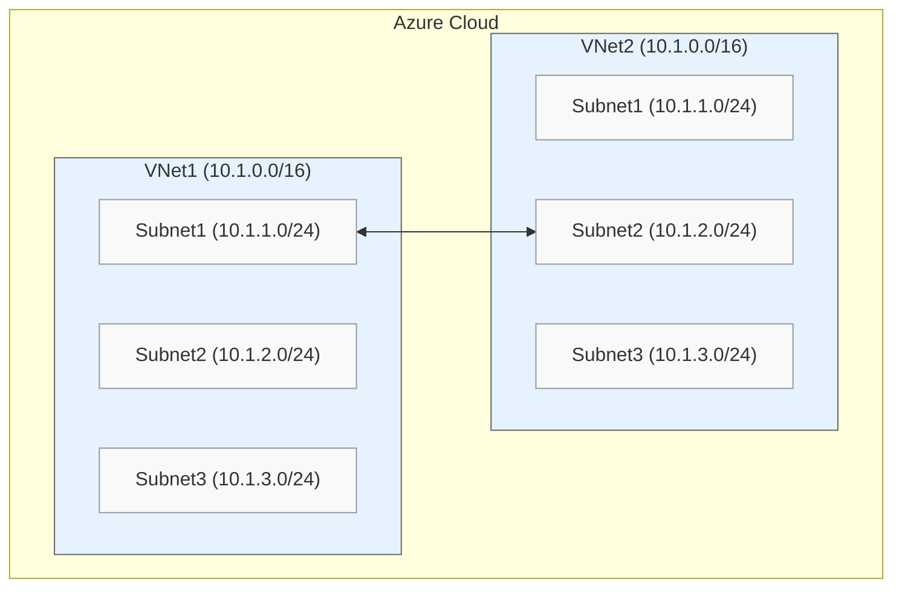

---

title: Azure Subnet Peering
authors: spainter
tags:
  - azure
  - networks

---

One of the sneaky under the radar features that could to be a game changer in the near future is Azure Subnet Peering. This is a feature that is already there in the API but not really documented or productised.
<!-- truncate -->
## What is Azure Subnet Peering?

To answer that we have to go back and look at what VNet peering is. Actually we can go back and have a look at what a VNet itself is: A VNet is a logical collection of subnets. Each VNet has one primary CIDR range and then zero or more secondary CIDR ranges. Those CIDR ranges can then be used in a single subnet or subdivided into more subnets so long as the address space does not overlap.

> You can subnet that however you choose in order to use some or all of the CIDR address space. There
> are some [great tools](https://blog.pichuang.com.tw/azure-subnets.html) to help you use your CIDR
> ranges efficinently.

When you peer a pair of VNets you gain the ability to route between them. The route to VNet 2 appears in the route table for VNet 1 and vice versa. The whole CIDR is advertised as a greedy summary rather than the individual subnets. With Azure Subnet Peering you can selectively peer specific subnets rather than the whole VNet CIDR. This means you have granular control of what subnets can route between each other.

## It's time for a lab

When you peer two VNets you gain the ability to route between all subnets in those VNets; this is out of the box functionality we have all learned to take for granted. You can [download a lab template](https://github.com/simonpainter/subnet-peering/tree/main/lab1) which creates the VNets and subnets in the diagram below if you want to follow along.



### Normal VNet peering

We can use the VM NICs in the subnets to verify that they can see the routes for their own local VNet. You will also see the system generated Internet route for default internet egress (I should probably get into the habit of including a NAT gateway soon).

```text
az network nic show-effective-route-table -n vm1-nic -g vnet-demo-rg -o table

Source    State    Address Prefix    Next Hop Type    Next Hop IP
--------  -------  ----------------  ---------------  -------------
Default   Active   10.1.0.0/16       VnetLocal
Default   Active   0.0.0.0/0         Internet
...
```

If we establish a normal VNet peering (which you can do through the GUI or the CLI) we get something like the next where the CIDR for the remote VNet appears in the routing table with the next hop of the peering. This is pretty much as we expect and should be no surprise to anyone who has peered two VNets together before. Again note that you see the summary for the entire VNet and not the individual subnets.

```text
az network nic show-effective-route-table -n vm1-nic -g vnet-demo-rg -o table

Source    State    Address Prefix    Next Hop Type    Next Hop IP
--------  -------  ----------------  ---------------  -------------
Default   Active   10.1.0.0/16       VnetLocal
Default   Active   10.2.0.0/16       VNetPeering
Default   Active   0.0.0.0/0         Internet
...
```

This is fine for most scenarios but in some case we might want to be selective about which routes we receive and consequently which subnets can route between each other, that's where subnet peering, which should probably be called subnet specific peering, comes in.

### Enabling Subnet Peering

First you need to enable it, it's not even anounced as a public preview yet so don't do this in your production subscriptions, this is strictly lab only at the moment. It is fairly simple to register it but it does take a few minutes to register.

```powershell
simon [ ~ ]$ az feature register --namespace Microsoft.Network 
                                 --name AllowMultiplePeeringLinksBetweenVnets 
Once the feature 'AllowMultiplePeeringLinksBetweenVnets' is registered, invoking 
'az provider register -n Microsoft.Network' is required to get the change propagated
{
  "id": "/subscriptions/851dc6e3-4d9f-4d07-899d-1f0b624f0826/providers/Microsoft.Features/providers/Microsoft.Network/features/AllowMultiplePeeringLinksBetweenVnets",
  "name": "Microsoft.Network/AllowMultiplePeeringLinksBetweenVnets",
  "properties": {
    "state": "Registering"
  },
  "type": "Microsoft.Features/providers/features"
}
```

At this point you will have to wait for a few minutes while it registers. You can check it after a few minutes or spam up/enter like I did in the powershell console until it shows registered.

```powershell
simon [ ~ ]$ az feature show --name AllowMultiplePeeringLinksBetweenVnets 
                             --namespace Microsoft.Network 
                             --query 'properties.state' -o tsv
Registered
```

### Establishing a Subnet Peering

Creating a peering is just like creating a VNet peering. In fact that's really what you are doing but with the added flags to say don't peer the entire VNet and another flag to say which subnets you want to include. We'll start with subnet1 in both VNets to see what happens.

```powershell
az network vnet peering create -n "vnet1-1-to-vnet2-1" -g vnet-demo-rg -o none\
        --vnet-name vnet1 --remote-vnet vnet2 \
        --allow-forwarded-traffic --allow-vnet-access --allow-gateway-transit \
        --peer-complete-vnet false \
        --local-subnet-names subnet1 --remote-subnet-names subnet1
az network vnet peering create -n "vnet2-1-to-vnet1-1" -g vnet-demo-rg -o none\
        --vnet-name vnet2 --remote-vnet vnet1 \
        --allow-forwarded-traffic --allow-vnet-access --allow-gateway-transit \
        --peer-complete-vnet false \
        --remote-subnet-names subnet1 --local-subnet-names subnet1
```

This establishes the peering in the diagram below. Well actually, it doesn't, or at least that's what I think from the behaviour we'll see below.



A quick look at the routing table on the VM1 NIC and we see the subnet range for subnet1 in VNet2 has appeared. This means you can reach that subnet from subnet1 in VNet1. You can test this by putting a hello world apache VM or whatever you like in there and connecting. What you also notice is that you can't route to any of the other subnets in VNet2 from subnet1 in VNet1.

```text
az network nic show-effective-route-table -n vm1-nic -g vnet-demo-rg -o table

Source    State    Address Prefix    Next Hop Type    Next Hop IP
--------  -------  ----------------  ---------------  -------------
Default   Active   10.1.0.0/16       VnetLocal
Default   Active   10.2.1.0/24       VNetPeering
Default   Active   0.0.0.0/0         Internet
...
```

If you check the effective route table for vm2-nic or vm3-nic which are in subnet2 and subnet3 of VNet1 you'll see that the route to 10.2.1.0/24 isn't there. Do try it out if you don't believe me.

### Adding another peering

Here's where it gets a bit curious though, and probably a little more familiar for hardcore network engineers from the on prem world as I get to start using some BGP analogies. If we try to add another peering between subnet2 on both VNets it fails with an error.

```powershell
az network vnet peering create -n "vnet1-2-to-vnet2-2" -g vnet-demo-rg -o none\
        --vnet-name vnet1 --remote-vnet vnet2 \
        --allow-forwarded-traffic --allow-vnet-access --allow-gateway-transit \
        --peer-complete-vnet false \
        --local-subnet-names subnet2 --remote-subnet-names subnet2
az network vnet peering create -n "vnet2-2-to-vnet1-2" -g vnet-demo-rg -o none\
        --vnet-name vnet2 --remote-vnet vnet1 \
        --allow-forwarded-traffic --allow-vnet-access --allow-gateway-transit \
        --peer-complete-vnet false \
        --remote-subnet-names subnet2 --local-subnet-names subnet2
```


### ~Subnet Peering~ VNet Peering with prefix filtering

The error basically says you already have a peering in place between those VNets. So this is what I meant when I said it's not really subnet peering, it's more like a VNet peering with the summarisation turned off and a explicit allow prefix filter for inbound and outbound.

> `--peer-complete-vnet false` this is the command which is equivalent to no route summarisation
> and the combination of `--remote-subnet-names subnet2` and  `--local-subnet-names subnet2` are the equivalent of a prefix
> list inbound and outbound on the peering. This is behaviour that is very familiar to the BGP boys and girls out there.

### Full mesh

So instead we'll delete the peerings and make a new one which will work. This allows the routes for subnet1 and subnet2 in both directions. Instead of having VNet1 subnet1 talk to VNet2 subnet1 and VNet1 subnet2 talk to VNet2 subnet2 we have both subnets on each side able to talk to both subnets on the other side.

```powershell
az network vnet peering create -n "vnet1-to-vnet2" -g vnet-demo-rg -o none\
        --vnet-name vnet1 --remote-vnet vnet2 \
        --allow-forwarded-traffic --allow-vnet-access --allow-gateway-transit \
        --peer-complete-vnet false \
        --local-subnet-names subnet1 subnet2 --remote-subnet-names subnet1 subnet2
az network vnet peering create -n "vnet2-to-vnet1" -g vnet-demo-rg -o none\
        --vnet-name vnet2 --remote-vnet vnet1 \
        --allow-forwarded-traffic --allow-vnet-access --allow-gateway-transit \
        --peer-complete-vnet false \
        --remote-subnet-names subnet1 subnet2 --local-subnet-names subnet1 subnet2
```

It's not what I wanted but it was useful for understanding the behaviour and the fact that this is still a VNet peering and not actually a subnet to subnet peering construct.



Now this peering is up let's check the routing table again and there are indeed routes to subnet1 and subnet2. Subnet3 hasn't been able to join the party though.

```text
az network nic show-effective-route-table -n vm1-nic -g vnet-demo-rg -o table

Source    State    Address Prefix    Next Hop Type    Next Hop IP
--------  -------  ----------------  ---------------  -------------
Default   Active   10.1.0.0/16       VnetLocal
Default   Active   10.2.1.0/24       VNetPeering
Default   Active   10.2.2.0/24       VNetPeering
Default   Active   0.0.0.0/0         Internet
...
```

### Trying with overlapping CIDRs

I thought I would check to see if I could use overlapping CIDRs. I was successful in using the first lab template, establishing peering for subnet1 to subnet1 and then adding a secondary CIDR on both VNets for 192.168.0.0/24. I was able to see the local one and not the remote one. This would be good for expanding out VNets with non routable address space if you needed to scale out lots of infrastrcuture that didn't need to be directly reachable from your corporate network - for those that operate at scale it's a good way of preserving the finite address space in RFC1918 addressing.

I built out a [second lab for download](https://github.com/simonpainter/subnet-peering/tree/main/lab2) with two VNets that have overlapping address space and the same three subnets. I thought I would try peering subnet1 in VNet1 to subnet2 in VNet2.



Although they are not overlapping subnets the peering command failed because the peering process determined that the VNet CIDRs themselves are overlapping.

```powershell
az network vnet peering create -n "vnet1-to-vnet2" -g vnet-demo-rg -o none\
        --vnet-name vnet1 --remote-vnet vnet2 \
        --allow-forwarded-traffic --allow-vnet-access --allow-gateway-transit \
        --peer-complete-vnet false \
        --local-subnet-names subnet1 --remote-subnet-names subnet2
az network vnet peering create -n "vnet2-to-vnet1" -g vnet-demo-rg -o none\
        --vnet-name vnet2 --remote-vnet vnet1 \
        --allow-forwarded-traffic --allow-vnet-access --allow-gateway-transit \
        --peer-complete-vnet false \
        --remote-subnet-names subnet2 --local-subnet-names subnet1
```

## Conclusion

After exploring this feature in depth, it becomes clear that "Subnet Peering" isn't quite what the name suggests. What we're really looking at is VNet peering with some BGP-like capabilities bolted on. The `--peer-complete-vnet false` parameter functions much like disabling route summarisation, preventing the advertisement of the entire VNet CIDR and instead allowing individual subnet routes to be advertised. Meanwhile, the `--local-subnet-names` and `--remote-subnet-names` parameters serve as prefix list equivalents, giving us fine-grained control over which subnet routes are allowed through the peering.

The lab work revealed some important constraints: you can't establish multiple peering relationships between the same VNets and the fundamental VNet-level restriction against overlapping address spaces remains in place. This reinforces that we're still working with VNet peering at its core, just with added controls for route advertisement and filtering.

So perhaps a more accurate name for this feature would be "VNet Peering with Subnet-Level Route Filtering." It's not the subnet-to-subnet peering construct some might have hoped for, but it does provide network engineers with familiar BGP-like tools for more granular control over their Azure network routing. As this feature matures and moves toward general availability, it will be interesting to see how these capabilities evolve and what new use cases emerge.