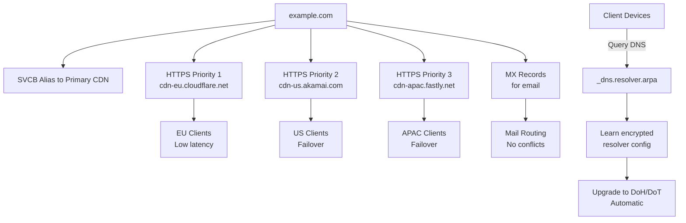

---

title: "SVCB and HTTPS Records in DNS: Service Binding and Modern DNS Discovery"
authors: simonpainter
tags:
  - dns
  - security
  - networks
  - architecture
  - educational
date: 2026-03-09

---

## DNS Service Binding (SVCB) and HTTPS Records: A Practical Guide

I'm going to walk you through SVCB and HTTPS DNS records, and why you should care about them. These aren't just shiny new standards—they solve real problems I've encountered managing network infrastructure at scale.

If you've ever wrestled with CDN delegation at your apex domain, or watched clients waste milliseconds negotiating protocols, you'll recognise the pain points these records address. I'll show you how they work, then we'll test them together with actual commands you can run right now.

---

## The Problem

<!-- truncate -->

Before RFC 9460 (November 2023), connecting to HTTPS services was surprisingly inefficient. Here's what happened:

Your browser would connect on HTTP/2, the server would respond with an Alt-Svc header saying "hey, I also support HTTP/3", and the browser would then open a new connection. That's multiple round trips when one should have done the job. It's like asking someone directions while driving, getting told about a faster route, and having to go all the way back to take it.

Zone apex caused another headache. You couldn't use CNAME at `example.com`—only subdomains worked. This meant delegating your whole domain to a CDN was complicated. You had to either break your email routing or use hacky workarounds. SVCB fixed this.

SVCB and HTTPS records let you send all the connection details in a single DNS query. Clients learn which protocols you support, which endpoint to use, even the IP addresses. No Alt-Svc negotiations. No multiple lookups. Just the information they need, straight away.

---

## How They Work

### The Basic Structure

A SVCB record looks like this:

```dns
_service._proto.example.com. 3600 IN SVCB 1 endpoint.cdn.net. alpn="h3,h2" port=443
```

Three key parts:

**Priority** (the `1` here) tells clients which record to try first. Lower numbers win. Priority 0 is special—it means "use this as an alias" (we'll get to that).

**Endpoint** (the `endpoint.cdn.net` part) is where the service actually lives.

**Parameters** (the `alpn="h3,h2"` bit) tell clients what protocols the endpoint supports. Here, HTTP/3 and HTTP/2.

The HTTPS record type works exactly the same way but without the underscore prefix nonsense. `example.com IN HTTPS 1 . alpn="h3,h2"` is cleaner than the SVCB equivalent.

### Two Operating Modes

**AliasMode** uses priority 0 and works like CNAME but only for a specific service. You can point your apex to a CDN endpoint:

```dns
example.com. IN SVCB 0 cdn.example.net.
```

The clever part? You can have this *and* keep your MX records for email. CNAME wouldn't let you do that.

**ServiceMode** uses priority 1 or higher and describes a specific endpoint with its parameters. You can have multiple ServiceMode records:

```dns
example.com. IN HTTPS 1 cdn-eu.cloudflare.net. alpn="h3,h2"
example.com. IN HTTPS 2 cdn-us.akamai.com. alpn="h3,h2"
example.com. IN HTTPS 3 cdn-apac.fastly.net. alpn="h3,h2"
```

Clients try priority 1 first, then 2, then 3. All endpoint info arrives in one query.

---

## What You Can Actually Do With These

### Serving Your Apex Domain From a CDN

This was a painful problem before SVCB. You want to delegate your apex domain to a CDN, but you still need mail servers. CNAME won't work at the apex.

With SVCB AliasMode:

```dns
example.com. IN SVCB 0 cdn.provider.net.
example.com. IN MX 10 mail.example.com.
example.com. IN TXT "v=spf1 include:_spf.provider.net ~all"
```

Your DNS query returns the CDN endpoint *and* your mail configuration. Everything works. No workarounds needed.

### Making HTTP/3 Work Better

HTTP/3 (QUIC) is faster and more resilient than HTTP/2, especially on slow or unstable networks. But clients don't know you support it without trial and error.

Old way: Browser connects on HTTP/2, server sends Alt-Svc header, browser waits, then reconnects on HTTP/3. Multiple round trips, extra latency.

New way: Your HTTPS record says it upfront:

```dns
example.com. IN HTTPS 1 . alpn="h3,h2"
```

Clients see this in DNS and connect directly on HTTP/3. No Alt-Svc dance. No wasted milliseconds. Data from real deployments shows this shaves 50–100ms off initial connections on average.

### Geographic Load Balancing Without BGP

Imagine you're operating a global service with presence across multiple regions. You use Cloudflare for Europe, Akamai for North America, and Fastly for Asia-Pacific. Traditionally you'd use GeoDNS or BGP to direct traffic.

With SVCB, you publish all endpoints at once:

```dns
example.com. IN HTTPS 1 cdn-eu.cloudflare.net. alpn="h3,h2"
example.com. IN HTTPS 2 cdn-us.akamai.com. alpn="h3,h2"
example.com. IN HTTPS 3 cdn-apac.fastly.net. alpn="h3,h2"
```

Modern clients try priority 1 first and automatically failover if it's unavailable. Smart clients can even choose based on geography. No extra DNS queries. No routing table complexity. The CDN endpoint details are right there in DNS.

### Automatic DNS Encryption Discovery

This is where things get interesting for enterprise security. Your network forces all DNS through encrypted channels (DoH or DoT) for privacy. But how do clients discover where the encrypted resolver lives?

SVCB records to the rescue. There's a special query every client can make:

```bash
dig _dns.resolver.arpa SVCB @1.1.1.1
```

This asks Cloudflare's resolver: "What's your encrypted endpoint?" And it responds:

```dns
_dns.resolver.arpa. 300 IN SVCB 1 one.one.one.one. alpn="h2,h3" port=443 key7="/dns-query{?dns}"
_dns.resolver.arpa. 300 IN SVCB 2 one.one.one.one. alpn="dot" port=853
```

Translation: "Use DoH at `one.one.one.one:443` (priority 1) or DoT at port 853 (priority 2)."

Clients learn this automatically. Your clients get a plaintext resolver from the network via DHCP, but then ask the resolver "do you support encryption?" and upgrade transparently. Your users never need to configure anything.

For your own domain, you'd do:

```dns
_dns.resolver.example.com. IN SVCB 1 doh.example.com. alpn="h3,h2" port=443 key7="/dns-query{?dns}"
_dns.resolver.example.com. IN SVCB 2 dot.example.com. alpn="dot" port=853
```

Now all DNS queries automatically encrypt. Zero manual configuration. This is particularly valuable for organizations managing security policies.

### Hiding Your Domain From Network Inspection

This is more advanced, but worth understanding. Encrypted Client Hello (ECH) hides the domain name from network observers during the TLS handshake. It stops censorious networks from seeing which websites you're visiting.

HTTPS records can distribute the encryption key:

```dns
example.com. IN HTTPS 1 . ech="<base64-key>"
```

News organisations in restrictive countries, healthcare providers managing sensitive data, financial services—they all use this. Your network can't inspect what your clients are accessing.

---

## Real Examples You Can Test

### Cloudflare's Public Resolver

Run this:

```bash
dig _dns.resolver.arpa SVCB @1.1.1.1 +short
```

I ran this and got:

```
1 one.one.one.one. alpn="h2,h3" port=443 ipv4hint=1.1.1.1,1.0.0.1 ipv6hint=2606:4700:4700::1111,2606:4700:4700::1001 key7="/dns-query{?dns}"
2 one.one.one.one. alpn="dot" port=853 ipv4hint=1.1.1.1,1.0.0.1 ipv6hint=2606:4700:4700::1111,2606:4700:4700::1001
```

What's happening here: Priority 1 says "use DoH with HTTP/2 or HTTP/3". The `ipv4hint` and `ipv6hint` parameters let clients connect without extra DNS lookups. Priority 2 offers DoT (DNS over TLS) as a backup.

Notice Cloudflare prefers DoH because it works through HTTP proxies. Smart choice for a public resolver.

### Google's DNS

```bash
dig _dns.dns.google SVCB @8.8.8.8 +short
```

Output:

```
1 dns.google. alpn="dot"
2 dns.google. alpn="h2,h3" key7="/dns-query{?dns}"
```

Google prioritises DoT (TLS on port 853) because it's lower latency for dedicated DNS clients. Different trade-off, same result: clients know exactly how to encrypt their queries.

### HTTP Records in the Wild

```bash
dig -t 65 cloudflare.com @1.1.1.1 +short
```

Returns:

```
1 . alpn="h3,h2" ipv4hint=104.16.132.229,104.16.133.229 ipv6hint=2606:4700::6810:84e5
```

That `.` means "use cloudflare.com itself" (not a different endpoint). The browser learns upfront that Cloudflare supports HTTP/3, the IPv4 addresses are already resolved, and it can connect immediately.

---

## Setting This Up

### Check Your dig Version

You need dig 9.20 or newer for SVCB support. Older versions don't understand the record type.

```bash
dig -v
```

If you're on macOS with Homebrew and have an old version:

```bash
brew install bind
alias dig=/opt/homebrew/opt/bind/bin/dig
```

Then reload your shell and you're good.

### Add Records to Your DNS

Most DNS providers now support SVCB and HTTPS records. Cloudflare, AWS Route 53, DNSimple, Akamai, Google Cloud DNS—they all have it. Check your provider's UI or API.

For a basic HTTP/3-enabled domain:

```dns
example.com. 3600 IN HTTPS 1 . alpn="h3,h2"
```

Add IP hints to save clients from extra lookups:

```dns
example.com. 3600 IN HTTPS 1 . alpn="h3,h2" ipv4hint=104.16.132.229
```

### Test It

```bash
dig -t 65 example.com +short
```

You should get your record back. If nothing appears, check that your provider supports the record type or wait for DNS caching to clear.

### Verify with Different Resolvers

Query different resolvers to ensure consistency:

```bash
dig -t 65 example.com @8.8.8.8
dig -t 65 example.com @1.1.1.1
dig -t 65 example.com @9.9.9.9
```

All should return the same thing (allowing for TTL differences).

---

## A Concrete Example: Multi-CDN Deployment

Let's say you're operating a global service. Here's what your zone could look like:

```dns
; Apex alias to primary CDN
example.com. IN SVCB 0 cdn.primary-provider.net.

; Geographic failover
example.com. IN HTTPS 1 cdn-eu.cloudflare.net. alpn="h3,h2"
example.com. IN HTTPS 2 cdn-us.akamai.com. alpn="h3,h2"
example.com. IN HTTPS 3 cdn-apac.fastly.net. alpn="h3,h2"

; Email still works alongside the SVCB alias
example.com. IN MX 10 mail.example.com.
example.com. IN MX 20 mail-backup.example.com.

; Encrypted DNS for internal clients
_dns.resolver.example.com. IN SVCB 1 doh.example.com. alpn="h3,h2" port=443 key7="/dns-query{?dns}"
_dns.resolver.example.com. IN SVCB 2 dot.example.com. alpn="dot" port=853
```

What this gives you:

Your apex is aliased to a primary CDN without breaking email. Clients across different regions try geographically-optimised endpoints. All clients automatically discover and upgrade to encrypted DNS. No configuration complexity. No manual resolver setup needed.

This is simpler than BGP-based load balancing, more flexible than GeoDNS, and works across all modern clients (iOS 17+, macOS 13+, Windows 11, modern browsers, etc.).



---

## Monitoring and Validation

### Verify Your Records Are Published

```bash
dig -t 65 example.com +dnssec
```

Look for RRSIG records in the response. That confirms DNSSEC is signing your HTTPS records.

### Test HTTP/3 Connectivity

Once your records are live, test that your service actually supports what you advertised:

```bash
curl --http3 https://example.com -v
curl --http2 https://example.com -v
```

Both should work. If HTTP/3 fails, remove `h3` from your `alpn` parameter.

### Track Adoption

Monitor your HTTP/3 traffic ratio over time. Most analytics providers show this. When you publish HTTPS records with `alpn="h3,h2"`, you'll typically see HTTP/3 adoption climb from 0% to 20–50% within a few weeks on modern clients.

---

## Standards and Safety

### What You Need to Know

SVCB (RFC 9460) and HTTPS (RFC 9110) are standardised at the IETF. Adoption is strong among infrastructure providers and modern operating systems.

**DNSSEC matters.** Always sign your SVCB/HTTPS records with DNSSEC to prevent DNS spoofing. Check your records:

```bash
dig -t 65 example.com +dnssec | grep RRSIG
```

If RRSIG appears, you're protected.

**Backward compatibility is built in.** Old clients simply ignore these records and fall back to standard connections. No breaking changes. No legacy client pain.

---

## Getting Started

1. Update your `dig` to version 9.20+ if needed.
2. Test Cloudflare's and Google's resolvers to understand the format.
3. Add HTTPS records to your domain (start simple: `alpn="h3,h2"`).
4. Test with `dig -t 65 yourdomain.com @8.8.8.8`.
5. Verify clients can connect normally (no alt-svc needed).
6. For enterprise use, plan your geographic failover strategy and encrypted DNS endpoints.

It's straightforward, benefits are real (latency improvements, simpler operations, automatic encryption), and the risk is zero.

---

## Resources

- [RFC 9460: SVCB and HTTPS Records](https://datatracker.ietf.org/doc/rfc9460/)
- [RFC 9461: SVCB for DNS Servers](https://datatracker.ietf.org/doc/rfc9461/)
- [RFC 9462: Discovery of Designated Resolvers](https://datatracker.ietf.org/doc/rfc9462/)
- [ISC BIND SVCB Documentation](https://kb.isc.org/docs/svcb-and-https-resource-records-what-are-they)
- [dnsdist SVCB Configuration](https://www.dnsdist.org/reference/svc.html)
- [APNIC Research on DDR Deployment](https://blog.apnic.net/2025/09/02/discovering-the-discovery-of-designated-resolvers/)

---

**Last updated:** March 2026
