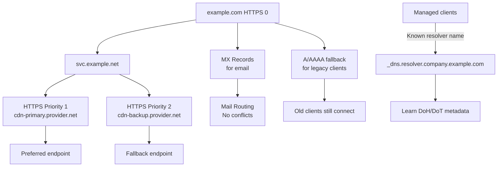

---

title: "DNS Service Binding (SVCB) and HTTPS Records: A Practical Guide"
authors: simonpainter
tags:
  - dns
  - security
  - networks
  - architecture
  - educational
date: 2026-03-09

---

In my previous post on [encrypted DNS](encrypted-dns.md), I mentioned SVCB and HTTPS records together. For encrypted DNS discovery specifically, it is SVCB, used with the DNS-server mapping in RFC 9461 and DDR in RFC 9462, that lets supporting clients discover encrypted resolver transports without a manually entered DoH URL. I got several follow-up questions asking what these records actually are, how they work, what problems they solve, and what new problems they create.

This is a deep dive into both. I'll explain the mechanics, show you how they work with real examples you can test, walk through their legitimate use cases, and then discuss the operational challenges they present, especially for organisations trying to maintain control over encrypted DNS at their perimeter.

I make no secret of the fact that I love DNS. I think it's one of the most fascinatingly simple yet powerful protocols in the internet stack. The strength of DNS is its flexibility to [do things that the original designers never imagined](dns-api-proxy.md), while its biggest weakness is its flexibility to do things that the original designers never imagined. SVCB and HTTPS records are a perfect example of both sides of that coin.

SVCB and HTTPS records are fundamentally different from the DNS records you're used to. They're not just another way to signpost from a domain to a server IP address. They're a service metadata layer that lets DNS tell clients which endpoints to use, which protocols those endpoints support, and how to connect to them. That flexibility is powerful. It's also why they've become a vector for unexpected behaviour in networks trying to enforce encrypted DNS policies.

Let's start with what they are and how they work.
<!-- truncate -->
## The Problem

Before RFC 9460 (November 2023), connecting to HTTPS services was surprisingly inefficient. Here's what happened:

Many sites still serve HTTP on port 80 and redirect to HTTPS. So your browser makes an HTTP request, gets a 301 redirect to `https://example.com`, then opens a TLS connection on port 443. That's already two round trips before any data flows.

Then the browser connects on HTTP/2, the server responds with an Alt-Svc header saying "hey, I also support HTTP/3", and the browser opens a new connection on QUIC. That's a third round trip. Multiple negotiations when one should have done the job.

Zone apex caused another headache. You couldn't use CNAME at `example.com`, only subdomains worked. This meant delegating your whole domain to a CDN was complicated. You had to either break your email routing or use hacky workarounds. The SVCB/HTTPS family fixed this for participating clients.

SVCB and HTTPS records let you move a lot of that connection metadata into DNS. Capable clients can learn supported protocols, preferred endpoints, and sometimes address hints before they connect. That can reduce redirects, avoid the Alt-Svc dance, and cut down on some follow-up lookups, but it does not magically eliminate every extra query in every implementation.

## How They Work

### The Basic Structure

A generic SVCB record looks like this:

```dns
_dns.resolver.example.com. 3600 IN SVCB 1 resolver.example.com. alpn="h2,h3" dohpath="/dns-query{?dns}"
```

Three key parts:

**Priority** (the `1` here) tells clients which record to try first. Lower numbers win. Priority 0 is special: it means "use this as an alias" (we'll get to that).

**Endpoint** (the `resolver.example.com` part) is where the service actually lives.

**Parameters** (the `alpn="h2,h3"` and `dohpath="/dns-query{?dns}"` bits) tell clients what protocols the endpoint supports and, for DoH, which URI template to use.

The important relationship is this: SVCB is the generic mechanism, while HTTPS is the SVCB-compatible RR type specialized for HTTPS origins. Because HTTPS already implies the `https` scheme, web clients query the origin name directly:

```dns
example.com. IN HTTPS 1 . alpn="h3,h2"
```

> Two useful bits of shorthand: RR type 65 is `HTTPS`, so `dig HTTPS example.com` is the readable way to query it. And in DNS-server SVCB records, `key7` is the parameter code for `dohpath`.

Generic SVCB is service-agnostic, so its owner name comes from the protocol mapping for that service, usually with underscored labels such as `_dns.resolver.example.com.`

### Understanding Prefix Labels and Service Names

SVCB query names come from the protocol mapping for the service you are describing. A common pattern is an underscored scheme label, and sometimes an extra port prefix for non-default ports:

```dns
_<scheme>.<name>
_<port>._<scheme>.<name>
```

**Examples:**

- `_dns.resolver.example.com` - SVCB records for a resolver named `resolver.example.com`
- `_9953._dns.dns1.example.com` - a DNS service on non-default port 9953
- `_8443._https.example.com` - HTTPS on non-default port 8443

The underscore prefix prevents conflicts with ordinary hostnames. A client looking for `_dns.resolver.example.com` will not accidentally match `resolver.example.com` itself. This service-awareness means you can describe different protocols cleanly without overloading the base hostname.

**For your main web service on the default HTTPS port**, you do not use prefix labels. Just use the HTTPS record at your origin name:

```dns
example.com. IN HTTPS 1 . alpn="h3,h2"
```

The HTTPS RR type is the specialized web variant, so it avoids the underscore label for ordinary `https://example.com` origins. If you are describing some other service, or HTTPS on a non-default port, the mapping-defined underscored name comes back into play.

### Two Operating Modes

**AliasMode** uses priority 0 and works like CNAME but only for the RR type being queried. For a web origin at the apex, that means `HTTPS 0`:

```dns
example.com. IN HTTPS 0 svc.example.net.
```

The clever part? You can publish this *and* keep your MX records for email. Web clients query `HTTPS`; mail clients query `MX`. CNAME would not let those coexist at the same owner name.

**ServiceMode** uses priority 1 or higher and describes a specific endpoint with its parameters. You can have multiple ServiceMode records:

```dns
example.com. IN HTTPS 1 cdn-eu.cloudflare.net. alpn="h3,h2"
example.com. IN HTTPS 2 cdn-us.akamai.com. alpn="h3,h2"
example.com. IN HTTPS 3 cdn-apac.fastly.net. alpn="h3,h2"
```

Clients prefer priority 1 first, then 2, then 3. The service metadata arrives up front, although clients may still need follow-up address lookups depending on the target names and resolver behavior.

## Browser Support and Practical Reality

Browser support is real, but it is not uniform.

- Safari on Apple platforms has historically been the most complete early implementation. In practice, Apple system networking has supported HTTPS RR processing since the iOS 14 and macOS 11 era, including direct use of HTTPS metadata for web connections.
- Chromium-based browsers such as Chrome and Edge have rolled support out gradually since the Chrome 96 timeframe. HTTPS-RR-driven upgrade and HTTP/3 behavior exist, but exact behavior has changed across releases, experiments, and platforms.
- Firefox has been more limited and conservative. You should not assume HTTPS-RR-driven `http` to `https` upgrade or direct HTTP/3 selection is active for every Firefox user.

The practical rule is simple: publish HTTPS records as an optimization layer, not as the only mechanism keeping your site secure or fast.

- Keep ordinary `301` or `308` redirects from `http` to `https`.
- Keep HSTS if you already use it.
- Keep Alt-Svc where it still helps older or slower-moving clients learn about HTTP/3.
- Keep working A/AAAA fallback for clients that ignore HTTPS records entirely.

## What You Can Actually Do With These

### Serving Your Apex Domain From a CDN

This was a painful problem before SVCB and HTTPS. You want to delegate your apex domain to a CDN, but you still need mail servers. CNAME will not work at the apex.

With HTTPS AliasMode:

```dns
example.com. IN HTTPS 0 cdn.provider.net.
example.com. IN MX 10 mail.example.com.
example.com. IN TXT "v=spf1 include:_spf.provider.net ~all"
```

Now web clients that understand HTTPS records can follow the web alias, while mail and SPF lookups still use the MX and TXT records at the same owner name.

**Why HTTPS AliasMode wins over CNAME at the apex:**

| Aspect | CNAME | HTTPS AliasMode |
| ------ | ----- | --------------- |
| Works at apex (`example.com`) | ✗ No | ✓ Yes |
| Allows other records at same level | ✗ No (CNAME excludes everything else) | ✓ Yes (MX, TXT, SPF, etc. coexist) |
| Service-specific | ✗ No (affects entire domain) | ✓ Yes (only HTTPS lookups follow it) |
| Often still needs follow-up address lookups | ✓ Yes | ✓ Yes |
| Standards status | ✓ Since 1987 | ✓ RFC 9460 (2023) |

Before HTTPS AliasMode, operators had to use workarounds: either put the apex on their own servers and proxy to the CDN, or move the site to a subdomain. HTTPS AliasMode makes the web part work correctly, although legacy clients still need ordinary A/AAAA fallback.

### Making HTTP/3 Work Better

HTTP/3 (QUIC) is faster and more resilient than HTTP/2, especially on slow or unstable networks. But clients don't know you support it without trial and error.

Old way: Browser connects on HTTP/2, server sends Alt-Svc header, browser waits, then reconnects on HTTP/3. Multiple round trips, extra latency.

New way: Your HTTPS record says it upfront:

```dns
example.com. IN HTTPS 1 . alpn="h3,h2"
```

Clients that support it can see this in DNS and attempt HTTP/3 immediately instead of waiting to learn about it from Alt-Svc after the first connection.

### Multi-Endpoint Failover Without BGP

Imagine you're operating a global service across multiple providers. You use one CDN as the preferred endpoint and another as a fallback. Traditionally you might reach for GeoDNS or BGP-heavy solutions.

With HTTPS, you can publish multiple endpoints in operator-preference order:

```dns
example.com. IN HTTPS 1 cdn-eu.cloudflare.net. alpn="h3,h2"
example.com. IN HTTPS 2 cdn-us.akamai.com. alpn="h3,h2"
example.com. IN HTTPS 3 cdn-apac.fastly.net. alpn="h3,h2"
```

Clients typically try the lowest priority first and can fail over if it is unavailable. That makes the record set useful for multi-endpoint failover and delegated service metadata. It is not a magic replacement for GeoDNS, though: geography comes from how those target names resolve and where those services live, not from `SvcPriority` itself.

### Automatic DNS Encryption Discovery

This is where things get interesting for enterprise security. As I covered in the [encrypted DNS post](encrypted-dns.md) and mentioned at the start of this post, SVCB records are the key to encrypted DNS discovery. When a client initially knows only a plaintext resolver IP, it can query `_dns.resolver.arpa` for SVCB records to learn about encrypted transports and parameters. This means you need to be careful if you want to maintain control over encrypted DNS at your network perimater, but it also means that supporting clients can discover DoH and DoT without a manually entered DoH URL. In practice you want to publish your own path to your own resolver when you come to support DoH or DoT, but also block other domain specific SVCB records to prevent auto-discovery of external DoH endpoints.

To test this, and assuming you have a recent version of dig, here is a special query every client can make:

```bash
dig _dns.resolver.arpa SVCB @1.1.1.1
```

This asks Cloudflare's resolver: "What's your encrypted endpoint?" And it responds:

```dns
_dns.resolver.arpa. 300 IN SVCB 1 one.one.one.one. alpn="h2,h3" port=443 key7="/dns-query{?dns}"
_dns.resolver.arpa. 300 IN SVCB 2 one.one.one.one. alpn="dot" port=853
```

> Try it yourself, the above is slightly simplified because Cloudflare also includes `ipv4hint` and `ipv6hint` parameters, but the key point is the same.

Translation: priority 1 advertises a DoH-capable endpoint using HTTP/2 or HTTP/3, and priority 2 advertises DoT.

**Understanding the `dohpath` parameter (key7):**

The `key7="/dns-query{?dns}"` part is the DoH path template. It tells clients how to construct a DoH request:

- `{?dns}` is a placeholder for the DNS query in wire format, base64url-encoded
- In resolver-name discovery, a client would construct a URI like `https://resolver.example/dns-query?dns=<base64url-query>`

Different providers use different paths:

- Cloudflare: `/dns-query{?dns}`
- Google: `/dns-query{?dns}`
- Custom resolvers: `/resolve{?dns}`, `/query{?dns}`, or another template that still contains the required `dns` variable

For IP-bootstrap DDR via `_dns.resolver.arpa`, there is one subtlety from RFC 9462: the client starts from the resolver IP it already knows. The SVCB data tells it which encrypted transports, ports, authentication names, and DoH path template are valid, but the bootstrap context still matters.

**The bootstrap trust problem:** The SVCB response arrives over plaintext DNS, so it cannot be trusted blindly. Before upgrading, the client must verify that the advertised DoH/DoT server actually controls the original resolver IP. It does this by checking the TLS certificate: the certificate presented by the encrypted endpoint must include the original plaintext resolver IP as a Subject Alternative Name (SAN). If it does not match, the client refuses to upgrade. This prevents an attacker on the plaintext path from redirecting DNS to a rogue encrypted resolver.

**Windows DDR support:** Microsoft co-authored the DDR specification and shipped support in Windows 11 and Windows Server 2022. You can enable it with:

```bash
netsh dns add global doh=yes ddr=yes
netsh dns add interface name="Ethernet" ddr=yes ddrfallback=no
```

Once enabled, the only plaintext DNS traffic on port 53 should be the DDR SVCB queries themselves. All other queries go over the discovered DoH connection. Set `ddrfallback=yes` if you want Windows to fall back to plaintext when DDR fails. Quad9 (`9.9.9.9`), OpenDNS (`146.112.41.2`), and Cloudflare (`1.1.1.1`) all support DDR discovery on their resolvers.

**A significant gap on the server side:** Windows DNS Server does not support SVCB or HTTPS record types, so you cannot use it to publish `_dns.resolver.arpa` records for your own internal resolver. If you are running a Windows DNS infrastructure and want to offer DDR to your clients, the most elegant workaround is to create a conditional forwarder for `resolver.arpa` pointing at a BIND instance that serves the SVCB records. Not ideal, but it works until Microsoft adds SVCB support to the server side.

If the resolver name is already known, you would publish something like this:

```dns
_dns.resolver.example.com. IN SVCB 1 resolver.example.com. alpn="h2,h3" dohpath="/dns-query{?dns}"
_dns.resolver.example.com. IN SVCB 2 resolver.example.com. alpn="dot"
```

With a supporting client and the right DDR validation model, that can move a device from plaintext bootstrap DNS to an encrypted resolver without a manually entered DoH URL. Powerful, but not unconditional or universal.

### Carrying More Than Protocol Hints

SVCB and HTTPS are not only about ALPN and ports. The design is meant to carry richer connection metadata, which is why these records matter to browser and CDN teams.

One example is [Encrypted Client Hello (ECH)](https://blog.cloudflare.com/encrypted-client-hello/), which aims to hide more of the TLS handshake metadata from passive observers. That sits slightly outside the core RFCs this post is focused on, so I am not going deep on the exact parameter definitions here.

> I have touched on SNI headers in the past and how they leak metadata, sometimes in a useful way like with firewall FQDN filtering without TLS inspection. [ECH](https://blog.cloudflare.com/encrypted-client-hello/) is an alternative to ESNI that encrypts the SNI and other handshake metadata, but it also requires clients to learn about ECH support through some out-of-band mechanism. SVCB and HTTPS records are a natural fit for that discovery, and some providers are already using them to advertise ECH support.

The important architectural point is that HTTPS records are a delivery mechanism for connection policy, not just a shortcut to HTTP/3. Once a client trusts that RRset, DNS can influence much more than which transport gets tried first.

## Real Examples You Can Test

### Cloudflare's Public Resolver

Run this:

```bash
dig _dns.resolver.arpa SVCB @1.1.1.1 +short
```

I ran this and got:

```text
1 one.one.one.one. alpn="h2,h3" port=443 ipv4hint=1.1.1.1,1.0.0.1 ipv6hint=2606:4700:4700::1111,2606:4700:4700::1001 key7="/dns-query{?dns}"
2 one.one.one.one. alpn="dot" port=853 ipv4hint=1.1.1.1,1.0.0.1 ipv6hint=2606:4700:4700::1111,2606:4700:4700::1001
```

What's happening here: priority 1 says "use DoH with HTTP/2 or HTTP/3". The `ipv4hint` and `ipv6hint` parameters can help clients avoid some follow-up address lookups when they honor them. Priority 2 offers DoT (DNS over TLS) as an alternative.

### Google's DNS

```bash
dig _dns.dns.google SVCB @8.8.8.8 +short
```

Output:

```text
1 dns.google. alpn="dot"
2 dns.google. alpn="h2,h3" key7="/dns-query{?dns}"
```

Google's RRset gives DoT priority 1 and DoH priority 2. The priorities express the operator's preference; the client still has to support the advertised transports.

### HTTPS Records in the Wild

```bash
dig HTTPS cloudflare.com @1.1.1.1 +short
```

Returns:

```text
1 . alpn="h3,h2" ipv4hint=104.16.132.229,104.16.133.229 ipv6hint=2606:4700::6810:84e5
```

That `.` means "use cloudflare.com itself" (not a different endpoint). The browser learns upfront that Cloudflare advertises HTTP/3. The address hints may let some clients skip follow-up address lookups, but they are still advisory.

## Setting this up for your domain

If you're using Cloudflare in proxied mode they are probably already publishing HTTPS records for you. If you want to set this up for your own domain, here are the steps:

> Make sure you have a recent version of `dig` that supports SVCB and HTTPS record types. Older versions ignore it completely, but you can still test with online tools or your browser's developer tools.

### Add Records to Your DNS

Most DNS providers now support SVCB and HTTPS records. Cloudflare, AWS Route 53, DNSimple, Akamai, and Google Cloud DNS all have it. Check your provider's UI or API.

For a basic HTTP/3-enabled domain:

```dns
example.com. 3600 IN HTTPS 1 . alpn="h3,h2"
```

If you are using a separate target name, you can add address hints so capable clients may skip some follow-up address lookups:

```dns
example.com. 3600 IN HTTPS 1 svc.example.net. alpn="h3,h2" ipv4hint=203.0.113.10 ipv6hint=2001:db8::10
```

### Test It

```bash
dig HTTPS example.com +short
```

You should get your record back. If nothing appears, check that your provider supports the record type or wait for DNS caching to clear.

If you don't have `dig` installed locally, use these browser-based tools instead:

- [Google Toolbox Dig](https://toolbox.googleapps.com/apps/dig/#SVCB/) – Enter your domain name and query type SVCB or HTTPS
- [nslookup.io](https://www.nslookup.io/) – Visual interface for checking SVCB records

### Verify with Different Resolvers

Query different resolvers to ensure consistency:

```bash
dig HTTPS example.com @8.8.8.8
dig HTTPS example.com @1.1.1.1
dig HTTPS example.com @9.9.9.9
```

All should return the same thing (allowing for TTL differences).

## Another Concrete Example: Apex Alias with Multiple Endpoints

Let's say you're operating a public website at the apex, want to delegate the web service cleanly, and still keep mail records at the same owner name. Here's what your zone could look like:

```dns
; HTTPS alias for the web service at the apex
example.com. IN HTTPS 0 svc.example.net.

; Service metadata lives on the delegated name
svc.example.net. IN HTTPS 1 cdn-primary.provider.net. alpn="h3,h2"
svc.example.net. IN HTTPS 2 cdn-backup.provider.net. alpn="h3,h2"

; Legacy fallback for clients that ignore HTTPS records
example.com. IN A 192.0.2.10
example.com. IN AAAA 2001:db8::10

; Email still works because HTTPS aliasing is RR-type-specific
example.com. IN MX 10 mail.example.com.
example.com. IN MX 20 mail-backup.example.com.

; Resolver-name discovery for clients that already know the resolver name
_dns.resolver.company.example.com. IN SVCB 1 resolver.company.example.com. alpn="h2,h3" dohpath="/dns-query{?dns}"
_dns.resolver.company.example.com. IN SVCB 2 resolver.company.example.com. alpn="dot"
```

What this gives you:

Your web origin can delegate HTTPS service metadata without sacrificing MX records. Supporting clients prefer the primary CDN metadata and can fall back to the secondary. Legacy clients still have ordinary A/AAAA fallback. The resolver-name SVCB records are separate: they help clients that already know `resolver.company.example.com` discover DoH and DoT.

This is simpler than trying to fake apex aliasing with CNAMEs, but it still needs realistic deployment hygiene: fallback A/AAAA for legacy clients, ordinary HTTPS redirects and HSTS for browsers that ignore HTTPS RRs, and a clear distinction between resolver-name discovery and `_dns.resolver.arpa` bootstrap DDR.



### Track Adoption

Monitor your HTTP/3 traffic ratio over time. Most analytics providers show this. When you publish HTTPS records with `alpn="h3,h2"`, you may see HTTP/3 adoption climb noticeably on clients that honour the records.

## Enterprise and CSP Use Cases

### Service Providers and Operational Benefits

From a service provider perspective, SVCB and HTTPS records can reduce recovery time during incidents. If your primary endpoint fails, participating clients already know about the secondary and can fall back without waiting for the next DNS publishing cycle. Your records define the preference order:

```dns
example.com. IN HTTPS 1 cdn-primary.provider.net. alpn="h3,h2"
example.com. IN HTTPS 2 cdn-backup.provider.net. alpn="h3,h2"
```

Most clients try priority 1 first and can fail over when that endpoint is unreachable. Some implementations may even probe more than one option in parallel, but you should treat that as an implementation detail rather than a universal guarantee.

### DNS Traffic Optimization for CSPs

ISPs and managed security providers can benefit from `ipv4hint` and `ipv6hint` parameters when the target name is separate from the owner name. These hints can reduce follow-up address lookups for clients that honor them:

```dns
example.com. IN HTTPS 1 svc.example.net. alpn="h3,h2" ipv4hint=203.0.113.10,203.0.113.11 ipv6hint=2001:db8::10
```

Without hints, a client must:

1. Query for HTTPS record (learns endpoint: `svc.example.net`)
2. Query for A record (learns IPv4)
3. Query for AAAA record (learns IPv6)
4. Connect

With hints, supporting clients can often skip steps 2 and 3. The hints are advisory rather than mandatory, but they can still reduce resolver load and shave time off connection setup.

### Encrypted DNS Discovery for Enterprise Networks

Organisations requiring encrypted DNS can use SVCB for resolver-name discovery when the resolver name is already known through DNR, manual configuration, or device management:

```dns
_dns.resolver.company.example.com. IN SVCB 1 resolver1.company.example.com. alpn="dot" port=853
_dns.resolver.company.example.com. IN SVCB 2 resolver1.company.example.com. alpn="h2,h3" dohpath="/dns-query{?dns}"
```

That is different from `_dns.resolver.arpa`, which is the bootstrap DDR query used when the client initially knows only a plaintext resolver IP. In both cases, supporting clients can discover encrypted transports without a hardcoded DoH URL, but automatic use still depends on client behavior and validation rules.

## Standards and Safety

### What You Need to Know

SVCB and HTTPS are standardized in RFC 9460. RFC 9461 defines the DNS-server mapping including `dohpath`, and RFC 9462 defines DDR. Adoption is strong among infrastructure providers, but client behavior still varies.

**DNSSEC matters.** Signing SVCB and HTTPS records helps protect clients from tampering and downgrade attacks. Check your records:

```bash
dig HTTPS example.com +dnssec
```

If `RRSIG` appears, signatures are published. If you query a validating resolver and see the `ad` flag, validation succeeded for that response.

**Backward compatibility is built in.** Old clients simply ignore these records and fall back to standard connections. No breaking changes. No legacy client pain.

## Getting Started

1. Use a recent `dig` if you want clean SVCB/HTTPS formatting.
2. Test Cloudflare's and Google's resolvers to understand the format.
3. Add HTTPS records to your domain (start simple: `alpn="h3,h2"`).
4. Test with `dig HTTPS yourdomain.com @8.8.8.8`.
5. Verify clients can connect normally, and keep redirects/HSTS for clients that ignore HTTPS records.
6. For enterprise use, distinguish `_dns.resolver.arpa` bootstrap discovery from `_dns.<resolver-name>` discovery.

Start simple, validate with real clients, and treat these records as an optimization layer rather than a magic replacement for every existing control.

## The Operational Challenges: Problems SVCB Creates

For most organisations, SVCB and HTTPS records are unambiguously good. But there's a significant operational class where they present real problems: organisations trying to maintain control over encrypted DNS at their network perimeter.

### Auto-Discovery of Unauthorized DoH Endpoints

Recall from the encrypted DNS post: supporting browsers and operating systems can query `_dns.resolver.arpa` to ask "where's your encrypted DNS endpoint?" SVCB records provide the answer. A client that gets a plaintext resolver from DHCP may then discover encrypted transports and, if its validation rules are satisfied, upgrade without an administrator explicitly entering a DoH URL.

When clients implement it, this can happen transparently. The user usually does not see it. The administrator may not see it either. Traffic analytics show HTTPS on port 443, which is so common it can disappear into the background. Your carefully planned encrypted DNS perimeter control can quietly stop working.

From a network security and compliance perspective, this is a problem. Your organisation decides all internal DNS should flow through your resolver with all the visibility and threat intelligence that entails. SVCB-based discovery can undermine that decision at the protocol level.

### The DDR Design Decision

This behaviour is intentional. RFC 9461 and RFC 9462 explicitly define how DNS clients can learn encrypted resolver transports and parameters without manual endpoint configuration. The goal is to make encrypted DNS easier to discover and deploy, not something that only works after hand-entering a DoH URL.

This is a reasonable security goal, because encrypted DNS is more private than plaintext. But it conflicts directly with the security goal of network administrators who want to *inspect* DNS for threats.

### Blocking SVCB Records as Defence

The standard mitigation is what I mentioned in the encrypted DNS post: block SVCB and HTTPS record types at your internal resolver. Infoblox Advanced DNS Protection (ADP) does this by default with four blocking rules:

- DNS HTTPS record (Rule ID 130502880)
- DNS HTTPS record TCP (Rule ID 130506000)  
- DNS SVCB record (Rule ID 130502870)
- DNS SVCB record TCP (Rule ID 130505900)

If clients never receive SVCB responses, they can't discover external DoH endpoints. They can't auto-upgrade. Your resolver remains the path of least resistance.

But this isn't a complete solution. It addresses auto-discovery but not clients with hardcoded DoH endpoints. A browser with `https://1.1.1.1/dns-query` baked in will use it regardless of SVCB records. Blocking SVCB is structural defence against auto-discovery, not perimeter defence.

### The Wider Problem: Protocol Layering

SVCB records expose a deeper tension in network architecture: what layer owns DNS policy?

**DNS layer perspective:** SVCB records are just DNS records. They're published by domain owners. Blocking them feels like censoring published information.

**Network perimeter perspective:** SVCB records are a bypass mechanism. They're infrastructure that circumvents network policy. Blocking them feels like basic access control.

Both perspectives are technically correct. They're in direct conflict.

An organisation enforcing encrypted DNS at the perimeter, blocking port 853, blocking known DoH provider IPs, and filtering SNI on port 443, is implementing a deliberate security policy. SVCB records are a vector for that policy to be circumvented.

Conversely, a user who wants privacy is entitled to it. Blocking SVCB records to prevent privacy-seeking behaviour is ethically arguable.

### Practical Mitigation Beyond Record Blocking

Blocking SVCB records at the resolver helps. But complete control requires multiple layers:

1. **Block the record types** (SVCB/HTTPS) at your internal resolver to prevent auto-discovery
2. **Block known DoH provider IPs** via threat intelligence feeds (Infoblox `Public_DOH_IP` feed, for example)
3. **Filter SNI on port 443 egress** to block known DoH provider domains even if clients hardcode them
4. **Monitor DNS analytics** for queries to known resolver infrastructure
5. **Monitor HTTP traffic** to port 443 for DoH patterns such as `GET` or `POST` requests to known DoH paths

No single layer is sufficient. SVCB records are just one part of a larger problem.

### When to Block, When to Allow

This depends on your security posture and threat model:

**Block SVCB/HTTPS records if:**

- You're required by compliance to inspect all DNS (healthcare, finance, government)
- You operate a zero-trust network where DNS is part of the trust chain
- Your threat intelligence depends on seeing DNS traffic unencrypted
- You have explicit policy that all DNS must route through your resolver

**Allow SVCB/HTTPS records if:**

- You trust your users to manage their own privacy
- Your security model doesn't depend on DNS visibility
- You're trying to encourage encrypted DNS adoption as a general principle
- You can monitor encrypted traffic patterns anyway (throughput, timing, destination IPs)

Both are defensible. The key is making the decision consciously, understanding the trade-offs, and implementing the mitigation layers that choice requires.

## Resources

- [RFC 9460: SVCB and HTTPS Records](https://datatracker.ietf.org/doc/rfc9460/)
- [RFC 9461: SVCB for DNS Servers](https://datatracker.ietf.org/doc/rfc9461/)
- [RFC 9462: Discovery of Designated Resolvers](https://datatracker.ietf.org/doc/rfc9462/)
- [ISC BIND SVCB Documentation](https://kb.isc.org/docs/svcb-and-https-resource-records-what-are-they)
- [dnsdist SVCB Configuration](https://www.dnsdist.org/reference/svc.html)
- [APNIC Research on DDR Deployment](https://blog.apnic.net/2025/09/02/discovering-the-discovery-of-designated-resolvers/)
- [Microsoft: Making DoH Discoverable with DDR](https://techcommunity.microsoft.com/blog/networkingblog/making-doh-discoverable-introducing-ddr/2887289) – Windows DDR implementation and TLS validation
- [Google Toolbox Dig Tool](https://toolbox.googleapps.com/apps/dig/#SVCB/) – Query SVCB records from your browser
- [nslookup.io SVCB Checker](https://www.nslookup.io/domains/fluxteam.net/dns-records/svcb/) – Visual SVCB record lookup
