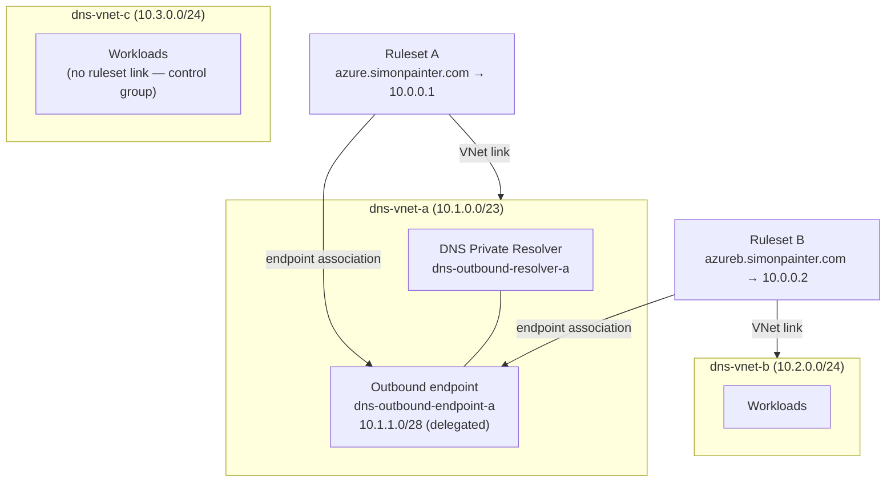
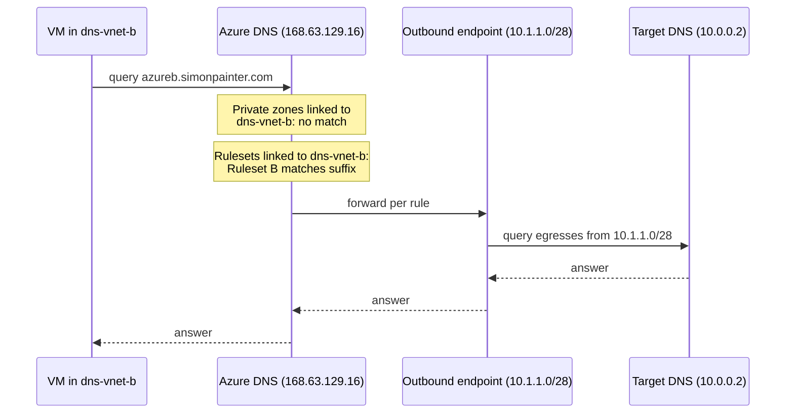

Azure DNS Private Resolver has a documented limit that reads like a feature: two DNS forwarding rulesets per outbound endpoint. The portal, however, behaves as though the limit is one. This is the story of proving the documentation right, the portal wrong, and why you might actually want two rulesets on the same endpoint in the first place.

<!-- truncate -->

## The problem

A DNS forwarding ruleset in Azure does two jobs that are easy to conflate. It holds the conditional forwarding rules — this domain goes to these DNS servers — and it links to virtual networks, which determines who gets to use those rules. The outbound endpoint association is a third, separate concern: it's just the egress point, the subnet the forwarded queries actually leave Azure from.

Because those are independent axes, an obvious design falls out. Suppose you have a shared services hub with a resolver, and you want workloads in one spoke VNet to resolve a private domain via conditional forwarding, but you *don't* want that rule polluting resolution for every other VNet in the estate. Ruleset links give you exactly that scoping: link a ruleset only to the VNets that should evaluate its rules.

But you don't want a second outbound endpoint just to carry the second ruleset. Outbound endpoints each demand a dedicated delegated subnet, and — more importantly if there's a firewall between Azure and your on-premises DNS servers — each endpoint is a different source subnet that someone has to write an ACL for. One egress point, multiple rule scopes, is the tidy answer.

The documentation says this works: two rulesets per outbound endpoint, 1,000 rules each. The portal says otherwise — try to associate a second ruleset with an endpoint that already has one and the option is simply not available. There's even a footnote buried in the limits documentation admitting that "different limits might be enforced by the Azure portal until the portal is updated," which is a polite way of saying the portal hasn't kept up with the API.

So: lab it.

## The topology

Three VNets, full mesh peering (the peering is irrelevant to the DNS behaviour, but it makes the lab reusable for reachability testing later). The resolver and its single outbound endpoint live in `dns-vnet-a`. Ruleset A links to `dns-vnet-a`; ruleset B links to `dns-vnet-b`. Both rulesets associate with the same outbound endpoint.



The point of the diagram is the fan-in on the right-hand side: two rulesets, two different VNet scopes, one egress point. `dns-vnet-c` deliberately has no ruleset link, so it's the control — queries from there for either domain should fall through to public resolution.

## The lab build

The base infrastructure is Terraform. The interesting parts are the delegated subnet for the outbound endpoint and the first ruleset; the VNets and peering mesh are boilerplate `for_each` maps I won't reproduce in full.

```hcl
resource "azurerm_subnet" "dns_resolver_outbound" {
  name                 = "snet-dns-resolver-outbound"
  resource_group_name  = azurerm_resource_group.dns_resolver_lab.name
  virtual_network_name = azurerm_virtual_network.dns_resolver_lab["a"].name
  address_prefixes     = ["10.1.1.0/28"]

  delegation {
    name = "Microsoft.Network.dnsResolvers"

    service_delegation {
      name    = "Microsoft.Network/dnsResolvers"
      actions = ["Microsoft.Network/virtualNetworks/subnets/join/action"]
    }
  }
}

resource "azurerm_private_dns_resolver_outbound_endpoint" "dns_resolver_lab" {
  name                    = "dns-outbound-endpoint-a"
  location                = var.location
  private_dns_resolver_id = azurerm_private_dns_resolver.dns_resolver_lab.id
  subnet_id               = azurerm_subnet.dns_resolver_outbound.id
}

resource "azurerm_private_dns_resolver_dns_forwarding_ruleset" "dns_resolver_lab" {
  name                                       = "dns-forwarding-ruleset-a"
  location                                   = var.location
  resource_group_name                        = azurerm_resource_group.dns_resolver_lab.name
  private_dns_resolver_outbound_endpoint_ids = [azurerm_private_dns_resolver_outbound_endpoint.dns_resolver_lab.id]
}
```

The outbound endpoint gets a dedicated /28 with the `Microsoft.Network/dnsResolvers` delegation — nothing else can live in that subnet. Note that unlike the inbound endpoint, the outbound endpoint doesn't get an IP address of its own; queries egress from addresses within the delegated subnet.

## Adding the second ruleset

This is the bit the portal won't do, so it's PowerShell. The `Az.DnsResolver` cmdlets take the outbound endpoint as a hashtable with an `id` key, which is a slightly odd shape but works:

```powershell
$rg       = "lab-simon-dnsresolver"
$location = "uksouth"

$outboundEndpoint = Get-AzDnsResolverOutboundEndpoint `
    -DnsResolverName "dns-outbound-resolver-a" `
    -ResourceGroupName $rg `
    -Name "dns-outbound-endpoint-a"

$rulesetB = New-AzDnsForwardingRuleset `
    -Name "dns-forwarding-ruleset-b" `
    -ResourceGroupName $rg `
    -Location $location `
    -DnsResolverOutboundEndpoint @{id = $outboundEndpoint.Id}
```

No complaint from the API. The endpoint that the portal insisted was fully occupied accepted the second association without argument. Then the rule and the link to `dns-vnet-b`:

```powershell
New-AzDnsForwardingRulesetForwardingRule `
    -DnsForwardingRulesetName $rulesetB.Name `
    -ResourceGroupName $rg `
    -Name "azureb-simonpainter-com" `
    -DomainName "azureb.simonpainter.com." `
    -ForwardingRuleState "Enabled" `
    -TargetDnsServer @(@{IPAddress = "10.0.0.2"; Port = 53})

$vnetB = Get-AzVirtualNetwork -ResourceGroupName $rg -Name "dns-vnet-b"

New-AzDnsForwardingRulesetVirtualNetworkLink `
    -DnsForwardingRulesetName $rulesetB.Name `
    -ResourceGroupName $rg `
    -Name "dns-vnet-b-link" `
    -VirtualNetworkId $vnetB.Id
```

Two details worth knowing. The domain name needs the trailing dot — `azureb.simonpainter.com.` — or the API rejects it. And a rule can carry up to six target DNS servers, tried in the order listed: the first IP is used unless it fails to respond, at which point the platform walks the list with an exponential backoff. It's failover ordering, not load balancing.

## What actually happens to a query

The part of this that trips up people arriving from traditional DNS infrastructure: the VNet doesn't point at the resolver. There's no custom DNS server setting involved. Linked VNets keep the default Azure-provided DNS (168.63.129.16), and the ruleset evaluation happens inside the Azure DNS platform.



The consequences of this design are what make the two-ruleset pattern useful:

A VM in `dns-vnet-b` querying `azureb.simonpainter.com` matches ruleset B and gets forwarded. The same VM querying `azure.simonpainter.com` matches nothing — ruleset A isn't linked to its VNet — and falls through to normal resolution. The rules are genuinely scoped per VNet, not per resolver.

Both forwarded query streams egress from the same 10.1.1.0/28 subnet. If the targets sit behind a firewall, there's exactly one source prefix to permit, no matter how many rulesets or linked VNets accumulate behind it.

And the linked VNet doesn't need peering to the resolver's VNet for any of this to work. The forwarding happens on the platform side; the only data-path requirement is that the *targets* are reachable from the outbound endpoint's subnet. The peering mesh in my lab is there for testing convenience, not because the resolver needs it.

## The caveats

The two-per-endpoint limit is a hard one, so this pattern buys you exactly one extra scope per endpoint. If you need finer-grained per-VNet rule scoping than two buckets, you're into additional outbound endpoints (maximum five per resolver, so ten rulesets in total) or rethinking the design.

Rule precedence *within* a ruleset is longest-suffix match, which is well defined. Precedence *across* two rulesets linked to the same VNet is not documented at all. Keep the namespaces disjoint between rulesets sharing a VNet — don't put `example.com` in one and `corp.example.com` in the other and hope.

The portal will happily display both associations once they exist — the endpoint's blade shows its rulesets, provisioning state Succeeded, everything looks intentional. It just won't let you create the second one. Until the portal catches up with its own API, this is a PowerShell, CLI, ARM, or Terraform job. (In Terraform it's trivial: two `azurerm_private_dns_resolver_dns_forwarding_ruleset` resources referencing the same endpoint ID in `private_dns_resolver_outbound_endpoint_ids`. If you've proven it manually first, `terraform import` the second ruleset or delete and recreate.)

## A footnote on Cloud Shell

One hazard encountered along the way that had nothing to do with DNS: PSReadLine's inline prediction in Cloud Shell. Its ghost-text suggestions kept getting accepted mid-edit, splicing fragments like `[outboundendpoint.id]` into commands — and on one occasion inside quoted strings, which would have created a forwarding rule for the literal domain `example.com.` had the parser not choked on an earlier token first. If you're pasting multi-line commands into Cloud Shell, do yourself a favour first:

```powershell
Set-PSReadLineOption -PredictionSource None
```

The predictive text is occasionally useful. It is never useful while pasting production DNS changes.

## Summary

The documentation is right and the portal is wrong: an outbound endpoint supports two forwarding rulesets, and the pattern of one shared egress point carrying separately-scoped rule sets for different VNets works exactly as the component model suggests it should. You just can't click your way to it.
