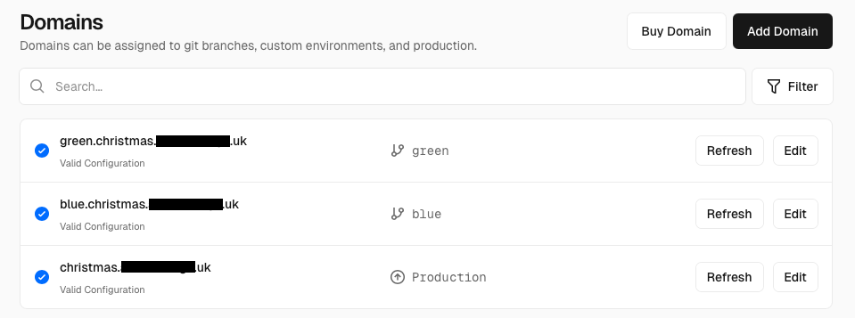

---

title: My first look at Vercel
authors: simonpainter
tags:
  - cicd
  - automation
  - programming
  - github
  - cloud
  - ai
  - aws
  - opinion
date: 2025-12-15

---

I was having a conversation recently and Vercel came up. The organisation I am currently working with has been exploring it as it seems to offer a lot of benefits for developers who have been let down by the promises of cloud.
I have to admit that I had not really looked at Vercel before, so I decided to take a look and while I was at it ended up building and deploying a simple web application that has been on the bottom of my to-do list for a while.
<!-- truncate -->
I guess the place to start is with what Vercel actually is. It has the vibe coding vibe and another close friend of mine likened it to [Replit](https://replit.com) and [Base44](https://base44.com/) which both allow you to turn ideas into applications using an agentic code factory. Vercel do have a similar product called [v0](https://v0.app) which is another vibe coding environment but that wasn't what I was looking at; between [Claude Code](https://claude.ai/code/) and [GitHub Copilot](https://code.visualstudio.com/docs/copilot/overview) I have more than enough help writing bad code.

Vercel is a cloud platform for deploying your web applications with a focus on performance, scalability, and developer experience. It aims to take the infrastructure management burden off developers so they can build and deploy the applications quickly and easily. For larger organisations this is probably something you already do with your existing developer experience but for smaller teams and individual developers this is a big deal.

> When I say that Vercel is a cloud platform I mean it's really a SaaS control plane that sits on top of AWS.
> The serverless function execution is powered by AWS Lambda and the static assets are stored in AWS S3. There is a small
> selection of integrations to other providers for databases and other services but the core of the platform is built on
> AWS.

## Getting started

I signed up with the Hobby plan. There are basically three plans: Hobby, Pro, and Enterprise. The Enterprise plans is not very transparent as you have to contact Vercel for pricing and I was told it was a "a custom plan built out for your unique usage and feature set". The Pro plan is $20 per month per seat and that is a committed spend to usage charges; the free Hobby plan has many of the same features as the Pro plan but with hard ceiling usage limits.

The sign up process is easy enough; you can sign up with GitHub, GitLab, Bitbucket, or email. I signed up with GitHub and authorised Vercel to access my repositories. There are a couple of optins to start building immeidately: you can either connect to one of your own existing repositories or you can create a new project from a template. I decided I needed a bit more time with Python and FastAPI so I created a new repository from the [FastAPI template](https://vercel.com/new/simon-painters-projects/templates/python/fastapi-python-boilerplate). This created a new repository in my GitHub account and I was able to clone it locally. It also deployed the application to a Vercel URL withn a few seconds and I could click a link to see my boilerplate FastAPI application.

## Working out the workflow

I wanted to work out how to connect a datastore but first I had to do the obligatory test of making a code change. I opened the project in vscode and made the obligatory hello world endpoint and committed the change. Once I pushed the change to GitHub it immediately triggered a new deployment in Vercel and as this deployment was on the main branch it updated the production deployment. 17 seconds later I was able to hit refresh and see the new endpoint live in a browser. I tinkered around with this before realising that it would be a lot quicker for me to run uvicorn locally so I could see the changes locally and only push when I was happy with the change. This then led to me back to thinking about how to connect a data storage option.

## Connecting a database

The data store options are both limited and unlimited. Vercel have a couple of their own options: Edge Config and Blob. Vercel Blob is object storage that is basically a rebadged AWS S3 as far as I can tell and I suspect that Edge Config looks very similar to Cloudfront Key-Value store. There are a few third party marketplace options so I opted for Upstash for Redis which has a free tier that was more than enough for my needs. The integration process was, on the surface very simple, however I did hit a few snags. The integration process puts a few environment variables into your Vercel project but these are not the same environmnent variables that the `Redis.from_env()` method in `upstash_redis` uses. The quickstart in the dashboard for the integration literally tells you to use that method

```python
from upstash_redis import Redis
redis = Redis.from_env()
redis.set("foo", "bar")
value = redis.get("foo")
```

It's not really that big of a deal and I was able to work it out from the error messages but it did slow me down a bit. Once I had worked out the correct environment variables to use I was able to get the connection working and store and retrieve values from Redis. There is a nice tight integration in the Vercel dashboard to open your table in the Upstash console so youc an use the data browser and other tools to manage your data.

## Boiler plate to testing in about an hour

The app I had in mind was a simple application to manage my christmas card list. I have a spreadsheet that I used but each year people move house and I don't always get around to updating it. I have long wanted a simple web application to enable people to update their own details so I can mail merge my envelopes in late November with confidence. I started with a simple FastAPI endpoint to POST and another to GET - nothing fancy. Then a simple HTML and JS static form to display a pre populated form with a data extract from my spreadsheet and POST the updated details back to the FastAPI endpoint. Each person has a unique ID and a GUID secret so they can only update their own details and I have a local script to generate QR codes for stickers to go in next year's Christmas cards. I had the whole thing working pretty quickly and deployed to a preview branch so that I could test. I asked [Zain](/authors/zainkhan) to test it and he was able to access the preview by logging in with his GitHub account and sending an access request. Once I was happy with it I merged the changes to main and Vercel deployed it to production.

## Adding a domain

I have a domain I use for family stuff so I decided it would look a bit less sketchy if I used that rather than the default Vercel URL. Adding a domain is really simple; more so than a lot of platforms because creating the CNAME record also serves the purpose of verifying domain ownership. This meant that the SSL certificate was automatically created and I was able to access the site securely with HTTPS on my own domain straight away.

## But how does it look?

My blank and boring form needed some styling so I added a couple of options for CSS stylesheets. This gave me the chance to do a bit of blue/green testing. I created two branches, one called green and one called blue, and made my changes to the CSS in each branch. I then created two new domains (actually subdomains of the main domain) and linked each one to the corresponding Github branch.



This meant both could be viewed live in preview and I could get feedback before merging the one I liked best into main for production deployment. Edge config in Vercel means that you can direct the users to the correct version of the site based on geography, A/B testing, or other criteria so you can maintain multiple versions of the site and switch users between them seamlessly.

## Some thoughts

I was looking at Vercel with a bit of scepticism initially but I have to say I was pleasantly surprised. It definitely has a lot to offer for the hobbyist and small development shops that don't have the resource to build and maintain their own infrastructure automations and create a full developer experience. The tight integration with GitHub et al means that you can get started quickly without leaving the confines of the tools you already know well. The deployment speed is impressive although I didn't test it on a large codebase or a complex rendering pipeline so I can't comment on that. The pricing at the lower end is excellent however it's too opaque at the enterprise level. The point where you move from Vercel to managing it yourself in AWS is a bit fuzzy and it would depend on the maturity of the organisation but I suspect for anything beyond a small team on Pro plan you'd be better off having your own team managing your cloud infrastructure directly.

As it's built on AWS you have to operate in some tight confines and that's good for organisations lacking the maturity of good architectural standards. There are also some options for peering the underlying VPCs into your own AWS account so that you can connect to your own databases and services over a private network. There is also an option for VPN which is likely to be built on AWS VPN gateways but it's all restricted to the Enterprise plan so I wasn't able to test that out. I expect for organisations with a large heritage estate that their cloud apps need to connect to on-prem it would be hard to justify Vercel over doing it yourself.

Overall I was impressed with Vercel and I can see why it's gaining popularity among developers. It offers a streamlined and efficient way to deploy web applications without the overhead of managing infrastructure, making it an attractive option for many use cases.
