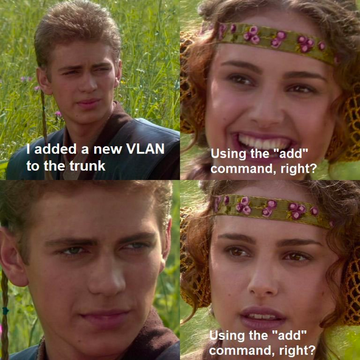

---

title: The vlan add disaster
authors: simonpainter
tags:
  - networks
  - opinion

date: 2025-06-12

---

A couple of days ago, I saw a meme targeted at network engineers that mentioned "the VLAN add disaster." I immediately understood what it meant. It feels like such a well-known thing now, enough to warrant a place in a meme, that it's become part of our professional zeitgeist over the last decade in networking.
<!-- truncate -->

> For the uninitiated, there's a command to restrict a VLAN-tagged trunk to carry only
> specific VLANs. The command to restrict it to, say, VLANs 5, 6, 7, and 9 is
> `switchport trunk allowed vlan 5-7,9`. As you can see, you can use ranges or
> comma-separated values.
>
> If you want to add VLAN 8 to the list above, you use the command
> `switchport trunk allowed vlan add 8`. What you definitely don't do is forget the `add`
> keyword and just type `switchport trunk allowed vlan 8`—because that replaces the existing
> list with whatever you included in the command. You could alternatively type
> `switchport trunk allowed vlan 5-9`, but who does that?

This is so ingrained in network engineer culture that I don't know a single engineer who doesn't have a war story about either their own mistake or someone else's in their organisation. I remember working at a bank in the middle of a very long, ongoing datacentre migration. They were using OTV to stretch L2 from one site to another while VMs and physical hardware were moved over. A large number of subnets were stretched, with the gateway migrated only when roughly 50% of servers had been moved. There were nightly changes to add VLANs to OTV and the corresponding trunks, and one of them had fallen victim to the VLAN add disaster. By the time I joined, every change manager was obsessed with asking whether someone had verified that the `add` keyword was included in the change plan.

My own story was actually a near miss. Not through my own smugness, but because a fantastically diligent ops guy was assigned to peer-review my change. He came over with his laptop, pointed to the line in my change script, and simply said, "nearly, mate."

While I was thinking about this, I nearly sat down to write about the absurdity of the UI mistake that Cisco made with that command. As I thought it through, though, I realised there probably wasn't a better way to implement it. The default state is to declaratively specify what you want; if you want to specify a delta with either the `add` or `remove` keyword, then you do just that. Having the default action as `add` would mean that `remove` would need to be supplemented with some other keyword, such as `replace`.

## The Value of Peer Review

I found myself thinking more about the value of good peer review and how it saved me from an outage, a long night, and almost certainly some real embarrassment. The simple act of running a fresh pair of eyes over a change plan can be all it takes to spot an error that could be catastrophic.

One recent organisation I worked with had a succession of avoidable outages and implemented a four-eyes change process where each change was done in tandem with two engineers on a shared screen during a recorded Teams session — a buddy system where the change implementer asked for approval from their buddy before hitting enter on each command. While it was onerous and resulted in massive costs and delays to networking projects, it was extremely effective. I can't imagine anyone outside the most critical infrastructure would have appetite for such an approach long-term.

## Speed vs. Safety

Strangely, the velocity of change is often cited as the reason for not having extensive peer reviews. I worked at a retailer that insisted on slowing down the change process to give more time for review. The newly appointed senior director of service mandated that all changes had to be raised a full month before the implementation date. The timestamp for the creation of the change would be checked by the change management team, and anything raised less than a month before the change date would not be allowed.

Two enterprising project managers from the northwest immediately raised dozens of blank changes and left them in draft state, selling them individually, for a small consideration, to their less-prepared colleagues a little over a month later when the golden quarter change freeze approached. It turned out that a more effective way to give time for review was to lengthen the minimum time between the submission of a fully completed change and the change date.

But velocity of change is exactly when four-eyes peer review is important, and it doesn't have to be an onerous process that delays the change. I spent time with an organisation going through a crisis where most of the change processes were unusable because the tooling was broken. One of the first things I did was ensure that all network changes had a second set of eyes on them, initially my own, but later this was scaled out to cover 24/7 crisis operations. Having at least one senior engineer on shift at all times just to do change reviews may have seemed indulgent, but it undoubtedly averted many mistakes that tired, stressed, and overworked engineers would have been forgiven for making. As the crisis abated, the culture of review continued in that organisation, providing a new level of transparency and accountability that I'm very proud of.

## More Than Just a Command

The VLAN add disaster has become more than just a cautionary tale about a poorly designed command — it's become a cultural touchstone that reminds us why we need each other. Every network engineer who's heard the story, whether they've lived it or not, understands the fragility of our infrastructure.

What started as a meme about Cisco command syntax reveals something deeper about our profession. We work in an environment where a single mistyped word can bring down critical services, where the pressure to move fast can cloud our judgment, and where the complexity of our systems often exceeds what any one person can safely navigate alone. The VLAN add disaster isn't really about VLANs at all—it's about the necessity of humility, the value of collaboration, and the wisdom of building safety nets into our processes.

The next time you're about to hit enter on a command, remember that diligent ops guy who saved me from my own mistake. Remember that good peer review isn't about slowing things down or questioning competence—it's about acknowledging that we're all human, and that our best defense against disaster is often just another pair of eyes and a simple question: "Are you sure about that, mate?"
