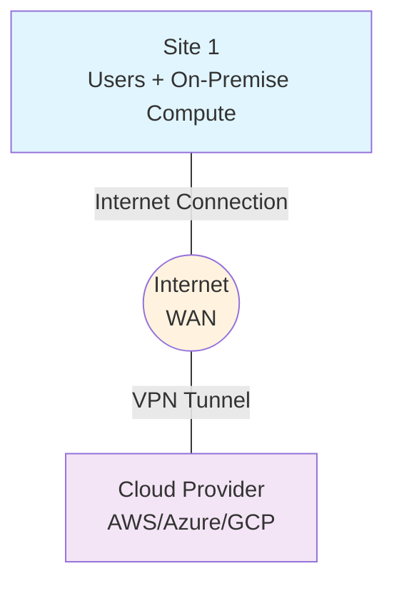
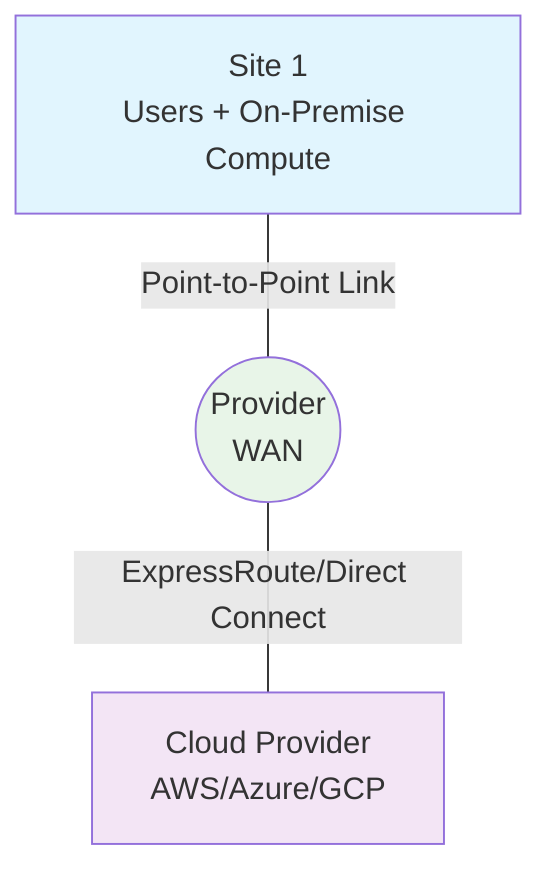
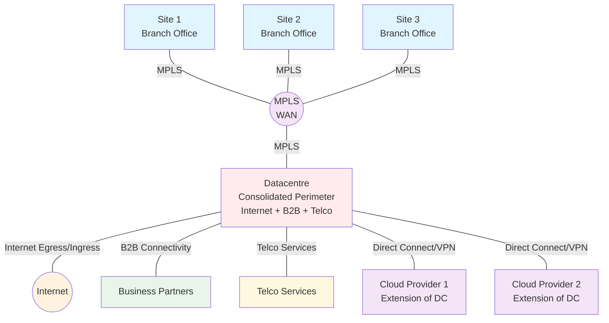
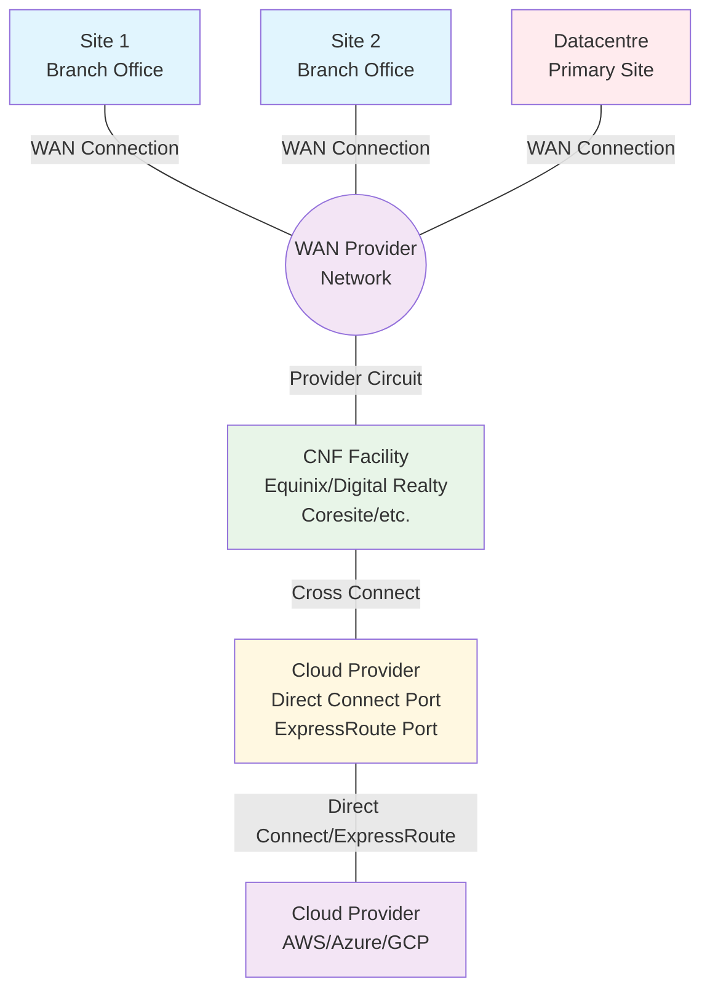
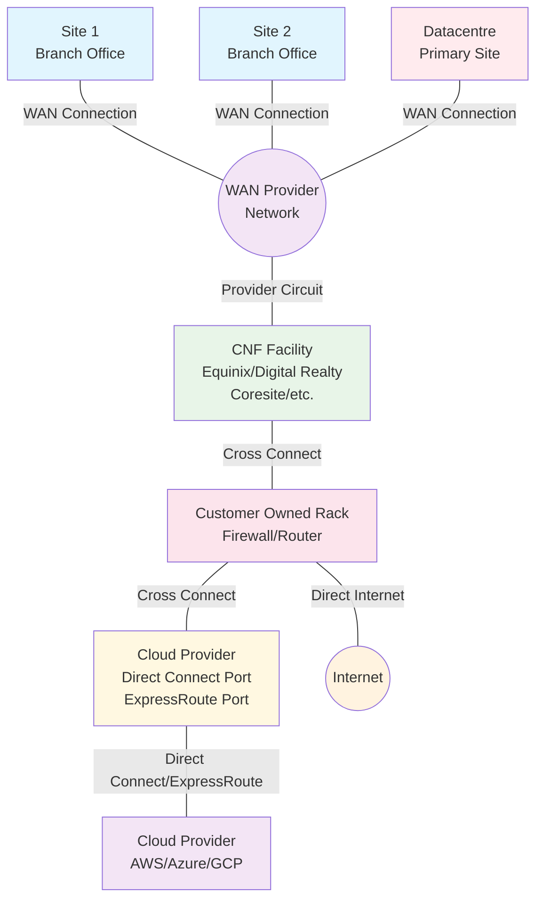
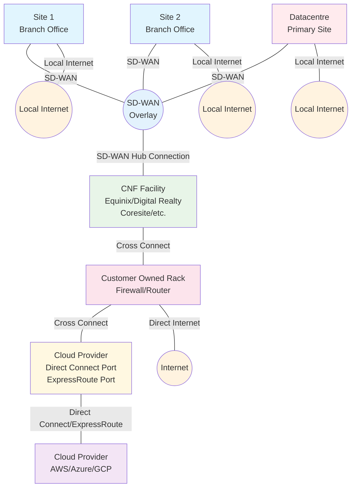
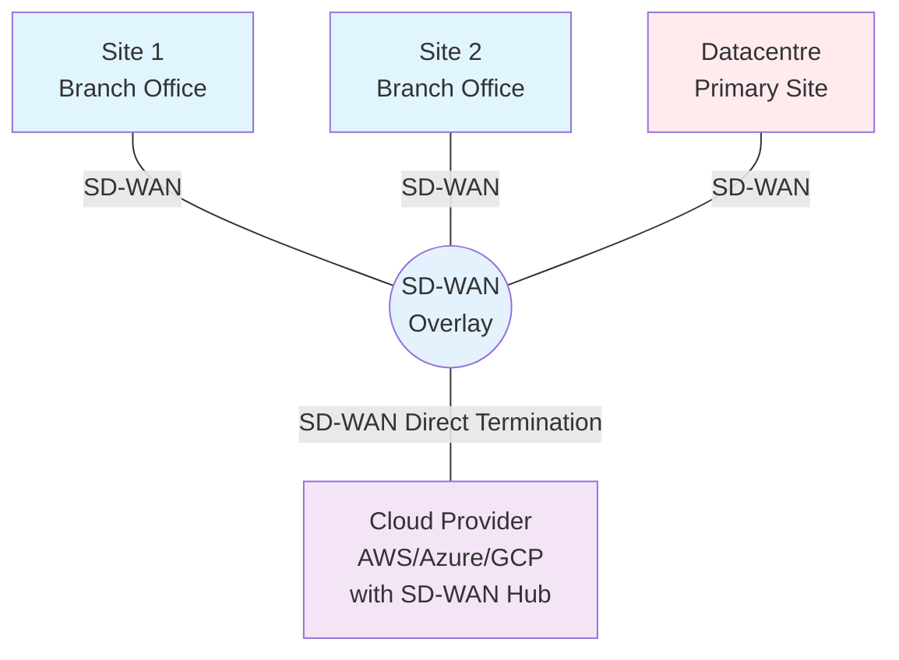

Adam Stuart has a [rather excellent rundown](https://github.com/adstuart/azure-sdwan) of the various ways you can approach SD-WAN connectivity in cloud, providing comprehensive technical guidance for Azure-based deployments. Much of the same applies in AWS although I have often said that AWS networking is more complex and akin to something dreamt up by a developer who couldn't even spell BGP. One of the legacy options included at the end of Adam's article is the cloud edge topology where you deploy physical hardware into a carrier neutral facility (CNF) like Equinix and use that as an interconnect between your SD-WAN and an ExpressRoute or Direct Connect circuit. This got me thinking about the uncertainty many organisations face when deciding how their overall cloud connectivity should evolve.

This article explores the journey from simple single-site connectivity to sophisticated multi-cloud SD-WAN architectures, examining the trade-offs, costs, and security implications of each approach. We'll walk through real-world topologies that organisations commonly implement, from basic VPN connections to cloud-native SD-WAN NVA hubs, helping you understand which approach might be right for your organisation's scale and maturity level.
<!-- truncate -->
It's very hard to take every scenario into account, particularly when you consider the vast range of scales that different organisations operate at. Not everyone has a global self-managed WAN with presence in multiple CNF locations, though some of the organisations I've worked with certainly do. At the other end of the scale, there are plenty of single-site businesses with locally hosted services they want to get services out of their building and into the cloud. I'll try to explore as many of the options as make sense, but bear in mind that not all of them will be appropriate for your scale or maturity.

> One of the biggest decisions every organisation must make is whether they consider the cloud network to
> be a trusted network without a firewall separating on-premise and cloud resources. There's no
> right answer that suits everyone, but I'd say the complexity of managing a perimeter that
> spans both environments is a significant consideration. This approach aligns with zero-trust
> principles where trust is never assumed based on network location. I do know of organisations that do this,
> but I'd consider them cyber incidents waiting to happen because a threat actor could exploit
> lateral movement unchecked.

## Starting without a WAN

The simplest topology is the single site with aspirations to extend to cloud. It's common that a single-site topology has all the connectivity centralised, so extending a VPN over the internet is the first iteration.

### Basic single-site topology with VPN over internet

Lowest cost but least predictable performance. The internet is a best-effort network, meaning that there's no guarantee of performance, availability, and certainly not security. This can lead to inconsistent user experiences for low latency or latency sensitive applications.

To expand this to multicloud you either scale out the VPN connections sideways, and accept some hairpinning for cloud to cloud connectivity, or you look at something like [Aviatrix](aviatrix.md). I am pretty sure that it's a very tight niche in the cloud growth curve where you're big enough to be serious about multicloud but still small enough that VPN makes sense.

### Moving to ExpressRoute or Direct Connect

The business case for ExpressRoute or Direct Connect rarely stacks up at this scale due to the high monthly costs, but if you were to extend your single site over a fixed link, that would most likely be in conjunction with a carrier-provided WAN link to connect to the CSP peering location.

This is the first instance where you can connect entirely without the need to have a firewall in place between the on-premise and cloud environments. However, it's important to consider the security implications of this approach and ensure that appropriate measures are in place to protect your resources. Unless your cloud maturity is high enough to manage this effectively through cloud-native security controls and network segmentation, it may be worth considering a more traditional approach with a clear demarcation and security policy enforcement between on-premise and cloud resources.

## Scaling to WAN Connected Sites

For multi-site organisations with an MPLS WAN and dedicated datacentres, it's pretty common for the datacentre to also be the location for the consolidated perimeter. Internet ingress and egress, business to business connectivity and telco connectivity all get consolidated into the datacentres, so the cloud connectivity naturally gets extended from the datacentre - the cloud becomes an extension of the datacentre, either through a direct connection or via a VPN.

This is rapidly becoming a legacy approach because organisations are embracing cloud-first strategies and have aspirations to move entirely to the cloud. In order to avoid putting additional dependencies on their on-premise infrastructure, the approach is to connect the cloud provider directly into their MPLS WAN.

### Enter the NNI

Network-to-Network Interconnect (NNI) represents a direct connection between network providers. Most WAN providers have the ability to provision a high-capacity edge port in the many CNFs that CSPs offer connectivity in. This means that for the modest price of a carrier cross-connect, you can have the cloud provider network directly accessible as another site on your WAN. It's worth noting that in this model you don't have firewalling between your on-premise and cloud environments; however, you can remedy this with cloud hub firewalls or by using a SASE provider like [Cloud Gateway](https://www.cloudgateway.co.uk/services/connectivity/cloud-connectivity/).

### Continuing this path

As the realisation dawns that there's no firewall between the on-premise networks and the cloud, the logical evolution of the above design is to build out a small presence in the CNF with cloud firewalls and perhaps internet egress - dedicated internet access (DIA) is considerably cheaper in a CNF because you can pay less for a cross-connect inside the facility than for miles of fibre under the road.

### Enhanced CNF presence with customer equipment for security and internet breakout

There can be a temptation to put compute and infrastructure services - DDI and such things - into the CNF rack, but that's mostly driven by the desire to move entirely from on-premise to cloud, and the CNF is seen as a halfway house for things that can't live in the cloud.
I would not recommend building out a dependency on a CNF for any sort of compute services because they are typically more expensive than most other colo datacentres, and are often less flexible. Keep your apps and infrastructure services in a datacentre and keep your CNF for connectivity.

It's worth noting that if you have centralised DHCP then you'll need somewhere to put that. DHCP servers in Azure are [not my cup of tea](https://learn.microsoft.com/en-us/azure/virtual-network/how-to-dhcp-azure) so you may need to look at alternatives. Realistically though how many organisations are entirely exclusive in cloud with no on-premise servers at all? I recently worked with a client who had a cloud only strategy with all the fanfares that go with it but now still maintain a colo on the quiet.

## Migrating to SD-WAN

SD-WAN in itself can represent a cost uplift and potential service downgrade compared to MPLS due to the inherent unpredictability of internet routing, but organisations choose it for several compelling reasons: reduced telco vendor lock-in (replaced by SD-WAN provider lock in), improved agility for adding new sites (you still need a circuit though), and (more realistically) as [a strategic step towards zero trust network access](sdwan-strategic-step-to-ztna.md). Most organisations consider it a like-for-like swap initially and retain the same topology until they finally embrace the benefits of local internet egress at sites, replacing centralised egress.

For organisations that have built out their CNF presence, it feels like it is an investment to continue to leverage rather than something that's now redundant and should be sunset as soon as possible. There are many reasons to use an ExpressRoute or Direct Connect circuit; the two biggest cited are predictability of latency and reduction in data egress charges (which can be substantial for bandwidth-intensive workloads). When you move to SD-WAN with the internet as the underlay network, you choose to sacrifice some of that predictability in latency, most likely because you have begun to move away from applications that are sensitive to latency and jitter.

### Hybrid SD-WAN approach maintaining CNF investment whilst adding local internet breakout

The model expands the perimeter without simplifying the topology; it introduces additional management overhead without removing the reliance on centralised capabilities. However, it does provide the foundation for future simplification as organisations gain confidence in internet-based connectivity.

### The Cloud is Just Another Place

The evolution towards cloud-native networking represents a fundamental shift in thinking. Rather than treating the cloud as a remote extension of the datacentre, modern architectures recognise cloud regions as equivalent network nodes in a distributed system.

### Cloud-native SD-WAN with direct termination

Eliminates physical infrastructure dependencies

The direct termination of SD-WAN into the cloud hub simplifies the network architecture because it equalises the hierarchy within the network for client sites, datacentre sites and cloud regions. This approach uses NVA (Network Virtual Appliances) SDWAN hubs rather than physical appliances and extends the overlay and all its benefits right into the cloud hub. This provides managed, scalable connectivity without the need for physical infrastructure.

This forms the last step before the potential removal of traditional SD-WAN entirely as all traffic moves to traverse the internet with application layer encryption and zero-trust security models instead of network layer security. In this future state, applications communicate directly over the internet using mutual TLS and other application-layer security protocols, with identity and device trust replacing network location as the primary security boundary.

## Conclusion

The journey towards cloud connectivity is rarely linear, and the "right" architecture often involves hybrid approaches that balance cost, performance, security, and operational complexity. The key is to choose an approach that aligns with your current capabilities whilst providing a clear path towards your target architecture.
