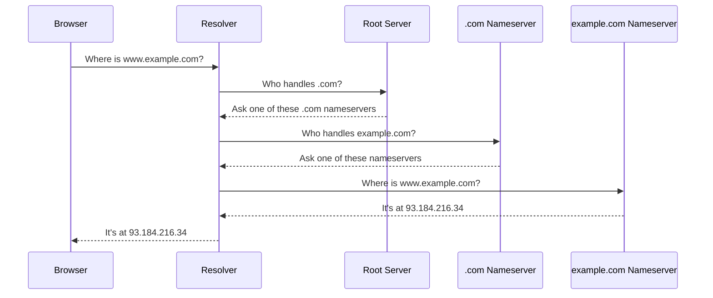

---

title: "Why there are exactly 13 DNS root servers"
authors: simonpainter
tags:
  - dns
  - networks
  - educational
date: 2026-04-16

---

The internet has exactly 13 DNS root servers. Not 12, not 14 — 13. That's not a coincidence or an arbitrary decision made in a committee meeting. It's a hard constraint baked into the physics of early networking, and the story behind it is a great example of how engineering limits shape the world we build.

<!-- truncate -->

## What are root servers anyway?

When you type `www.example.com` into your browser, your computer doesn't magically know where that is. It needs to look it up. DNS — the Domain Name System — is the phone book that turns human-readable names into IP addresses your computer can route to.

The lookup process starts at the top. Your DNS resolver (usually provided by your ISP or a service like `1.1.1.1`) asks a root server: "who's in charge of `.com`?" The root server points you to the `.com` nameservers, those point you to `example.com`'s nameservers, and eventually you get the IP address you need.



The root servers are the very first step. Every DNS lookup on the internet ultimately traces back to them. They're the authoritative source for the root zone — the "`.`" at the top of the DNS hierarchy that you never see but is always there.

## The 512-byte problem

When DNS was designed in the 1980s, the internet was a very different place. RFC 1035, published in 1987, defined the protocol we still use today at its core. One of the key decisions was that DNS would run over UDP — the fast, connectionless protocol — rather than TCP, which adds the overhead of a handshake and connection management.

UDP is great for quick queries. You fire a packet, you get a packet back. But UDP packets have a practical size limit. The original DNS spec capped responses at **512 bytes**. That's not much — this paragraph alone is already bigger than that.

Why 512? The internet of 1987 ran over a patchwork of different network types, and 512 bytes was a safe size that could travel across all of them without being fragmented. Fragmented packets are slow, unreliable, and complicated to reassemble. Keeping responses under 512 bytes meant they'd fit in a single UDP datagram and arrive intact.

## The maths that gave us 13

Here's where it gets interesting. The root servers need to announce themselves. When your resolver starts up, it needs a "hints file" — a list of the root servers and their IP addresses so it knows where to begin. This list is itself delivered as a DNS response, and that response has to fit in 512 bytes.

Let's work through the packet layout. A DNS response has:

- A fixed **12-byte header** containing message ID, flags, and counts
- A **question section** — what was asked
- An **answer section** — the NS records pointing to each root server
- An **additional section** — the "glue records" with the actual IP addresses

Each root server entry needs two records: an NS record giving its name (like `a.root-servers.net`) and an A record with its IPv4 address. With DNS name compression — a clever trick where repeated domain suffixes like `.root-servers.net` are replaced with a back-reference pointer — each pair of records takes roughly 35–40 bytes.

With a 12-byte header and 13 pairs of records:

```
12 bytes  (header)
+ 5 bytes  (question)
+ 13 × ~15 bytes (NS records, with name compression)
+ 13 × ~16 bytes (A glue records)
= ~484 bytes
```

Add a fourteenth root server and you'd push past 512. So 13 it was. The number wasn't chosen for mystical reasons — it's just the most that fit in the tin.

## The names behind the letters

The 13 root servers are known by the letters A through M (skipping nothing), and their names follow the pattern `x.root-servers.net`. They're run by 12 different organisations — Verisign operates both A and J.

| Letter | Operator |
|--------|----------|
| A | Verisign |
| B | USC Information Sciences Institute |
| C | Cogent Communications |
| D | University of Maryland |
| E | NASA Ames Research Center |
| F | Internet Systems Consortium |
| G | US Department of Defense |
| H | US Army Research Lab |
| I | Netnod |
| J | Verisign |
| K | RIPE NCC |
| L | ICANN |
| M | WIDE Project |

The geographic and organisational spread is deliberate. If one organisation has an outage, the others keep the internet's DNS infrastructure running. Diversity is resilience.

## 13 names, but thousands of machines

Here's the twist: there aren't actually 13 physical servers. There are over 1,600.

Each "root server" is really a name for a cluster of machines spread across the globe, all sharing the same IP address. This works through **anycast** — a routing technique where multiple machines advertise the same IP address, and your traffic gets directed to whichever is geographically or topologically closest.

So when your resolver queries `a.root-servers.net`, it might talk to a machine in London, Frankfurt, Singapore, or São Paulo depending on where you are. The 13 "servers" are really 13 identities, each backed by many instances. It's a neat workaround for the original physical limitation — we couldn't add more root *names*, but we could add more root *machines*.

## What changed: EDNS and beyond

The 512-byte limit held until 1999, when Paul Vixie published RFC 2671 introducing **EDNS0** — Extension Mechanisms for DNS. EDNS0 lets a client advertise a larger buffer size in its query, and the server can respond with a bigger packet if the client can handle it. Most modern resolvers advertise 4,096 bytes or more.

This opened the door to larger DNS responses, which was critical for **DNSSEC** — DNS Security Extensions. DNSSEC adds cryptographic signatures to DNS records to prove they haven't been tampered with, and those signatures are large. Without EDNS0, DNSSEC would be practically impossible.

DNS over TCP was always technically allowed as a fallback when a response was too big for UDP, but it was rarely used. The convention was clear: DNS is UDP, TCP is the exception. EDNS0 shifted that balance by making large UDP responses viable, and more recently **DNS over TLS (DoT)** and **DNS over HTTPS (DoH)** have brought TCP back into the mainstream for privacy reasons — wrapping DNS queries in encryption so your ISP can't see what you're looking up.

## A constraint that shaped the internet

The 13-root-server limit is a wonderful example of how constraints from one era leave permanent marks on the technology that follows. The engineers who defined DNS in 1987 weren't thinking about a global internet with billions of devices. They were solving the problems in front of them with the tools they had.

The 512-byte UDP limit was a reasonable constraint at the time. The decision to cap root servers at a number that fit that constraint was pragmatic. And the anycast architecture that now lets those 13 names expand to 1,600+ machines is an elegant solution that grew around the original limitation rather than replacing it.

The number 13 isn't magic. It's just physics, arithmetic, and a bit of clever engineering.
