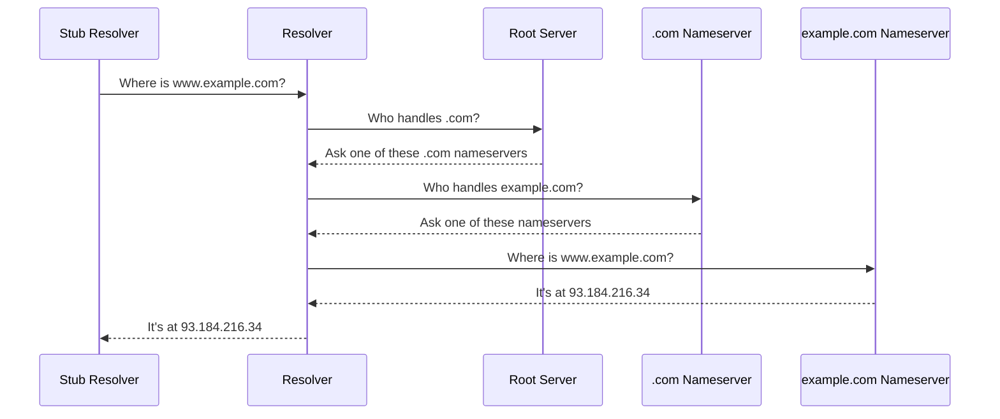

---

title: "Why there are exactly 13 DNS root servers"
authors: simonpainter
tags:
  - dns
  - networks
  - educational
date: 2026-04-16

---

I'm enjoying reading ["DNS: The Internet's Control Plane" by Enrique Somoza](https://www.amazon.co.uk/DNS-Internets-Enrique-Somoza-D-Sc/dp/B0GVZXYHDT/ref=zg_bsnr_g_3756_d_sccl_14/000-0000000-0000000?psc=1) and one of the things it mentioned was that there are exactly 13 DNS root servers and this is a hangover from the early days of the internet. It also predates the anycast architecture that allows each root server IP to be served by multiple machines around the world. I thought it worth a little dig. Get it?

The book itself, and many of the search results I found, say that it is due to the 512-byte limit of a UDP DNS response. But I wanted to get into the detail that wasn't easily found and understand exactly what the response was and how the 13 is calculated.

<!-- truncate -->

## What are root servers anyway?

When you type `www.example.com` into your browser, your computer doesn't magically know where that is. It needs to look it up. DNS (the Domain Name System) is the phone book that turns human-readable names into IP addresses your computer can route to.

The lookup process starts at the top. Your DNS resolver (usually provided by your ISP or a service like `1.1.1.1`) asks a root server: "who's in charge of `.com`?" The root server points you to the `.com` nameservers, those point you to `example.com`'s nameservers, and eventually you get the IP address you need.



The root servers are the very first step. Every DNS lookup on the internet ultimately traces back to them. They're the authoritative source for the root zone, the "`.`" at the top of the DNS hierarchy that you never see but is always there.

## The 512-byte problem

When DNS was designed in the 1980s, the internet was a very different place. [RFC 1035](https://www.rfc-editor.org/rfc/rfc1035), published in 1987, defined the protocol we still use today at its core. One of the key decisions was that DNS would mostly use UDP for ordinary queries, while also supporting TCP for larger or truncated responses.

UDP is great for quick queries. You fire a packet, you get a packet back. But UDP packets have a practical size limit. The original DNS spec capped responses at **512 bytes**. That's not much; this paragraph alone is already bigger than that.

> I have covered a bit more detail about the DNS protocol, including how DNS works over both UDP and TCP, in [this post about DNS Encryption](encrypted-dns.md#dns-over-tcp-adding-a-length-field)

Why 512? The internet of 1987 ran over a patchwork of different network types, and 512 bytes was a safe size that could travel across all of them without being fragmented. Fragmented packets are a pain because you need to have sequence numbers and all that jazz. Keeping responses under 512 bytes meant they'd fit in a single UDP datagram and arrive intact.

## Where does my resolver get the list of root servers from?

The root servers are not announced through DNS, they are coded into your resolver. You can download the 'root hints' file from [IANA](https://www.iana.org/domains/root/files) which contains the names and IP addresses of the 13 root servers. This file is updated periodically as needed, but the core list of 13 servers has remained stable for decades. So why do we need to worry about the size of the response if it's hardcoded into the resolver? Well those hints are used for the priming query specified in [RFC 9609](https://www.rfc-editor.org/rfc/rfc9609).

## And now the maths bit

[RFC 9609](https://www.rfc-editor.org/rfc/rfc9609), and [RFC 8109](https://www.rfc-editor.org/rfc/rfc8109) before it, formalised the rules around the priming query response. The resolver picks one of the hint addresses, sends a query for `. IN NS`, and the response must come back with an RCODE of NOERROR with the Authoritative Answer (AA) bit set. The NS records appear in the Answer section (not the Authority section, because they originate from the root zone itself), and the Additional section carries the A and AAAA records for each root server. You can try this out yourself with `dig . NS @a.root-servers.net` and see the response.

Under the original [RFC 1035](https://www.rfc-editor.org/rfc/rfc1035) 512-byte limit, there were no AAAA records yet so only the IPv4 A records were needed. Alongside the NS records you could fit 13 of these. Let's work through why 13 is the maximum.

A DNS response has:

- A fixed **12-byte header**: message ID, flags, and counts
- A **question section**: what was asked
- An **answer section**: the NS records pointing to each root server
- An **additional section**: the A records with the actual IPv4 addresses

Each root server needs an NS record giving its name (like `a.root-servers.net`) and an A record with its IPv4 address. DNS uses name compression, a trick where repeated domain suffixes are replaced with a two-byte back-reference pointer to where the suffix already appeared in the packet.

The first NS record has to spell out `root-servers.net` in full, costing 31 bytes. Every subsequent NS record can use a pointer back to that suffix, shrinking each RDATA from 20 bytes down to 4 bytes, making each of those records just 15 bytes. I verified this by capturing a real priming response and parsing the raw packet.

With a 12-byte header and 13 servers:

```text
 12 bytes  (header)
+  5 bytes  (question)
+ 31 bytes  (NS1: l.root-servers.net, full RDATA)
+180 bytes  (12 × 15 bytes, NS2-NS13 with compressed RDATA)
+208 bytes  (13 × 16 bytes, A records with compressed names)
= 436 bytes
```

That fits comfortably under 512 bytes. In fact, with the modern `x.root-servers.net` naming scheme and this level of compression, you could squeeze in up to 15 servers before hitting the limit. So why 13? The naming convention was not always this uniform. The original root servers had names like `NS.NIC.DDN.MIL` and `A.ISI.EDU`, heterogeneous names with no shared suffix to compress. Without that suffix compression, the encoding is larger and the arithmetic tightens up considerably.

The constraint also looks rather different once you add IPv6. Each AAAA record is 28 bytes (the address field is four times the size of an IPv4 address). Once you include both A and AAAA records for all 13 servers, the response balloons to around 800 bytes, well over the 512-byte limit. RFC 9609 acknowledges this directly: "The combined size of all the A and AAAA RRsets exceeds the original 512-octet payload limit." This is why root servers are permitted to omit some addresses from the Additional section without setting the TC (Truncated) bit, and why modern resolvers use EDNS0 to advertise a larger buffer.

RFC 9609 also notes something worth knowing: resolvers **should not** expect exactly 13 NS records in the response, because some root servers have historically returned fewer. If your resolver doesn't get all the addresses it needs, it can query for them directly.

## 13 names, but thousands of machines

But are we dependent for our most important infrastructure on just 13 servers? Not quite: there aren't actually 13 physical servers. There are over 1,500.

Each "root server" is really an anycast IP for a cluster of machines spread across the globe, all sharing the same address. This gives resilience and performance because resolvers can query the nearest instance of `a.root-servers.net` rather than having to talk to a single machine in one location.

So when your resolver queries `a.root-servers.net`, it might talk to a machine in London, Frankfurt, Singapore, or São Paulo depending on where you are. The 13 "servers" are really 13 identities, each backed by many instances. It's a neat workaround for the original physical limitation; we couldn't add more names or IP addresses, but we could add more root *servers*.

## What changed: EDNS and beyond

The 512-byte limit held until 1999, when Paul Vixie published RFC 2671 introducing **EDNS0** (Extension Mechanisms for DNS). EDNS0 lets a client advertise a larger buffer size in its query, and the server can respond with a bigger packet if the client can handle it. Most modern resolvers advertise 4,096 bytes or more.

DNS over TCP was always technically allowed as a fallback when a response was too big for UDP but EDNS0 opened the door to larger UDP DNS responses, which was critical for **DNSSEC** (DNS Security Extensions). DNSSEC adds cryptographic signatures to DNS records to prove they haven't been tampered with, and those signatures are large. Without EDNS0, DNSSEC would be practically impossible.

## A constraint that shaped the internet

The 13-root-server limit is a wonderful example of how constraints from one era leave permanent marks on the technology that follows. The engineers who defined DNS in 1987 weren't thinking about a global internet with billions of devices. They were solving the problems in front of them with the tools they had.

The 512-byte UDP limit was a reasonable constraint at the time. The decision to cap root servers at a number that fit that constraint was pragmatic. And the anycast architecture that now lets those 13 names expand to over 1,500 machines is an elegant solution that grew around the original limitation rather than replacing it. Can you imagine having a root zone with 1,500 NS records?

The number 13 isn't magic. It's just bytes, arithmetic, and a bit of clever engineering.
