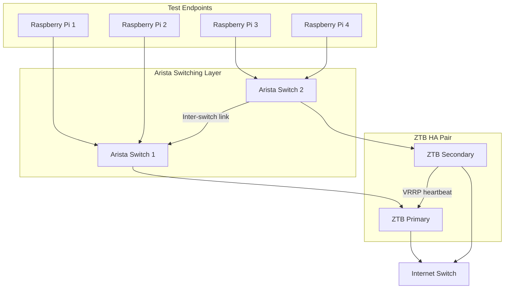
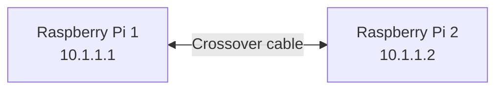

---

title: "Zero Trust Branch in an OT World: Testing Latency and Resilience with Arista and Raspberry Pi"
authors: simonpainter
tags:
  - networks
  - security
  - zero-trust
  - ot
  - arista
  - zscaler
  - performance
  - testing
date: 2026-05-09

---

Running 24/7 robotic logistics sites means the network is never off. A switch reload, a failover event, or a software upgrade during a busy pick cycle could stop every robot on the floor simultaneously. This article documents a series of tests I ran to find out whether a Zscaler Zero Trust Branch deployment alongside Arista switches can meet the latency and resilience demands of an operational technology environment.

<!-- truncate -->

## The Problem with Networks in OT Environments

OT networking has a different set of rules from the office world. In a typical retail logistics site running multi-vendor robotic storage systems, the network isn't carrying web browsing traffic: it's carrying the heartbeat signals, motion commands, and sensor data that keep autonomous systems running safely.

PROFINET RT, the real-time profile used by most industrial Ethernet devices, expects cycle times between 1ms and 10ms. Miss two or three consecutive cycles and the PLC declares a fault. The robot stops. A technician has to walk to the cell and reset it manually. In a dark warehouse running hundreds of robots simultaneously, that's not a five-minute problem.

The same logic applies to network changes. There are no maintenance windows in a 24/7 operation. Any switch upgrade or failover that takes the network down for more than a second will trigger E-stops across the floor.

This creates a challenge when you want to modernise the network with zero trust architecture. The promise of zero trust is compelling: segment every device, verify every connection, give third-party vendors browser-based access to specific systems without ever touching the network. But if the solution adds latency or introduces instability during upgrades, it won't survive contact with the OT team.

So I set up a test lab to find out.

## The Solution Stack

The three components under test are Zscaler Zero Trust Branch, Arista switching, and Zscaler Privileged Remote Access.

### Zscaler Zero Trust Branch

Zero Trust Branch (ZTB) is Zscaler's on-premises hardware appliance that replaces traditional branch firewalls, VPNs, and SD-WAN devices. A physical Zscaler Edge appliance sits at the edge of each site and forwards all traffic to the Zscaler Zero Trust Exchange in the cloud. Policy is identity and context based rather than IP based, which means segmentation follows the device rather than the VLAN.

The feature that caught my attention for OT environments is what Zscaler calls device segmentation with /32 isolation. Rather than grouping devices into subnets, each device gets a /32 host route. It can only communicate with what policy explicitly permits. A compromised robot cannot reach a PLC, even if they're on the same physical switch, because there's no network path that Zscaler hasn't approved.

Zscaler markets ZTB explicitly for industrial environments:

> *"Zero Trust Branch isolates and segments IoT/OT devices to stop unauthorized access and the spread of ransomware, ensuring industrial environments stay secure and operational. Because segmentation is handled without the need for an endpoint agent, it can effectively secure legacy and headless systems without the need to take them offline."*

The Edge appliance supports dual-appliance HA with VRRP, so the upstream Arista switches see a virtual IP and MAC address. When the primary ZTB fails, the secondary takes over the VRRP group and traffic continues without the switches reconverging.

### Zscaler Privileged Remote Access

The third-party vendor access problem in OT is a real headache. You need a robotics vendor to connect to a specific robot for a firmware update. Traditional VPN gives them access to the entire OT VLAN. That's too much trust for a contractor with an unmanaged laptop.

Privileged Remote Access (PRA) solves this with browser-based access. The vendor opens a standard web browser, authenticates with MFA, and gets an HTML5-rendered RDP or SSH session to the specific device they need. They never install a client. Their laptop never touches the OT network. Zscaler brokers the connection through an App Connector running close to the target system.

The credentials are injected from a cloud vault. The vendor never sees them. The session is recorded for audit. Access can be scoped to a maintenance window so it expires automatically.

> *"VPNs and traditional PAM solutions grant broad network access, frequently extending implicit trust to administrator and third-party devices. This 'all or nothing' model undermines least-privileged access and creates opportunities for ransomware attacks, credential abuse, and lateral movement."*

### Arista and Hitless Upgrades

Arista's selling point for OT-adjacent environments is their In-Service Software Upgrade (ISSU) capability, which they market as "hitless." On platforms with redundant supervisors (the 7500R and 7800R series), a software upgrade triggers a supervisor switchover while the line cards continue forwarding packets. The hardware ASIC never stops. BGP and OSPF adjacencies are preserved via Graceful Restart. Arista's marketing language is "zero traffic disruption" and "no planned downtime for software maintenance."

On fixed-form switches, Arista offers a "warm reload" variant where the EOS process restarts but the forwarding hardware continues based on the last programmed tables. This isn't zero-packet-loss in the strictest sense, but the disruption window is measured in milliseconds rather than seconds. The important caveat is that BFD sessions will drop during ISSU if sub-second timers are configured, and Graceful Restart must be negotiated with all BGP peers before the upgrade begins.

I'll be testing this claim directly. The `echo_test` tool, described below, keeps a persistent TCP session alive and records any interruption to the microsecond.

## The Test Lab

The lab is built around four Raspberry Pi 5 single-board computers connected to two Arista switches, which in turn connect through a pair of Zscaler ZTB Edge appliances to an internet-facing switch.



The Raspberry Pi 5 runs a standard Raspberry Pi OS and is a capable test platform: it has a gigabit Ethernet interface, plenty of headroom for running test tooling, and consistent enough performance that it won't introduce measurement noise into the results.

### Test Tools

I'm using two tools I've written for this purpose.

**[uping](https://github.com/simonpainter/uping)** is a microsecond-precision ICMP ping written in C. Standard `ping` reports latency in milliseconds, which isn't granular enough to assess OT suitability. uping embeds a high-resolution timestamp directly in the ICMP payload using `clock_gettime(CLOCK_MONOTONIC)` so the round-trip time is calculated from the actual packet send time rather than an approximation. Running with `sudo` opens a raw socket for the most accurate results; without it, it falls back to a DGRAM socket with a warning.

**[echo_test](https://github.com/simonpainter/echo_test)** is a TCP echo latency tool. It opens a persistent TCP connection to a standard RFC 862 echo service and sends timed payloads, recording the round-trip time for each in microseconds. Unlike uping, echo_test keeps a long-lived TCP session open, which makes it ideal for detecting session interruption. If a switch upgrade or VRRP failover breaks the TCP session even briefly, echo_test will capture it. The output includes standard deviation, which gives a picture of jitter as well as raw latency.

The key difference between the two tools is protocol layer. uping measures ICMP latency at Layer 3. echo_test measures TCP latency at Layer 4 over a real connection. In environments with stateful firewalls or security inspection, the two numbers can diverge significantly. That divergence is itself useful data.

## The Tests

### Test 0: Loopback Baseline

Before measuring anything across a physical link I ran both tools against the loopback interface on Pi 2. The loopback never touches the NIC, the cable, or anything external — packets go from the sending process, through the kernel's network stack, and straight back. It's the purest possible measure of OS and software overhead.

```text
simon@pi2:~ $ uping 127.0.0.1
UPING 127.0.0.1 (127.0.0.1): ICMPv4 ICMP, timeout 2.0s
seq=1 35µs from 127.0.0.1
seq=2 12µs from 127.0.0.1
seq=3 17µs from 127.0.0.1
seq=4 15µs from 127.0.0.1
seq=5 11µs from 127.0.0.1
...
seq=42 9µs from 127.0.0.1
seq=43 13µs from 127.0.0.1
seq=44 9µs from 127.0.0.1
seq=45 10µs from 127.0.0.1
seq=46 8µs from 127.0.0.1
^C
--- 127.0.0.1 uping statistics ---
46 packets transmitted, 46 received, 0.0% loss
rtt min/avg/max = 8/10.7/35 µs
```

```text
simon@pi2:~ $ python echo_test/client/echo_client.py 127.0.0.1 7
ECHO 127.0.0.1:7 (64 bytes of data)
64 bytes from 127.0.0.1:7: seq=1 time=45.111 μs
64 bytes from 127.0.0.1:7: seq=2 time=61.463 μs
64 bytes from 127.0.0.1:7: seq=3 time=45.277 μs
64 bytes from 127.0.0.1:7: seq=4 time=34.222 μs
64 bytes from 127.0.0.1:7: seq=5 time=31.925 μs
...
64 bytes from 127.0.0.1:7: seq=20 time=66.685 μs
^C
--- 127.0.0.1:7 echo statistics ---
20 packets transmitted, 20 received, 0.0% packet loss
rtt min/avg/max/stddev = 28.167/39.056/66.685/10.739 μs
```

The loopback numbers give us a useful lower bound: the Raspberry Pi 5's kernel network stack costs roughly 10µs for an ICMP round-trip and 39µs for a TCP echo round-trip. Those are irreducible overheads baked into the OS. Everything added by the physical NIC, cable, and any network devices on top of that.

Comparing loopback to the crossover cable results puts the physical layer cost in perspective:

| | uping avg | echo_test avg |
| --- | --- | --- |
| Loopback (kernel only) | 10.7µs | 39.1µs |
| Crossover cable | 179.4µs | 195.4µs |
| Physical layer overhead | ~169µs | ~156µs |

The physical NIC and gigabit link add around 160–170µs to the kernel baseline. That's the cost of serialising the packet onto the wire, transmitting it at 1Gbps, and deserialising it at the far end — twice, for the round trip. It's a fixed floor that no amount of network optimisation can remove, because it's physics.

### Test 1: Crossover Cable Baseline

Before introducing any switching hardware, I connected Pi 1 directly to Pi 2 with a crossover cable. This gives a true baseline for the Raspberry Pi 5's network stack latency with no intermediate devices.



I ran uping twice: first without `sudo` to see the DGRAM socket baseline, then with `sudo` to use the raw socket mode which embeds the timestamp directly in the ICMP payload for the most accurate reading.

Without `sudo` (DGRAM socket):

```text
simon@pi1:~/uping $ ./uping 10.1.1.2
uping: using unprivileged DGRAM socket (timing may be less accurate; run with sudo for best results)
UPING 10.1.1.2 (10.1.1.2): ICMPv4 ICMP, timeout 2.0s
seq=1 197µs from 10.1.1.2
seq=2 170µs from 10.1.1.2
seq=3 165µs from 10.1.1.2
seq=4 162µs from 10.1.1.2
seq=5 161µs from 10.1.1.2
seq=6 169µs from 10.1.1.2
seq=7 162µs from 10.1.1.2
seq=8 160µs from 10.1.1.2
seq=9 180µs from 10.1.1.2
^C
--- 10.1.1.2 uping statistics ---
9 packets transmitted, 9 received, 0.0% loss
rtt min/avg/max = 160/169.6/197 µs
```

With `sudo` (raw socket, 40 packets):

```text
simon@pi1:~/uping $ sudo ./uping 10.1.1.2
UPING 10.1.1.2 (10.1.1.2): ICMPv4 ICMP, timeout 2.0s
seq=1 363µs from 10.1.1.2
seq=2 176µs from 10.1.1.2
seq=3 167µs from 10.1.1.2
seq=4 165µs from 10.1.1.2
seq=5 168µs from 10.1.1.2
...
seq=34 322µs from 10.1.1.2
...
seq=36 175µs from 10.1.1.2
seq=37 177µs from 10.1.1.2
seq=38 174µs from 10.1.1.2
seq=39 177µs from 10.1.1.2
seq=40 173µs from 10.1.1.2
^C
--- 10.1.1.2 uping statistics ---
40 packets transmitted, 40 received, 0.0% loss
rtt min/avg/max = 160/179.4/363 µs
```

The raw socket run gave a min/avg/max of 160/179.4/363µs across 40 packets. The average is virtually identical to the DGRAM run — the two modes measure the same underlying network latency. The reported max is higher here because the longer run captured a couple of occasional spikes (seq=1 at 363µs and seq=34 at 322µs) that are likely background OS scheduler interruptions on the Pi rather than network events. The steady-state band from seq=3 onwards is consistently 160–180µs.

The raw socket run gave a clean baseline: sub-200µs point-to-point between two Raspberry Pi 5s with nothing in between. To put it in context, PROFINET RT requires delivery within 1–10ms. Even accounting for the multiple network hops we're about to introduce, we're starting from a floor that's more than five times below the tightest standard industrial Ethernet threshold. There's meaningful headroom to absorb switching and routing overhead before we'd need to worry.

I also ran echo_test across the same crossover path to get the TCP baseline:

```text
simon@pi1:~ $ python3 echo_test/client/echo_client.py 10.1.1.2 7
ECHO 10.1.1.2:7 (64 bytes of data)
64 bytes from 10.1.1.2:7: seq=1 time=108.204 μs
64 bytes from 10.1.1.2:7: seq=2 time=228.241 μs
64 bytes from 10.1.1.2:7: seq=3 time=247.612 μs
64 bytes from 10.1.1.2:7: seq=4 time=211.297 μs
64 bytes from 10.1.1.2:7: seq=5 time=207.945 μs
...
64 bytes from 10.1.1.2:7: seq=38 time=187.204 μs
^C
--- 10.1.1.2:7 echo statistics ---
39 packets transmitted, 38 received, 2.6% packet loss
rtt min/avg/max/stddev = 108.204/195.387/247.612/20.966 μs
```

The TCP echo average sits at 195.4µs — about 16µs higher than the uping average of 179.4µs. That gap is expected: TCP adds connection state overhead compared to raw ICMP, and the echo server on Pi 2 introduces a small amount of application processing time for each bounce. The standard deviation of 20.966µs reflects the spread you can see in the raw numbers: the session takes a few packets to settle (seq=2 through seq=6 are the highest), then tightens into a consistent band around 185–200µs for the remainder.

The 2.6% packet loss (one packet from 39) is worth noting. In this context it most likely reflects the Ctrl-C interrupt catching a packet mid-flight rather than genuine loss, but it's something to watch in later tests on longer runs.

The crossover baselines from both tools are now established. All subsequent tests will be measured against these numbers.

### Test 2: Single Arista Switch (L2 Baseline)

*Results to follow.*

Pi 1 and Pi 2 connected through a single Arista switch on the same VLAN. This measures what the Arista switching silicon adds to the baseline latency. Arista's fixed-form campus switches use custom silicon with cut-through forwarding, so I'd expect the added latency to be in the low microseconds.

### Test 3: Two Connected Arista Switches

*Results to follow.*

Pi 1 on Arista Switch 1 talking to Pi 3 on Arista Switch 2 via the inter-switch link. This adds another hop and the inter-switch link latency. Still a pure L2 path with no routing.

### Test 4: Routed via the ZTB

*Results to follow.*

Pi 1 and Pi 3 on separate network segments, with traffic routed through the Zscaler Zero Trust Branch. This is the most important latency test: how much does the ZTB add to the path? Traffic will leave the Arista switch, hit the ZTB Edge appliance, get forwarded to the Zscaler cloud for inspection, and return to the destination. The cloud exchange adds a real-world internet hop, so I expect latency in the single-digit milliseconds. Whether that's acceptable for the target use case is the question.

### Test 5: /32 Host Isolation

*Results to follow.*

Both Pi 1 and Pi 2 on the same subnet, but with ZTB's /32 host isolation enabled. Policy permits communication between the two. This tests whether the segmentation mechanism itself adds latency compared to the baseline routed path through ZTB. If /32 isolation forces a different forwarding path or additional policy lookup, it should show up in the numbers.

### Test 6: Hitless Upgrade of Arista

*Results to follow.*

With `echo_test` running a persistent TCP session between Pi 1 and Pi 3 across the inter-switch link, I'll trigger an EOS software upgrade on Arista Switch 1. The test is simple: does the TCP session survive? If echo_test records a gap in sequence numbers or an elevated RTT, that's the upgrade window. If it shows a clean, continuous stream, Arista's hitless upgrade claim holds up.

I'll capture the full echo_test output around the upgrade window so any disruption is visible at microsecond resolution.

### Test 7: ZTB VRRP Failover

*Results to follow.*

With `echo_test` running a persistent TCP session across the ZTB path, I'll trigger a VRRP failover by pulling the primary ZTB appliance offline. The VRRP group should promote the secondary within sub-second timers, and the Arista switch should continue forwarding to the same virtual IP without any configuration change.

The question is whether that VRRP transition is fast enough to keep the TCP session alive. In a real OT environment, this simulates a ZTB appliance failure or a planned reboot during a software update.

## What I'm Trying to Prove

The goal of all these tests is straightforward: can a Zscaler Zero Trust Branch deployment be recommended for 24/7 retail logistics sites running multi-vendor robotics?

To answer yes, I need to show:

1. The additional latency introduced by the ZTB path is well within OT acceptable thresholds (under 10ms for PROFINET RT class traffic)
2. Software upgrades to the Arista switching layer cause no measurable TCP session interruption
3. A ZTB VRRP failover event causes no measurable TCP session interruption
4. Third-party vendors can access specific OT devices through PRA without touching the OT network

Results will be added to this article as testing progresses. The baseline crossover result above is a promising start.

---

*Test tooling: [uping](https://github.com/simonpainter/uping) and [echo_test](https://github.com/simonpainter/echo_test)*
