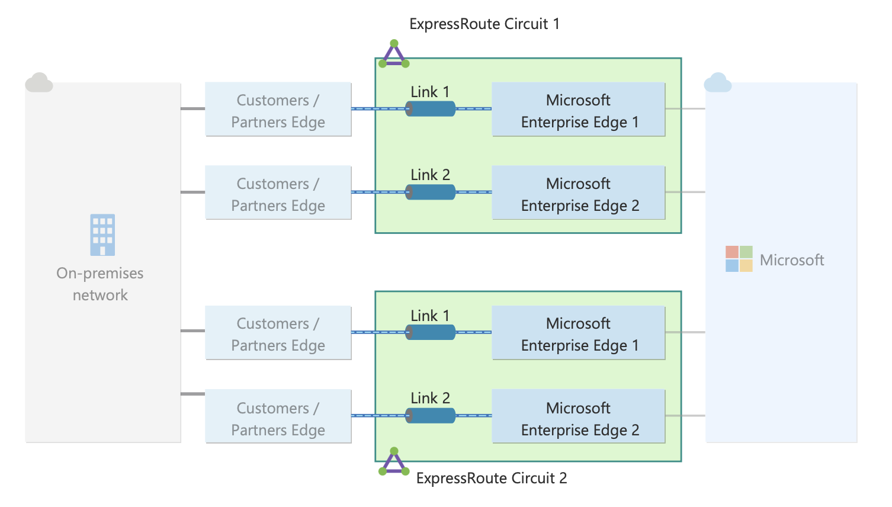

I will always be a network engineer and that means that some words have very specific meanings that have taken root in my soul. The terminology within ExpressRoute has bothered me for ages and when speaking to a few people I found that I am not the only one who finds it unintuitive. To me a circuit is a single link but to Microsoft a circuit is the pair of links and the associated peerings.

Here's a run down of what's what:

### ExpressRoute Circuit

This is the container construct for two links

#### ExpressRoute Direct Port Pair

Where you don't have 

#### ExpressRoute Peering

Each ExpressRoute circuit has two BGP sessions terminating on the MSEEs

### ExpressRoute Gateway

Logic construct in a vNET

### ExpressRoute Connection

This connects an ExpressRoute circuit to a gateway

