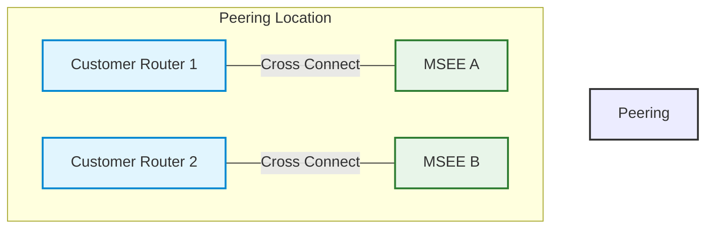

I will always be a network engineer and that means that some words have very specific meanings that have taken root in my soul. The terminology within ExpressRoute has bothered me for ages and when speaking to a few people I found that I am not the only one who finds it unintuitive. To me a circuit is a single link but to Microsoft a circuit is the pair of links and the associated peerings!

Here's a run down of what's what:

### Express Route Direct (ERD)

Pair of physical ports in a peering location. Typically an ERD customer would use cross connects from their own equipment to connect to those ports. Each port is on a separate Microsoft Enterprise Edge (MSEE) devices.

