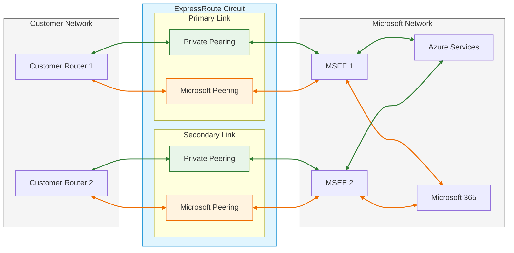

## Make it make sense

I will always be a network engineer and that means that some words have very specific meanings that have taken root in my soul. The terminology within ExpressRoute has bothered me for ages and when speaking to a few people I found that I am not the only one who finds it unintuitive. To me a circuit is a single link but to Microsoft a circuit is the pair of links and the associated peerings!

Here's a run down of what's what, starting with the wires and working up.

### ExpressRoute Direct (ERD)

Pair of physical ports in a peering location in the Microsoft Enterprise Edge (MSEE) and enable the physical fibre cross connects at layer 1 to the customer router. Prior to ERD being available as a product these would typically exist only in the form of a cross connect to service providers who offered ExpressRoute connectivity services, but are now offered direct to customers who have the requirement and the necessary supporting infrastructure.
Microsoft documents refer to these as ExpressRoute Direct *resources* to either add or remove confusion with [ExpressRoute Direct Circuits](#expressroute-direct-circuit).

> ExpressRoute Direct resources are provided as a pair of ports in separate MSEE devices to ensure that maintenance outages or
> failures on a single MSEE do not cause loss of service. It is not possible to buy them with a single link.

ExpressRoute Directs are paired inside a single peering location except when they used in [ExpressRoute Metro](#expressroute-metro); in that case the separate [ExpressRoute Direct Links](#expressroute-direct-link) are supplied in two separate peering locations but still function as a pair.

ExpressRoute Direct supports both QinQ and Dot1Q VLAN tagging.

- QinQ VLAN Tagging allows for isolated routing domains on a per ExpressRoute circuit basis. Azure dynamically gives an S-Tag at circuit creation that can't be changed. Each peering on the circuit (Private and Microsoft) uses a unique C-Tag as the VLAN. The C-Tag isn't required to be unique across circuits on the ExpressRoute Direct ports.
- Dot1Q VLAN Tagging allows for a single tagged VLAN on a per ExpressRoute Direct port pair basis. A C-Tag used on a peering must be unique across all circuits and peerings on the ExpressRoute Direct port pair.

### ExpressRoute Direct Link

Nominally a single port on the MSEE or a single fibre pair cross connect to that port. These cannot be bought separately and are supplied as pairs in the same peering location, or in a metro pair in two separate locations for [ExpressRoute Metro](#expressroute-metro).

### ExpressRoute Direct Circuit

Exactly the same as an [ExpressRoute Circuit](#expressroute-circuit) however instead of being provided over a telco partner's infrastructure it's provisioned over an [ExpressRoute Direct](#expressroute-direct-erd) resource. A single ExpressRoute Direct resource can have multiple ExpressRoute Direct Circuits associated with it.

### ExpressRoute Circuit

These are the logical constructs which encompasses two [ExpressRoute Links](#expressroute-link).

### ExpressRoute Link

Each [ExpressRoute Circuit](#expressroute-circuit) is made up of two links, these are the vlan tagged layer 2 connections between customer (or telco) managed equipment and the MSEE. T

### ExpressRoute Peering

Each [ExpressRoute Circuit](#expressroute-circuit) consists of a pair of [links](#expressroute-link) and each of these can have distinct peerings. A peering is required for each link and a single circuit can support both [Azure private peerings](#peering-type-azure-private-peering) and [Microsoft peerings](#peering-type-microsoft-peering).

#### Peering type: Azure private peering

Azure compute services, such as virtual machines (IaaS) and cloud services (PaaS), deployed within a virtual network can be connected through the private peering domain. This domain is considered a trusted extension of your core network into Microsoft Azure.

#### Peering type: Microsoft peering

Connectivity to Microsoft online services (Microsoft 365, Azure PaaS services, and Microsoft PSTN services) occurs through Microsoft peering. This peering enables bi-directional connectivity between your WAN and Microsoft public cloud services without using the Internet.

#### Required Subnet Configuration

- Two subnets outside of any VNet address space
- One subnet for primary link, one for secondary link
- Customer uses first usable IP, Microsoft uses second usable IP
- Subnet size options:
  - IPv4: Two /30 subnets
  - IPv6: Two /126 subnets
  - Dual-stack: Two /30 and two /126 subnets
- Public addressing or RFC1918 can be used for [Private peering](#peering-type-azure-private-peering)
- Public addressing must be used for [Microsoft peering](#peering-type-microsoft-peering)

#### VLAN Configuration

- Valid VLAN ID required
- Must be unique within the [ExpressRoute Circuit](#expressroute-circuit)
- Same VLAN ID used for both primary and secondary [ExpressRoute Link](#expressroute-link)

#### BGP Configuration for Private Azure Peerings

- AS number (2-byte or 4-byte supported)
- Private AS numbers allowed except 65515-65520
- Optional MD5 hash for session security

#### BGP Configuration for Microsoft Peerings

- AS number (2-byte or 4-byte supported)
- Private AS numbers allowed except 65515-65520
- Public AS numbers allowed with proof of ownership
- Optional MD5 hash for session security

### ExpressRoute Connection

A Connection is the resource that links an [ExpressRoute Circuit](#expressroute-circuit) at the MSEE to an [ExpressRoute Gateway](#expressroute-gateway). You can have more than one connection on a single [ExpressRoute Circuit](#expressroute-circuit), A standard Azure ExpressRoute circuit can typically support up to 10 connections to virtual networks, all within the same geopolitical region; however this limit is the default and can be raised.

### ExpressRoute Gateway

An ExpressRoute Gateway is a virtual network gateway that enables private connectivity between your on-premises network and Azure through [ExpressRoute Connections](#expressroute-connection).

Key points:

- Acts as a bridge between your virtual network and on-premises network
- Handles routing between these networks
- Supports multiple circuits for redundancy
- Must be deployed in a dedicated gateway subnet
- Scales based on selected SKU
- An [ExpressRoute Gateway](#expressroute-gateway) can connect to more than one [ExpressRoute Connection](#expressroute-connection).

#### Available Gateway SKUs and capabilities

| Gateway SKU  | FastPath | Max Connections |
|------------|----------|-----------------|
| Standard SKU/ERGw1Az  | No | 4 |
| High Perf SKU/ERGw2Az  | No | 8 |
| Ultra Performance SKU/ErGw3Az  | Yes | 16 |
| ErGwScale (Preview)  | Yes* | 4-16** |

> *FastPath requires minimum 10 scale units
> ** Up to 4 connections with 1 scale unit (2Gbps), up to 8 with at least 2 scale units (4Gbps) and up to 16 connections with
> at least 10 scale units. 

### ExpressRoute Metro

ExpressRoute Metro is a variation of an ExpressRoute Circuit where the separate [ExpressRoute Links](#expressroute-link) are provisioned in different physical peering locations within a metro area. This give additional geographic redundancy for those who do not require two separate resillient [ExpressRoute Circuits](#expressroute-circuit) in two separate locations.

> ExpressRoute Metro can be selected when ordering an [ExpressRoute Direct](#expressroute-direct-erd) and the metro pair
> appears like any single peering location on the list of available locations.
