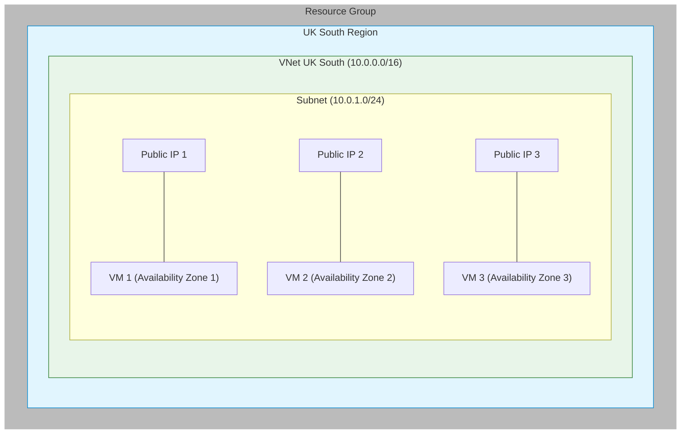
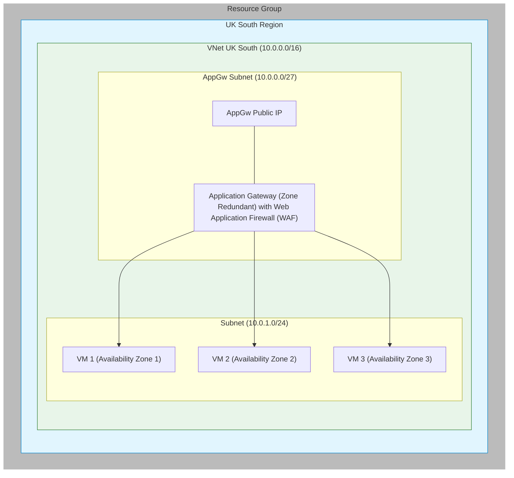
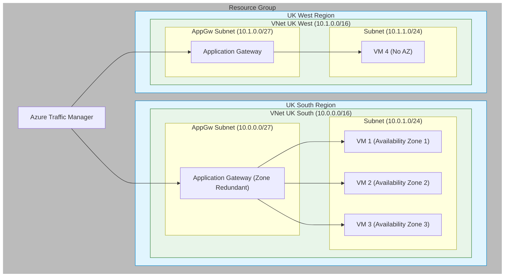
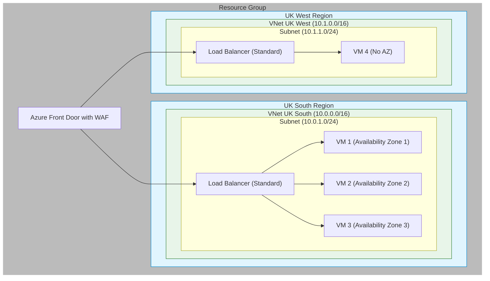

---

title: Where to WAF

---

A good friend of mine is doing his [AZ-700](https://learn.microsoft.com/en-us/credentials/certifications/azure-network-engineer-associate/?practice-assessment-type=certification) next week and asked me a few questions about Azure Traffic Manager, Azure Front Door and the WAF capabilities in Azure. Some of the questions were a bit confusing in the practice exams he has been taking. As he's not only a good friend but also the kind chap who proof reads a lot of these blog posts I thought I'd do something to try to explain what the options are any when you'd use them. On a side note if you fancy talking to a top tier network guy and all round nice fella I thoroughly recommend you look up [Zain Khan](https://www.linkedin.com/in/zainkhan123/).

### Web applications 101

Let's start with our web app - time for a good old Hello World - create a VNet in UKSouth and add three linux VMs, one in each AZ, and give them each a public IP. When you SSH into them you can run something like the script below and then when you put the public IP into your browser you get a page response.

```bash
#!/bin/bash
apt-get update
apt-get install -y apache2
systemctl enable apache2
systemctl start apache2
echo "Hello, World from UK South, AZ1" > /var/www/html/index.html

```

> If you use teraform you can add the bootstrap script above into there and
> you don't even have to SSH into it. Either way don't forget to configure
> an NSG to allow tcp/22 for ssh and tcp/80 for http inbound.

You should now have something that looks a bit like this:



Giving out three different addresses for your three application instances is going to be troublesome so at a bare minimum we're going to need to set ourselves up with some sort of loadbalancer. In reality you're probably going to want autoscaling groups behind a loadbalancer but that's not something we're doing in a lab like this.

> The magic of the Azure Load Balancer is that it operates at Layer 4 (TCP/UDP) and doesn't really work in the same way that the AWS ones or a typical on-premises load balancer does. It works ephemerally within the fabric so it isn't some sort of VM that can terminate a connection. Instead, it looks at the first encapsulated packet in transit, decides where it's going using a 5-tuple hash (source IP, source port, destination IP, destination port, protocol type), and then sends all subsequent encapsulated traffic to the right place. The nature of Azure Load Balancer means that it is always zone redundant.

We can put an azure loadbalancer in front of our VMs, we would also need a public IP for it, but that means that your traffic from the internet is getting directly terminated on the VM itself. That's pretty scary stuff nowadays. Try it with your hello world server for a while and take a look at your access logs and see how long it takes before the bad guys are probing it. A much better solution is some sort of reverse proxy that will terminate the connections: Azure Application Gateway does this nicely. Operating at Layer 7 (HTTP/HTTPS), it functions similarly to on-premises equipment like F5 LTMs in that it will terminate a connection, perform TLS offload and provide separation between your external and internal traffic flows.

```bash
simon@MacBook-Pro WAF % curl http://172.167.121.180
Hello, World from UK South, Availability Zone 1!
simon@MacBook-Pro WAF % 
```

The Application Gateway is different from an Azure Loadbalancer because under the hood it's an autoscaling group of VMs with a loadbalancer in front. You don't see that loadbalancer though, but you will notice that applcation gateways require their own dedicated subnets so they can autoscale in it. AWS does a far better job of hiding stuff like that.

The minimum subnet size for an Azure Application Gateway is /29 (providing 8 IP addresses). However, Microsoft recommends using at least a /28 (16 IP addresses) or preferably a /27 (32 IP addresses) to allow for scale out and high-availability scenarios.
For the v2 SKU specifically, Microsoft recommends:

- /27 or larger for standard deployments
- /26 or larger if you plan to enable Web Application Firewall (WAF)
- /24 or larger for enterprise deployments that may need to scale up significantly

The other thing about the Application Gateway to note is that because it's a group of VMs they are deployed across availability zones so an Application Gateway is always Zone Redundant.

> Oh, yeah, did you see that? If the AppGW has a WAF on it you'll need a bigger subnet. That's because a WAF is quite taxing on the AppGW so it'll need to scale out more. The WAF capability comes in two versions (v1 and v2), with v2 offering enhanced features and better performance. WAF policies can be created separately and shared across multiple Application Gateways, allowing for consistent security rules across your infrastructure. It's all just software on a VM after all.

Anyway, here we are with our zone redundant web application in a single region. For most organisations that's it. That's all you need. If your customers are all based in a single geography and you have no data soverignty needs then that's enough. Availability zones are there to provide all the redundancy you need with, in most cases, metro area physical separation and separate failure domains across all the things that matter like power, cooling, and connectivity.

You can slide a WAF capability into the Application Gateway and be home in time for tea and sticky buns.



### Adding another region

So there are lots of good reasons why you *do* want another region; I mentioned some above. And in that case the simplest way to do that is to duplicate what you just built in another region and use Azure Traffic Manager to direct traffic, using DNS jiggery pokery, to the right Application Gateway in the right region. There are lots of ways you can control and manage that traffic redirect but in the end the client gets an IP of an Application gateway and makes a connection to it, that connection is guarded by the Application Gateway's WAF.

In the diagram below I have added UK West as the secondary region. UK West is a bit of an abomination so I don't really know why you would want to do that.



> I dislike diagrams that appear to show traffic going through Azure Traffic
> Manager, or indeed in the old days an F5 Global Traffic Manager (GTM). DNS
> is, to network engineers, control plane traffic and should be off to the
> side somewhere. Having said that I have never worked out a way to
> represent it well in a diagram.

Again for many that's enough. If your customers are likely to be geographically close to your Azure region, or latency isn't a big deal for your application, then you can again get your coat and head out of the door with the satisfaction of a job well done.

### Customers everywhere

Sometimes you just want to get your assets a bit closer to your customers. The folks in the ecommerce team are trying to sell sand to the Australians and the pictures showing the different grit sizes are taking an age to load in Perth, WA. You could replicate your application in a closer region and deal with the challenges of keeping your data in sync across region but that's a pain: it's time to get a Content Delivery Network (CDN). Azure Front Door is similar to other WAF enabled CDNs like CloudFlare. In fact most people who need Azure Front Door are probably already using CloudFlare so if you aren't familiar with CloudFlare then you probably aren't going to benefit much from Azure Front Door. Both rely on a large network of edge servers spread around the globe which act as caching reverse proxies for your customers to connect to. It saves you having lots of versions of your application spread around lots of regions because it caches static assets like image files, CSS files, and script assets. Dynamic content is still retrieved in realtime from the origin server. As Front Door terminates the connection at the edge and serves from the edge cache where possible, it's the logical place to put the WAF. It's unlikely you'll benefit from having a WAF at the Application Gateway, or indeed benefit from having an Application Gateway at all, if your application is safely hidden behind Azure Front Door.



There are always edge cases where you would need both Front Door and Application Gateway, the main one being where you want to retain the TLS termination that you get in Application Gateway whilst also benefiting from the edge caching of Front Door and perhaps if you really wanted WAF both locally and at the edge but that isn't really a typical architecture. For the most part it's one or the other, use Application Gateway and Azure Traffic Manager to bring customers to you or use Azure Front Door to bring our application closer to your customers. In both cases the WAF goes at the very edge as the first thing that the traffic hits, either at the Front Door or the Application Gateway but rarely both.

### Cost and Performance Considerations

#### Single Region with Application Gateway + WAF

**Costs:**

- Application Gateway v2: Fixed hourly rate plus processing costs per GB
- WAF Policy: Additional cost per Application Gateway instance
- Public IP: Small fixed monthly cost
- VMs: Compute costs plus associated storage
- Data Transfer: Charged for outbound traffic

**Performance:**

- Latency: 1-5ms added by Application Gateway
- WAF Impact: 2-8ms additional processing time
- Zone Redundancy: < 10ms between availability zones
- Throughput: Up to 120 Gbps with v2 SKU
- Auto-scaling: Scales at ~60% CPU utilization

#### Multi-Region with Traffic Manager

**Additional Costs:**

- Traffic Manager: Monthly cost per million DNS queries
- Secondary Region: Doubles infrastructure costs
- Inter-Region Data Transfer: Higher costs for cross-region traffic
- Additional Public IPs and Application Gateways

**Performance:**

- DNS Latency: 50-100ms for initial resolution
- Regional Failover: 10-30 seconds (DNS propagation)
- Cross-Region Traffic: Varies by region pair (e.g., UK South to UK West ~10ms)
- No performance impact on subsequent requests

#### Global Distribution with Front Door

**Costs:**

- Front Door: Base cost plus per-route charges
- WAF Rules: Per-rule processing charges
- CDN Cache: Storage and request costs
- Data Transfer: Reduced by caching but varies by region

**Performance:**

- Edge Latency: < 10ms to nearest point of presence
- Cache Hit Ratio: Typically 60-80% for static content
- Dynamic Content: 30-60% faster than direct access
- Global Load Balancing: Automatic routing to nearest healthy origin
- SSL/TLS Termination: At edge reduces backend load
