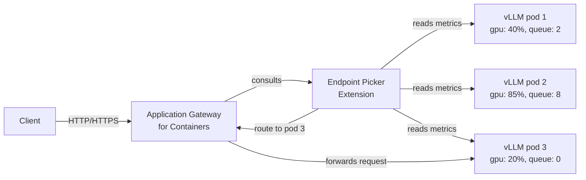

If you're running self-hosted AI models on AKS, routing inference traffic is a different problem to routing web traffic. A standard HTTP load balancer doesn't know about GPU queue depth or KV cache utilisation — it just sees HTTP requests. The new inference gateway for Application Gateway for Containers changes that.

Microsoft put this feature into public preview on 24 June 2026. It brings the Kubernetes [Gateway API Inference Extension](https://gateway-api-inference-extension.sigs.k8s.io/) into Application Gateway for Containers, giving you model-aware routing decisions at the ingress layer without building your own sidecar logic.

The short version: your gateway can now pick which model server pod handles a request based on real-time signals from the model itself, not just round-robin or connection count.

<!-- truncate -->

## What it is

The inference gateway extends Application Gateway for Containers with two new Kubernetes resource types: `InferencePool` and `InferenceObjective`. An `InferencePool` is a group of model server pods (for example, pods running vLLM) that the gateway manages as a unit. An `InferenceObjective` lets you express routing goals such as minimising latency for a particular model.

The component that does the actual routing decision is called the Endpoint Picker extension (EPP). The EPP runs as a separate deployment inside your AKS cluster and watches each pod in the pool. It reads vLLM metrics — queue depth, KV cache utilisation, which models are loaded — and tells the Application Gateway for Containers data path which specific pod should handle each request. Think of the EPP as an intelligent traffic controller that understands the state of your model servers, rather than a simple health checker.

The gateway still handles the usual Application Gateway for Containers concerns: TLS termination, WAF attachment, and health probes. The inference-specific logic sits on top of that.



## Who should care

If you're running self-hosted LLMs on AKS — whether for cost control, data residency, or model customisation — this matters. Without model-aware routing, you can end up sending a request to a pod that's already saturated, which increases latency across your whole inference tier.

It's also relevant if you want enterprise ingress features (WAF, TLS, Azure-managed certificates) in front of your model servers without standing up a separate ingress stack. Application Gateway for Containers handles all of that.

The feature works with any vLLM-compatible model that exposes an OpenAI-compatible API at `/v1`. The docs use `Qwen/Qwen2.5-0.5B-Instruct` as the example, but the configuration is model-agnostic.

## How to use it

You need an AKS cluster with a GPU node pool and the NVIDIA device plugin installed. The ALB Controller version needs the inference gateway feature enabled at install time.

### Enable the feature on ALB Controller

When you install or upgrade ALB Controller, add the `aiGateway` flag:

```bash
helm upgrade --install alb-controller \
  oci://mcr.microsoft.com/application-lb/charts/alb-controller \
  --namespace azure-alb-system \
  --set albController.aiGateway=true \
  --version <version>
```

This also installs the Gateway API Inference Extension CRDs (v1.3.1). You can verify them:

```bash
kubectl get crds | grep inference.networking
```

You should see `inferencepools.inference.networking.k8s.io` and `inferenceobjectives.inference.networking.x-k8s.io`.

### Deploy the InferencePool and EPP

The Kubernetes Gateway API Inference Extension project publishes a Helm chart that deploys the EPP and creates the `InferencePool` resource in one step:

```bash
INFERENCE_POOL_NAME='vllm-qwen2-5-0-5b'
NAMESPACE='inference'

helm upgrade --install "${INFERENCE_POOL_NAME}" \
  --namespace "${NAMESPACE}" \
  --set "inferencePool.modelServers.matchLabels.app=${INFERENCE_POOL_NAME}" \
  --set "inferenceExtension.image.tag=v1.3.1" \
  --set "provider.name=none" \
  --version "v1.3.1" \
  oci://registry.k8s.io/gateway-api-inference-extension/charts/inferencepool
```

The chart labels your model server pods to match the `InferencePool` selector, so keep the `app` label consistent between your vLLM deployment and this chart value.

### Create the Gateway and HTTPRoute

Create an Application Gateway for Containers `Gateway` resource, then an `HTTPRoute` that points at the `InferencePool` as its backend:

```bash
kubectl apply -f - <<EOF
apiVersion: gateway.networking.k8s.io/v1
kind: HTTPRoute
metadata:
  name: ${INFERENCE_POOL_NAME}
  namespace: ${NAMESPACE}
spec:
  parentRefs:
  - name: ai-gateway
  rules:
  - matches:
    - path:
        type: PathPrefix
        value: /v1
    backendRefs:
    - group: inference.networking.k8s.io
      kind: InferencePool
      name: ${INFERENCE_POOL_NAME}
EOF
```

Once the gateway is programmed, requests to `/v1/chat/completions` route through the EPP to the optimal pod.

## Gotchas and limits

A few things worth knowing before you dive in.

**GPU node pool is required.** The vLLM model server needs a `nvidia.com/gpu` resource. If your node pool isn't tainted with `sku=gpu:NoSchedule`, remove the toleration from the vLLM deployment manifest, but you still need the GPU SKU.

**Model download takes time.** The first pod startup includes pulling the model weights from Hugging Face. For larger models this can take ten minutes or more. The Helm chart startup probe has a 60-attempt limit at 10-second intervals, which gives you around 10 minutes of grace.

**Helm release name collision.** The `inferencepool` chart names the `InferencePool` after the Helm release. If you already have an `InferencePool` with the same name that was created outside Helm, the install fails with an `invalid ownership metadata` error. Delete the existing pool first or pick a different release name.

**Preview terms apply.** This is a public preview feature. Don't run it for production inference workloads until it reaches GA. The [supplemental preview terms](https://azure.microsoft.com/support/legal/preview-supplemental-terms/) apply.

**EPP port.** The EPP service runs on port 9002. If you have restrictive network policies in your cluster, make sure the Application Gateway for Containers data path can reach that port.

## Quick takeaway

This is a practical addition for teams running self-hosted models on AKS who want model-aware ingress without building custom routing logic. The EPP reads live model server metrics and steers each request to the least-loaded pod, which should meaningfully reduce tail latency under uneven load.

If you're already using Application Gateway for Containers, the incremental cost to try this is low — just the `aiGateway=true` flag on ALB Controller and a GPU-backed node pool. Worth evaluating now while it's in preview.

## Links

- Official announcement: [Public Preview: Application Gateway for Containers – Inference gateway](https://azure.microsoft.com/en-us/updates?id=566516)
- Learn: [Configure the inference gateway](https://learn.microsoft.com/en-us/azure/application-gateway/for-containers/how-to-inference-gateway)
- Learn: [Application Gateway for Containers overview](https://learn.microsoft.com/en-us/azure/application-gateway/for-containers/overview)
- Learn: [Use GPUs for compute-intensive workloads on AKS](https://learn.microsoft.com/en-us/azure/aks/gpu-cluster)
- Kubernetes: [Gateway API Inference Extension](https://gateway-api-inference-extension.sigs.k8s.io/)
