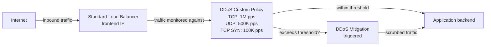

Azure DDoS Protection has always used machine learning to auto-tune detection thresholds per protected resource. That adaptive approach works well for most workloads — but it can be a poor fit if your traffic has known, predictable patterns that don't match what the model expects. The new custom policy feature, now in public preview, lets you override the automatic thresholds with your own fixed values for specific protocols.

Think of it like this: adaptive tuning is the thermostat that learns your home's routine and adjusts itself. A custom policy is the moment you decide the thermostat is wrong and set the temperature yourself. For most people the thermostat is fine. For the person who hosts a gaming event every Saturday night, knowing exactly what "normal" looks like makes a manual override worth it.

The feature works at the protocol level — TCP, UDP, and TCP SYN — and applies to inbound traffic on Standard Load Balancer frontend IPs. Protocols you don't tune continue using adaptive mitigation, so you only take over what you specifically need to control.

<!-- truncate -->

## What it is

A custom policy is a standalone Azure resource (`Microsoft.Network/ddosCustomPolicies`) that contains one or more *detection threshold rules*. Each rule tells Azure DDoS Protection: "for this protocol, trigger mitigation when inbound traffic exceeds this many packets per second." The threshold range is 50,000 to 2,000,000 packets per second.

You create the policy, define your rules, and then associate it with one or more Standard Load Balancer frontend IP configurations. Once associated, inbound traffic to those frontend IPs is measured against your fixed thresholds rather than the ML-generated ones.



Protocols you don't add a rule for continue to use adaptive auto-tuning. So if you only care about TCP, you can set just a TCP rule and leave UDP and TCP SYN to the automatic system.

## Who should care

The default adaptive tuning is genuinely good for typical web workloads where traffic builds up, fluctuates during the day, and drops overnight. The model learns that pattern and sets thresholds accordingly.

Custom policy is useful when adaptive tuning is working against you:

**Gaming platforms** that run scheduled events — tournaments, game launches, server resets — see intentional traffic spikes that can look attack-like to an adaptive model. A custom threshold lets you tell Azure that 800,000 UDP packets per second is perfectly normal for Saturday evenings.

**Latency-sensitive applications** where false-positive mitigation is worse than the attack itself. If your adaptive threshold is too tight for a financial trading feed or a real-time data pipeline, a fixed threshold gives you predictable behaviour.

**High-throughput services** with sustained rates that sit close to where adaptive tuning would normally set its trigger. If you're consistently running at 700,000 TCP pps, the adaptive model might set its threshold at 750,000 — a 7% margin. A custom policy lets you set a more comfortable headroom.

**Regulated environments** that need consistent, auditable DDoS settings across all deployments, not thresholds that silently change as the model updates.

## How to use it

### Via the Azure portal

1. Search for **DDoS custom policy** in the Azure portal and select **Create**.
2. Fill in the basics: subscription, resource group, name, and region.
3. On the **Custom rules** tab, select **Add a rule** under **Detection threshold**.
4. For each rule: give it a name, pick the protocol (TCP, UDP, or TCPSYN), and enter a threshold between 50,000 and 2,000,000 packets per second. Direction is inbound (the only option during preview).
5. Optionally associate a Standard Load Balancer frontend IP on the same page, or add it later from the policy's **Policy settings** page.
6. Select **Review + create**, then **Create**.

### Via Azure CLI

This creates a policy with a single TCP threshold and associates it with a Standard Load Balancer frontend IP:

```bash
# Create a resource group
az group create --name MyResourceGroup --location eastus

# Create a custom policy with a TCP detection threshold of 1M pps
az network ddos-custom-policy create \
  --resource-group MyResourceGroup \
  --name MyCustomPolicy \
  --location eastus \
  --detection-rule-name tcp-threshold \
  --detection-mode TrafficThreshold \
  --traffic-type Tcp \
  --packets-per-second 1000000

# Get the policy's resource ID
dcpId=$(az network ddos-custom-policy show \
  --resource-group MyResourceGroup \
  --name MyCustomPolicy \
  --query id --output tsv)

# Associate the policy with a Standard Load Balancer frontend IP
az network lb frontend-ip update \
  --resource-group MyResourceGroup \
  --lb-name MyLoadBalancer \
  --name MyFrontendIP \
  --ddos-settings "ddos-custom-policy={id:$dcpId}"
```

The `--packets-per-second` value must be between 50,000 and 2,000,000. The `--traffic-type` accepts `Tcp`, `Udp`, or `TcpSyn`. The CLI `create` command only sets one rule — add more from the portal or use an ARM template if you need to tune multiple protocols in one deployment.

### Via ARM template

If you want everything in code, here's a template that creates a custom policy with a single TCP threshold and links it to a frontend IP in one deployment:

```json
{
  "$schema": "https://schema.management.azure.com/schemas/2019-04-01/deploymentTemplate.json#",
  "contentVersion": "1.0.0.0",
  "parameters": {
    "policyName": {
      "type": "string"
    },
    "location": {
      "type": "string",
      "defaultValue": "[resourceGroup().location]"
    },
    "frontendIPConfigurationId": {
      "type": "string",
      "metadata": {
        "description": "Resource ID of the Standard Load Balancer frontend IP configuration."
      }
    },
    "tcpThreshold": {
      "type": "int",
      "defaultValue": 1000000,
      "metadata": {
        "description": "Inbound TCP detection threshold in packets per second (50,000 to 2,000,000)."
      }
    }
  },
  "resources": [
    {
      "type": "Microsoft.Network/ddosCustomPolicies",
      "apiVersion": "2025-07-01",
      "name": "[parameters('policyName')]",
      "location": "[parameters('location')]",
      "properties": {
        "detectionRules": [
          {
            "name": "tcp-threshold",
            "properties": {
              "detectionMode": "TrafficThreshold",
              "trafficDetectionRule": {
                "packetsPerSecond": "[parameters('tcpThreshold')]",
                "trafficType": "Tcp"
              }
            }
          }
        ],
        "frontEndIpConfiguration": [
          {
            "id": "[parameters('frontendIPConfigurationId')]"
          }
        ]
      }
    }
  ]
}
```

To add UDP or TCP SYN rules as well, add more entries to the `detectionRules` array with `trafficType` set to `Udp` or `TcpSyn`.

## Gotchas and limits

A few things worth checking before you commit to a threshold.

**Standard Load Balancer only.** The feature works exclusively with Standard Load Balancer frontend IP configurations. You can't apply a custom policy directly to a public IP resource on its own. If your DDoS-protected workload doesn't sit behind a Standard Load Balancer, you'll need to restructure your architecture or wait for broader support.

**Inbound only.** During preview, detection thresholds only apply to inbound traffic. Outbound traffic continues to use the default behaviour.

**Threshold range is fixed.** The minimum is 50,000 pps and the maximum is 2,000,000 pps. You can't go lower than 50,000 — if you need mitigation to trigger at lower rates, that's outside the scope of this feature.

**Some regions aren't supported yet.** If you create a policy in one of these regions you'll get a `RegionNotEnabledForFeature` error:

- Sweden South
- Southeast US
- Indonesia Central
- Chile Central
- Austria East
- Southeast US 3
- Malaysia West
- Belgium Central
- Israel Northwest

**Setting a threshold disables adaptive tuning for that protocol.** This is by design, but it's worth internalising. Once you set a TCP threshold, the ML model no longer updates it automatically. If your traffic profile changes significantly, you need to update the policy yourself. Start conservative, test in a non-production environment, and watch your mitigation telemetry after applying a policy.

**Preview caveats apply.** This is a public preview feature, so the [Supplemental Terms of Use for Microsoft Azure Previews](https://azure.microsoft.com/support/legal/preview-supplemental-terms/) apply. Don't rely on it for production workloads without understanding the stability implications.

## Quick takeaway

Azure DDoS Protection custom policy fills a genuine gap for teams who know their traffic better than a machine learning model can learn it. If you're running a gaming platform, a high-throughput data service, or any workload with predictable traffic spikes, fixed protocol-level thresholds give you control that adaptive tuning can't. It's a narrow feature — Standard Load Balancer frontend IPs only, inbound traffic only — but for the workloads it fits, it's a meaningful addition.

If you're evaluating it, start with one protocol, set a conservative threshold, and monitor the mitigation metrics carefully before rolling it out broadly.

## Links

- Official announcement: [Public Preview: Azure DDoS Protection custom policy](https://azure.microsoft.com/en-us/updates?id=568063)
- Learn: [What is Azure DDoS Protection custom policy? (preview)](https://learn.microsoft.com/en-us/azure/ddos-protection/ddos-custom-policy-overview)
- Learn: [Create and manage a custom policy using the Azure portal (preview)](https://learn.microsoft.com/en-us/azure/ddos-protection/manage-ddos-custom-policy-portal)
- Learn: [Create a custom policy using Azure CLI (preview)](https://learn.microsoft.com/en-us/azure/ddos-protection/manage-ddos-custom-policy-cli)
- Learn: [Create a custom policy with an ARM template (preview)](https://learn.microsoft.com/en-us/azure/ddos-protection/manage-ddos-custom-policy-template)
- Learn: [Azure DDoS Protection overview](https://learn.microsoft.com/en-us/azure/ddos-protection/ddos-protection-overview)
