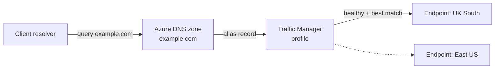

Azure DNS can now hand DNS-based load balancing over to Traffic Manager directly. The integration entered public preview on 4 August 2026, and it lets you associate a record set in your Azure DNS zone with a Traffic Manager profile using alias records — no CNAME pointing at a `trafficmanager.net` name required.

If you've ever wanted your zone apex — `example.com` rather than `www.example.com` — to benefit from Traffic Manager's failover, performance, or geographic routing, this is the feature that makes it clean. DNS standards don't allow a CNAME at the apex, so until now you had to compromise or work around it.

The alias record does the heavy lifting. Azure DNS resolves queries against the Traffic Manager profile in real time, so your DNS answers follow the health and routing rules you've set, and they stay in sync when the underlying resources change.

<!-- truncate -->

## What it is

Traffic Manager is Azure's DNS-based traffic router. It doesn't sit in the data path — it answers DNS queries with the endpoint that best matches your routing method, whether that's priority failover, weighted distribution, lowest latency, or geography. Traditionally you'd connect your own domain to it with a CNAME record pointing at `myprofile.trafficmanager.net`.

This integration replaces that CNAME step with an alias record set inside Azure DNS. You create an A or AAAA record set, mark it as an alias, and target your Traffic Manager profile. Azure DNS then answers queries for that name according to the profile's routing rules.



Because it's an alias rather than a static record, Azure keeps the answer synchronised with the profile. If an endpoint fails a health check, DNS responses shift to a healthy one without you touching the zone.

## Who should care

**Anyone hosting an app on a root domain.** The "CNAME at apex" problem has been a pain for years. If you want `example.com` itself to fail over between regions, this integration solves it without hacks.

**Teams running multi-region deployments.** If you already use Traffic Manager for subdomains, you can now bring your apex records into the same routing model and manage everything in one Azure DNS zone.

**Anyone tired of stale DNS.** Alias records track their target, so a change to the Traffic Manager profile doesn't leave a dangling record behind. That's one less way for DNS to break during infrastructure changes.

## How to use it

In the portal, open your Azure DNS zone, add a record set, and flip **Alias record set** to yes. Choose **Azure resource** as the alias type and pick your Traffic Manager profile as the target.

With the Azure CLI, it looks like this:

```bash
# Get the resource ID of the Traffic Manager profile
tmid=$(az network traffic-manager profile show \
    --resource-group myResourceGroup \
    --name myTrafficManagerProfile \
    --query id --output tsv)

# Create an alias A record at the zone apex pointing at the profile
az network dns record-set a create \
    --resource-group myResourceGroup \
    --zone-name example.com \
    --name "@" \
    --target-resource "$tmid"
```

One thing to plan for: when the alias sits at the zone apex, DNS queries must resolve to IP addresses. That means your Traffic Manager profile needs external endpoints defined by IPv4 or IPv6 addresses rather than FQDNs. For subdomain records you have more flexibility.

## Gotchas and limits

**It's a preview.** The [Supplemental Terms of Use for Microsoft Azure Previews](https://azure.microsoft.com/support/legal/preview-supplemental-terms/) apply, so no SLA yet. Test it somewhere non-critical first.

**Apex records need IP-based endpoints.** As above, an alias at the root of your zone requires the Traffic Manager profile to use external endpoints with IP addresses. If your endpoints are App Services or other FQDN-only targets, apex aliasing won't work for them yet.

**DNS-based routing has DNS-shaped behaviour.** Traffic Manager steers traffic through DNS answers, so failover speed depends on the record TTL and how well resolvers honour it. Keep TTLs short if quick failover matters to you.

**Your zone must be in Azure DNS.** The alias mechanism only works when Azure DNS hosts the zone. If your domain lives with another DNS provider, you're still in CNAME territory.

## Quick takeaway

This is a small feature that removes a long-standing annoyance. DNS-based load balancing at the zone apex used to need workarounds; now it's a single alias record. If you run multi-region apps on Azure and want your root domain to fail over cleanly, it's worth a try while it's in preview.

## Links

- Official announcement: [Public Preview: Azure DNS enables DNS-based load balancing through Traffic Manager integration](https://azure.microsoft.com/updates?id=565214)
- Learn: [Azure DNS alias records overview](https://learn.microsoft.com/en-us/azure/dns/dns-alias)
- Learn: [What is Traffic Manager?](https://learn.microsoft.com/en-us/azure/traffic-manager/traffic-manager-overview)
- Learn: [Traffic Manager routing methods](https://learn.microsoft.com/en-us/azure/traffic-manager/traffic-manager-routing-methods)
- Learn: [Host load-balanced Azure web apps at the zone apex](https://learn.microsoft.com/en-us/azure/dns/dns-alias-appservice)
