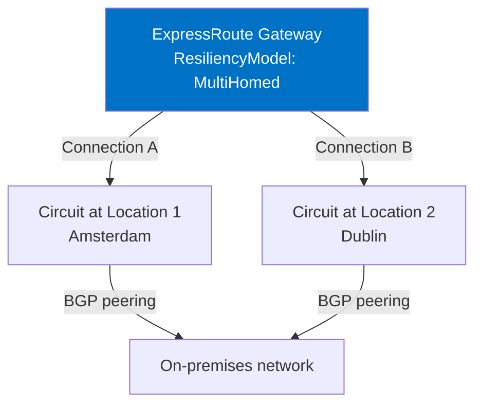

If you've ever spent an afternoon worrying about whether your ExpressRoute gateway is actually resilient — or just *feels* like it is — Azure's new Resiliency Guard feature is worth a look. It's a guided setup experience, now in public preview, that helps you configure your ExpressRoute virtual network gateway to meet a defined level of availability. Rather than leaving you to piece together best practices from documentation, it surfaces the resiliency model directly in the gateway configuration and tells you whether you've met it.

The feature introduces two resiliency models: **multi-homed** and **single-homed**. Multi-homed means your gateway connects to circuits in at least two physically separate locations, so a location-level outage doesn't take down your hybrid connectivity. Single-homed is the simpler setup — one circuit, one location — which works fine when location-level redundancy isn't a requirement.

What's new here isn't really the architecture. Well-designed ExpressRoute deployments have been using redundant circuits for years. What's new is that Azure now knows what you've configured and can tell you whether it meets the multi-homed standard. Azure Advisor will actively recommend upgrading to multi-homed for any critical workloads it spots running on single-homed gateways.

<!-- truncate -->

## What it is

Resiliency Guard is a property on the ExpressRoute virtual network gateway resource called `ResiliencyModel`. When you create or update a gateway, you set this to either `MultiHomed` or `SingleHomed`. The portal exposes this as a **Resiliency Model** selector on the gateway's **Configuration** tab.

Once you've set the model and connected your circuits, the portal shows you a connectivity status that confirms whether you've actually met the standard. For multi-homed, that means Azure has verified you have connections to circuits in different peering locations, or that you're using an ExpressRoute Metro circuit. If you haven't wired everything up yet, the portal makes that gap visible rather than quietly letting you think you're covered.



One safeguard worth knowing: Azure blocks the deletion of multi-homed and Metro gateways by default. To delete one, you first have to downgrade it to single-homed and wait for the change to propagate. It's an intentional speed bump to stop accidental teardowns of gateways that carry critical traffic.

## Who should care

If you run ExpressRoute for anything that needs high availability, this affects how you should think about gateway configuration going forward. Azure Advisor will start generating recommendations for single-homed gateways that it classifies as running critical workloads, so you may start seeing those surface in your subscription.

For teams that already run dual-circuit setups in separate peering locations, the main change is adopting the `ResiliencyModel` property so Azure recognises the intent. For teams that haven't yet built out redundancy, this is a useful nudge with a clear target state.

Virtual WAN gateways aren't supported in this preview. If you're using Virtual WAN, you're not yet in scope.

## How to use it

### Portal

When you create a new ExpressRoute virtual network gateway, you'll find the **Resiliency Model** option in the gateway creation form. Select **Multi-homed** or **Single-homed** depending on your requirements.

For an existing gateway, open the **Configuration** tab and change the model there. To move from single-homed to multi-homed, you'll first need to add a second connection to a circuit at a different location (or a Metro circuit), wait for it to establish, and then flip the model. The portal won't let you set multi-homed if you haven't met the connectivity requirement.

### Azure CLI

```bash
# Create a new gateway with multi-homed resiliency model
az network vnet-gateway create \
  --resource-group MyResourceGroup \
  --name MyERGateway \
  --location westeurope \
  --gateway-type ExpressRoute \
  --sku ErGw2AZ \
  --vnet MyVNet \
  --resiliency-model MultiHomed

# Update an existing gateway's resiliency model
az network vnet-gateway update \
  --resource-group MyResourceGroup \
  --name MyERGateway \
  --resiliency-model MultiHomed
```

Make sure the gateway already has connections to circuits in separate locations before setting `MultiHomed`. If the connectivity requirement isn't met, the portal shows a mismatch banner and the gateway continues to behave as single-homed in practice.

### Bicep

```bicep
resource erGateway 'Microsoft.Network/virtualNetworkGateways@2025-07-01' = {
  name: 'MyERGateway'
  location: 'westeurope'
  properties: {
    gatewayType: 'ExpressRoute'
    sku: {
      name: 'ErGw2AZ'
      tier: 'ErGw2AZ'
    }
    ipConfigurations: [
      {
        name: 'gwipconfig'
        properties: {
          subnet: {
            id: gatewaySubnetId
          }
          publicIPAddress: {
            id: publicIpId
          }
        }
      }
    ]
    resiliencyModel: 'MultiHomed'
  }
}
```

Replace `gatewaySubnetId` and `publicIpId` with the resource IDs for your gateway subnet and public IP. The `resiliencyModel` property is what's new here — everything else follows the standard ExpressRoute gateway schema.

## Gotchas and limits

**Virtual WAN isn't supported yet.** The preview covers ExpressRoute virtual network gateways only. If you're on Virtual WAN, you'll have to wait.

**You need to register for the preview.** This isn't automatically enabled for all subscriptions. Submit the [public preview form](https://forms.office.com/r/L828eyz8Qj) to enable it for your subscription.

**The resiliency model is declarative, not enforcement.** Setting `MultiHomed` doesn't automatically create resilient connectivity — it declares your intent. You still need to create the connections to multiple circuits at different locations. If you set `MultiHomed` without meeting the connectivity requirement, the gateway shows a mismatch state in the portal.

**Downgrading from multi-homed requires extra steps.** To switch back to single-homed on a non-Metro gateway, you need to change the model first, confirm the change, and then manually delete the extra connections. If you skip deleting the extra connections, the mismatch banner reappears.

**Deletion protection applies.** Multi-homed and Metro gateways are protected from accidental deletion. You have to downgrade to single-homed before Azure will let you delete the gateway. Plan for this if you're automating gateway lifecycle management.

**Preview terms apply.** The [Supplemental Terms of Use for Microsoft Azure Previews](https://azure.microsoft.com/support/legal/preview-supplemental-terms/) cover this feature. Don't run it as the sole resiliency mechanism for production workloads without considering the stability implications.

## Quick takeaway

ExpressRoute Resiliency Guard doesn't change how you build a resilient ExpressRoute setup — circuits in separate locations, redundant connections, BGP failover. What it changes is that Azure now has a formal property to represent and validate that intent. Azure Advisor can then act on it, surfacing gaps rather than leaving them invisible.

If you're already running multi-circuit setups, it's worth adopting the `ResiliencyModel` property so your configuration is explicit and Advisor doesn't flag you. If you're planning a new gateway, start with the right model from the beginning.

## Links

- Official announcement: [[In preview] Public Preview: Azure ExpressRoute resiliency guard](https://azure.microsoft.com/updates?id=568666)
- Learn: [ExpressRoute Resiliency Guard (Preview)](https://learn.microsoft.com/azure/expressroute/resiliency-model)
- Learn: [ExpressRoute gateway overview](https://learn.microsoft.com/azure/expressroute/expressroute-about-virtual-network-gateways)
- Learn: [ExpressRoute Metro](https://learn.microsoft.com/azure/expressroute/metro)
