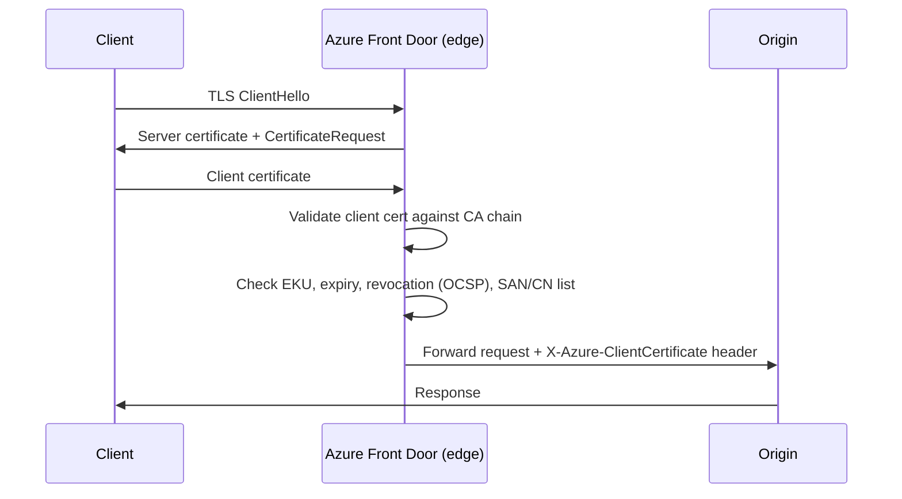

Normal TLS means the client checks the server's certificate and decides whether to trust it. Mutual TLS — mTLS for short — adds the other half of that handshake: the server also checks the client's certificate. Azure Front Door can now do that verification at the edge, and it's in public preview.

This matters for any workload that needs to know exactly which clients are allowed in, not just that the connection is encrypted. Think B2B APIs, IoT device fleets, banking integrations, or internal apps where "authenticated user" isn't enough and you want cryptographic proof of identity at the network layer.

Before this preview, you'd have to push mTLS validation back to your origins and handle it there. Now Front Door does it globally, before traffic ever reaches your backend.

<!-- truncate -->

## What it is

Mutual TLS (mTLS) is a variation of the standard TLS handshake where both sides present a certificate. In a typical HTTPS connection, only the server proves its identity. With mTLS, the client also presents a certificate, and the server (or in this case, Azure Front Door) validates it against a trusted Certificate Authority (CA).

Azure Front Door mTLS is available on the **Premium** tier only. You upload your CA certificate chain to Front Door via Azure Key Vault, configure your endpoint and domains to enforce mTLS, and Front Door handles validation at the edge across all its global points of presence.



Front Door strips any incoming `X-Azure-Client*` headers from the client before they reach your origin, so your backend can trust those headers as genuine attestations from Front Door rather than client-supplied values.

## Who should care

If your API or service already relies on username/password or OAuth tokens, mTLS is a complementary layer rather than a replacement. It's particularly useful when:

**You need device identity, not just user identity.** IoT devices, edge gateways, and service-to-service integrations often can't use interactive authentication. A client certificate baked into the device gives you cryptographic proof that the device is known and trusted.

**You're running B2B integrations.** Your partners can prove their identity with a certificate issued by their own CA. You upload that CA's root to Front Door, and you know every request really came from them.

**Compliance requires mutual authentication.** Some regulated environments mandate mTLS at the network boundary. Doing it at the edge means your origins don't have to implement it individually.

**You want defence in depth.** Even with application-layer authentication in place, mTLS at the edge stops unauthenticated connections from even reaching your backend. It's a Zero Trust principle applied at the network edge.

## How to configure it

The setup involves three things: uploading your CA certificate to Key Vault, configuring a new mTLS-enabled endpoint, and then creating your custom domains with mTLS settings applied. The order matters — read the gotchas section first before touching any existing Front Door configuration.

### Via the Azure portal

1. In your Front Door profile, go to **Security > Mutual TLS CA certificates** and add your CA chain (root + up to three intermediates, PEM format, each under 25 KB).
2. Under **Settings > Front Door manager**, create a **new endpoint** and check **Enforce mutual TLS**. You can't use the default `*.azurefd.net` domain with mTLS — only custom domains.
3. Go to **Settings > Domains**, add a new custom domain, scroll to **Advanced settings**, and enable **Mutual TLS**. Choose one of the four modes (see below). Associate the domain with your mTLS endpoint.
4. Add a route in Front Door Manager to connect the domain to an origin group.
5. Once validated, point your domain's CNAME to the Front Door endpoint. Also lock down your origin to only accept traffic from Front Door.

### mTLS validation modes

There are four modes, from strictest to most permissive:

**Client certificate required and validated** — the default when mTLS is on. Front Door requires a cert, checks it against the CA chain, checks expiry, revocation via OCSP, and optionally checks the certificate's SAN/CN against an allowlist you configure.

**Client certificate required but not validated** — Front Door requires a cert and rejects requests without one, but passes all validation responsibility to your origin. The cert is forwarded in a header.

**Client certificate validation if presented** — optional cert. If the client sends one, Front Door validates it fully. If not, the request passes through for your origin to handle.

**mTLS passthrough to origin** — Front Door does nothing with the cert. Everything goes to your origin for handling.

### Via Azure CLI

This creates a new Front Door endpoint, enables mTLS, then adds a custom domain with the default strict validation mode:

```bash
# Upload CA cert to Key Vault first
az keyvault certificate import \
  --vault-name my-keyvault \
  --name my-ca-cert \
  --file ca-chain.pem

# Enable mTLS on a new endpoint (existing endpoints can't be converted)
az afd endpoint create \
  --resource-group MyRG \
  --profile-name my-afd-profile \
  --endpoint-name my-mtls-endpoint \
  --mutual-tls-enforcement Enabled

# Add the CA cert to Front Door from Key Vault
az afd ca-certificate create \
  --resource-group MyRG \
  --profile-name my-afd-profile \
  --certificate-name my-ca-cert \
  --secret-name my-ca-cert \
  --vault-name my-keyvault

# Create a custom domain with mTLS enabled
az afd custom-domain create \
  --resource-group MyRG \
  --profile-name my-afd-profile \
  --custom-domain-name api-example-com \
  --host-name api.example.com \
  --mutual-tls-enabled true \
  --mutual-tls-mode RequiredCertificateValidated \
  --certificate-name my-ca-cert
```

Once the domain validates, add a route to connect it to an origin group:

```bash
az afd route create \
  --resource-group MyRG \
  --profile-name my-afd-profile \
  --endpoint-name my-mtls-endpoint \
  --route-name my-route \
  --custom-domains api-example-com \
  --origin-group my-origin-group \
  --supported-protocols Https \
  --forwarding-protocol HttpsOnly
```

## Gotchas and limits

There are a few things to sort out before you enable this on anything live.

**Premium only.** mTLS isn't available on Front Door Standard. If you're on Standard, you'd need to upgrade.

**New endpoints only.** You can't enable mTLS on an existing Front Door endpoint. You need to create a new endpoint with mTLS enabled, move your domains across, and switch your DNS. That means planned downtime for existing domains — plan accordingly.

**No default domains.** The `*.azurefd.net` endpoint domain can't be added to routes on an mTLS endpoint. All your routes must use custom domains.

**No caching with mTLS.** Enabling mTLS on a domain disables caching for routes using that domain. If you need edge caching and mTLS, you're stuck — that combination isn't supported yet.

**CA chain limits.** You can upload a root plus up to three intermediate certificates. Each certificate must be PEM-encoded and under 25 KB. No auto-rotation is supported, but you can attach two CA certs at once for rollover — Front Door uses whichever one is valid.

**OCSP only for revocation.** Azure Front Door checks certificate revocation using OCSP. If your CA doesn't publish an OCSP responder in the AIA extension of client certs, revocation checking won't work.

**Public CA certs for mTLS are going away.** Due to industry changes, public CAs are moving away from issuing certificates with the client authentication Extended Key Usage (EKU). Front Door checks EKU, so certificates without it will fail validation. Plan to use your own private CA for mTLS client certs — that gives you full control and continuity.

**SAN/CN validation quirk.** If you enable SAN/CN list checking, your Front Door custom domain hostname must be explicitly in the allowed list. Wildcard domains in the allowed list match one subdomain level below the wildcard.

## Debugging 403 errors

If you get unexpected 403 responses after enabling mTLS, pass `X-Azure-DebugInfo: 1` with your request. Front Door returns `X-Azure-Externalerror` in the response with a specific error code. Common ones include `ClientCertMissing` (no cert presented), `ClientCertExpired`, `ClientCertRevoked`, `ClientCertIncorrectPurpose` (missing client auth EKU), and `ClientCertCNSANMismatch` (cert doesn't match your allowed list).

## Quick takeaway

Azure Front Door mTLS fills a real gap for teams that need cryptographic client identity verification at the edge. It's not a replacement for application-layer authentication, but as a complementary control it's strong — especially for B2B APIs, IoT workloads, and Zero Trust architectures. The main catch is that you can't retrofit it onto existing endpoints, so migrating an established Front Door profile takes a bit of planning. If you're setting up a new endpoint, it's the right time to turn it on.

This is a public preview, so check the [Supplemental Terms for Azure Previews](https://azure.microsoft.com/support/legal/preview-supplemental-terms/) before rolling it out to production workloads.

## Links

- Official announcement: [Public Preview: Azure Front Door mutual TLS](https://azure.microsoft.com/updates?id=569251)
- Learn: [Mutual TLS authentication in Azure Front Door (preview)](https://learn.microsoft.com/azure/frontdoor/mutual-tls)
- Learn: [Azure Front Door overview](https://learn.microsoft.com/azure/frontdoor/front-door-overview)
- Learn: [Secure traffic to Azure Front Door origins](https://learn.microsoft.com/azure/frontdoor/origin-security)
