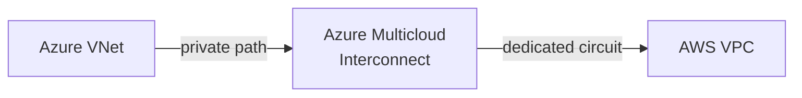

Azure Multicloud Interconnect is now in public preview. It gives you a managed, private connection between Azure and another cloud provider — starting with AWS — without touching the public internet or wrestling with manual cross-provider provisioning.

If you've ever tried to stitch together an AWS Direct Connect and an Azure ExpressRoute circuit on your own, you'll know the pain: separate commercial relationships, separate operational processes, and a lot of careful coordination just to get a private pipe between two clouds. This service collapses that into a single, cloud-native workflow inside Azure.

The feature builds on open industry APIs, so the two clouds can talk to each other about provisioning without you acting as the translator. At preview launch, you get 1 Gbps of dedicated bandwidth and a choice of four Azure regions.

<!-- truncate -->

## What it is

Azure Multicloud Interconnect is a managed connectivity service. You create a connection resource in Azure, generate an activation key, and share it with your AWS account to complete the circuit. No BGP configuration on your end, no coordinating with a colocation provider, no chasing up two separate support teams when something goes wrong.

Under the covers, Azure and AWS use standardised Open API specifications to handle provisioning between themselves. The result is a private, dedicated path that stays off the public internet.



Think of it like a managed ExpressRoute circuit, but instead of pointing at your on-premises network, it points at another cloud. The same enterprise-grade reliability and performance model, just aimed sideways rather than downwards.

## Who should care

**Teams running workloads split across Azure and AWS.** If you have data in AWS S3 that Azure ML workloads need to process, or an AWS-hosted SaaS that writes back to an Azure SQL database, a private path between the two clouds changes the architecture options available to you.

**Anyone worried about data egress costs or latency on cross-cloud traffic.** Routing production traffic through the public internet adds latency and, depending on your architecture, egress charges. A dedicated private connection gives you predictable performance and keeps traffic off the shared internet.

**Organisations with regulatory requirements around data transit.** If your compliance posture requires that data doesn't traverse the public internet, this is the mechanism that makes multicloud architectures easier to justify to your auditors.

## How to use it

During preview, the Azure CLI is your most reliable path. Here's the broad shape of it:

```bash
# Register the preview feature flag
az feature register \
    --namespace Microsoft.Network \
    --name AzureMulticloudInterconnect

# Create a Multicloud Interconnect resource
az network multicloud-interconnect create \
    --resource-group myResourceGroup \
    --name myMulticloudLink \
    --location eastus \
    --bandwidth-in-gbps 1 \
    --peer-provider aws

# Generate an activation key to share with your AWS account
az network multicloud-interconnect generate-key \
    --resource-group myResourceGroup \
    --name myMulticloudLink
```

On the AWS side, you use that activation key to accept the connection through the AWS Direct Connect console or CLI. Once both sides confirm, the circuit comes up.

You can also provision this through the Azure portal: search for **Multicloud Interconnect** in the marketplace, fill in your resource group, region, and target provider, and the portal walks you through key generation and sharing.

## Gotchas and limits

**Only AWS is supported in preview.** Support for additional cloud providers will come later, but for now AWS is the only option.

**Preview bandwidth is capped at 1 Gbps.** If you need more throughput, you'll need to wait for GA or request an exception through Microsoft.

**Preview regions are limited.** On the Azure side, you can use Australia East, East US, Germany West Central, and West US. The corresponding AWS regions are US East, US West, Asia Pacific Sydney, and Europe Frankfurt. Your workloads need to live close to those regions to get good performance from the connection.

**It's a preview.** The [Supplemental Terms of Use for Microsoft Azure Previews](https://azure.microsoft.com/support/legal/preview-supplemental-terms/) apply. No SLA, and behaviour may change before GA. Don't build production-critical paths on it yet.

**You still need network routing sorted.** The interconnect gives you a private path, but you need to ensure your Azure Virtual Network and your AWS VPC have the right routing and security rules to actually use it. The connection itself doesn't configure your application layer.

## Quick takeaway

Multicloud networking has always been harder than it should be. Azure Multicloud Interconnect doesn't reinvent the underlying technology — it removes the operational friction of setting it up. For teams with genuine cross-cloud requirements, the public preview is worth exploring, especially if AWS is already in your stack. Just keep it off production traffic until it reaches GA.

## Links

- Official announcement: [Public Preview: Azure Multicloud Interconnect](https://azure.microsoft.com/updates?id=570364)
- Blog: [Introducing Azure Multicloud Interconnect for AWS](https://azure.microsoft.com/en-us/blog/introducing-azure-multicloud-interconnect-for-aws/)
- Learn: [Azure Multicloud Interconnect overview](https://learn.microsoft.com/en-us/azure/multicloud-interconnect/overview)
- Learn: [Azure Multicloud Interconnect FAQ](https://learn.microsoft.com/en-us/azure/multicloud-interconnect/faq)
- Learn: [What is Azure ExpressRoute?](https://learn.microsoft.com/en-us/azure/expressroute/expressroute-introduction)
