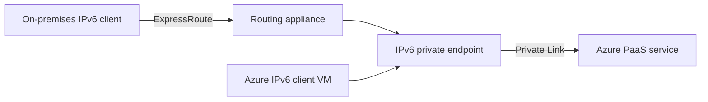

Azure Private Link now works over IPv6, in public preview. You can create private endpoints with IPv6 addresses and reach Azure PaaS services like Azure Storage and Azure SQL Database from IPv6 clients, whether they sit in an Azure virtual network or on-premises behind ExpressRoute.

This has been one of the more awkward gaps in Azure's IPv6 story. Private endpoints have been IPv4-only since they launched, so anyone running dual-stack or IPv6-first networks had to fall back to IPv4 just to reach PaaS services privately. That workaround starts to disappear now.

It's a preview, so there are regional limits and a short list of supported services. But if IPv6 is on your roadmap, this is worth a look.

<!-- truncate -->

## What it is

A private endpoint is a network interface in your virtual network that gives you a private IP address for an Azure PaaS service. Until now that address could only be IPv4. With this preview you can set the endpoint's IP version to IPv6 instead, and clients connect to the service over IPv6 end to end.

Two scenarios are supported. The first is Azure-native: an IPv6 client VM in a dual-stack virtual network connects to a PaaS service through an IPv6 private endpoint. The second is on-premises: IPv6 clients reach the endpoint over ExpressRoute, with a Virtual Network Routing Appliance in the virtual network forwarding traffic to the endpoint.



## Who should care

If you're building or migrating to IPv6-heavy networks, this closes a real gap. Large organisations moving to IPv6 to escape RFC 1918 address exhaustion have had to keep IPv4 around purely for private endpoints. That's an untidy exception in an otherwise clean design.

It also matters if you have on-premises IPv6 clients that need private access to Azure PaaS services over ExpressRoute. Before this, those clients needed NAT64 or dual-stack plumbing to make the last hop work.

If you're happy on IPv4 and have no IPv6 plans, you can skip this one for now.

## How to use it

First, register your subscription for the preview. Registration is mandatory before you configure anything:

```bash
az feature register --namespace Microsoft.Network --name SupportIPv6PrivateEndpoint --subscription <subscription-id>
az provider register --namespace Microsoft.Network
```

You'll need a dual-stack virtual network with `privateEndpointVNetPolicies` set to `Basic`, and a dual-stack subnet with `privateEndpointNetworkPolicies` set to `RouteTableEnabled`. Then create the private endpoint with the new `--ip-version-type` parameter:

```bash
az network private-endpoint create \
  --name <private-endpoint-name> \
  --resource-group <resource-group-name> \
  --vnet-name <vnet-name> \
  --subnet <subnet-name> \
  --private-connection-resource-id <resource-id-of-target-service> \
  --group-id <group-id> \
  --connection-name <connection-name> \
  --location <region> \
  --ip-version-type IPv6
```

DNS works the same way as IPv4 private endpoints: create the private DNS zone for the service, link it to your virtual network, and check the service's FQDN resolves to the endpoint's IPv6 address. The [full walkthrough on Microsoft Learn](https://learn.microsoft.com/en-us/azure/private-link/private-link-ipv6) covers the DNS, ExpressRoute, and routing setup in detail.

## Gotchas and limits

The preview is only available in five regions: West Central US, East Asia, UK South, Central US, and North Europe. If your workloads live elsewhere, you're waiting.

Service coverage is narrow too. Only Azure Storage, Azure SQL Database, Azure Key Vault, and Azure Data Explorer support IPv6 private endpoints right now. Most other PaaS services will presumably follow, but there's no published timeline.

The on-premises path needs a Virtual Network Routing Appliance to forward traffic from ExpressRoute to the endpoint, which adds a component you don't need with IPv4 private endpoints. And as with any preview, there's no SLA and Microsoft doesn't recommend it for production workloads.

## Takeaway

This is a meaningful step in Azure's slow march towards proper IPv6 parity. It won't change anything for IPv4-only estates, but if you're designing IPv6-first networks it removes one of the more stubborn IPv4 dependencies. Try it in a lab region now, and keep an eye on the service and region list as the preview grows.

You can read the [official announcement](https://azure.microsoft.com/updates?id=568842) and the [configuration guide on Microsoft Learn](https://learn.microsoft.com/en-us/azure/private-link/private-link-ipv6).
