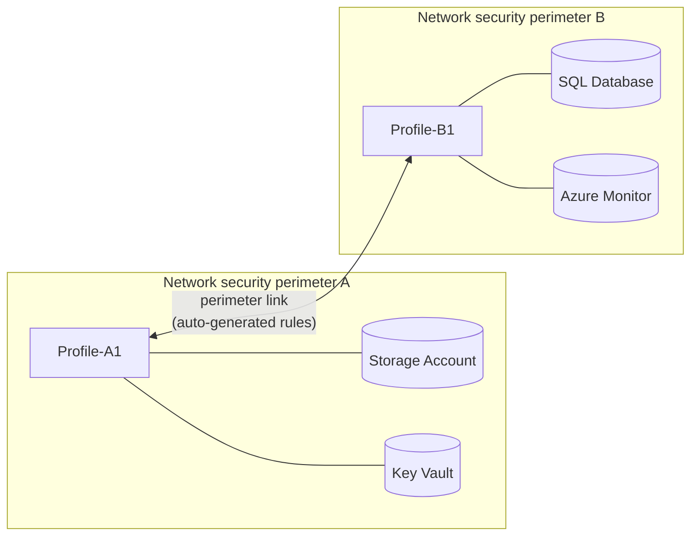

Network security perimeter (NSP) is Microsoft's answer to PaaS firewall sprawl: draw a boundary around your storage accounts, key vaults, and databases, then manage access rules at the perimeter level instead of per resource. It works well — right up until a resource inside one perimeter needs to talk to a resource inside another.

Until now the answer was manual access rules on both sides, which meant punching holes in the very boundaries you built to avoid exactly that. The new **perimeter link** feature, now in public preview, fixes this. You create a single link between two perimeters and Azure generates the required inbound and outbound rules on both sides for you.

Think of it as a trust handshake between two walled gardens. The gardens stay walled, but the residents you choose can visit each other without you propping the gates open.

<!-- truncate -->

## What it is

A perimeter link — Microsoft also calls it a cross-perimeter connection — joins two independent network security perimeters through one connection. You pick a *local* profile in your perimeter and a *remote* profile in the other perimeter, and the link creates a trust relationship between them.

Once the link exists, resources associated with the linked profiles can communicate without any extra NSP access rules. Azure automatically adds the inbound and outbound allow rules to both profiles, with a source type of **Network security perimeter**, so you can see exactly which rules came from the link.

The link is symmetric. *Local* and *remote* are just relative to whichever perimeter you configure it from — traffic flows in both directions once the link is up.



One important detail: perimeter links require **managed identity authentication**. Resources talking across the link must use managed identities — no other authentication method is supported. That keeps the whole thing aligned with Zero Trust principles: the link establishes network trust, but every request still carries a verifiable identity.

## Who should care

If you've adopted NSP and split your estate into more than one perimeter, this is for you. A common pattern is a central logging or monitoring perimeter that every workload perimeter needs to reach — Log Analytics workspaces in one perimeter, application resources in others. Before perimeter links, that meant hand-crafted access rules on every perimeter, kept in sync by hope and discipline.

It also helps teams that separate perimeters by environment, business unit, or subscription. A key vault in a shared-services perimeter serving secrets to an application in a workload perimeter is exactly the scenario this was built for.

During the preview, six PaaS services support cross-perimeter connectivity: Azure SQL Database, Azure Storage, Azure Cosmos DB, Azure Key Vault, Azure Monitor, and Azure Service Bus. If your cross-perimeter traffic involves other services, you'll still need manual rules for those.

## How to use it

### Register the preview feature

The feature sits behind the `AllowNspLink` flag on the `Microsoft.Network` provider:

```bash
az feature register \
    --namespace Microsoft.Network \
    --name AllowNspLink

# Wait for the Registered state
az feature show \
    --namespace Microsoft.Network \
    --name AllowNspLink \
    --query properties.state \
    --output tsv

# Refresh the provider
az provider register --namespace Microsoft.Network
```

You'll also need the NSP CLI extension if you don't have it already: `az extension add --name nsp`.

### Create the link

With two perimeters in place — each with a profile and at least one associated PaaS resource — creating the link is one command:

```bash
# Grab the resource ID of the remote perimeter
remotePerimeterId=$(az network perimeter show \
    --name remote-nsp \
    --resource-group remote-rg \
    --query id \
    --output tsv)

# Create the link from the local perimeter
az network perimeter link create \
    --name link-to-remote \
    --perimeter-name local-nsp \
    --resource-group local-rg \
    --auto-remote-nsp-id "$remotePerimeterId" \
    --local-inbound-profile "['local-profile']" \
    --remote-inbound-profile "['remote-profile']"
```

After the link is created, check the inbound and outbound rules on both profiles. You'll see new auto-generated rules with a source type of **Network security perimeter** — proof the link is doing its job. The portal and PowerShell (`New-AzNetworkSecurityPerimeterLink`) work too if the CLI isn't your thing.

Enable diagnostic logging on your perimeters, profiles, and associated resources before you start. You'll want it for validating that cross-perimeter traffic actually flows.

## Gotchas and limits

**Managed identity is mandatory.** If your service-to-service calls use keys, SAS tokens, or connection strings, the link won't help you. Move to managed identities first.

**Auto approval only works in the same subscription.** For cross-subscription links, the person creating the link needs Contributor access on the remote subscription, or the `Microsoft.Network/networkSecurityPerimeters/linkPerimeter/action` permission on the remote NSP. Without one of those, the link can't be created.

**Ten links per perimeter.** That's the maximum during preview. If you're planning a hub perimeter that everything links to, count your spokes before you commit to the design.

**Removal is one-sided.** Either perimeter's administrator can delete the link — no consent needed from the other side, even if the link was originally created through mutual approval. When the link goes, the auto-generated rules go with it and cross-perimeter traffic is denied immediately. Worth knowing before you build production dependencies on a link someone else can remove.

**It's a preview.** No SLA, and the usual preview terms apply. It's available in all Azure public and US Government regions that support NSP, but I'd keep it out of production until GA.

## Quick takeaway

Perimeter links remove the ugliest part of running multiple network security perimeters: the manual rules you had to maintain whenever resources needed to talk across boundaries. One link, automatic rules on both sides, managed identity enforced throughout.

If you're already running NSP with more than one perimeter, this is worth testing now. If you're still deciding whether to adopt NSP at all, the fact that Microsoft is filling in gaps like this suggests the model is maturing nicely.

## Links

- Official announcement: [[In preview] Public Preview: Perimeter link feature in network security perimeter](https://azure.microsoft.com/updates?id=568837)
- Learn: [Perimeter link feature in Network Security Perimeter (Preview)](https://learn.microsoft.com/en-us/azure/private-link/perimeter-links-overview)
- Learn: [Configure a perimeter link between network security perimeters](https://learn.microsoft.com/en-us/azure/private-link/configure-perimeter-link)
- Learn: [Network security perimeter concepts](https://learn.microsoft.com/en-us/azure/private-link/network-security-perimeter-concepts)
