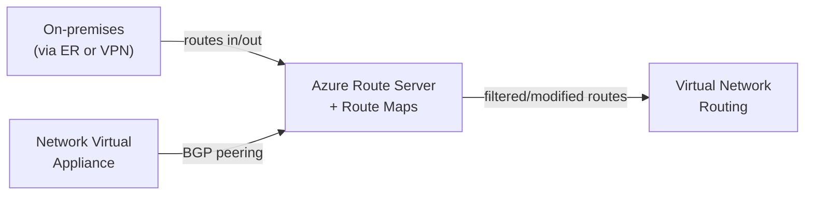

If you've ever wished you could influence how routes flow through Azure Route Server — filter unwanted prefixes, prepend AS-PATH to shift traffic to a backup link, or summarise a hundred on-prem routes into a single tidy aggregate — Route Maps is the feature you've been waiting for. It entered public preview on 31 July 2026.

Route Maps gives you per-connection, per-direction control over BGP route advertisements on Azure Route Server. You can match routes by prefix, AS-PATH, or BGP community, then drop them, modify their attributes, or aggregate them. It applies to BGP peerings with network virtual appliances (NVAs), ExpressRoute gateway connections, and VPN gateway connections in the same virtual network.

Think of it like a routing policy engine sitting inside your Route Server. Every route that enters or leaves gets checked against your rules, and you decide what comes through and in what shape.

<!-- truncate -->

## What it is

Azure Route Server already handles BGP route exchange between your NVAs, ExpressRoute and VPN gateways, and the rest of your virtual network. Route Maps adds a policy layer on top of that exchange. You define a route map as an ordered list of rules. Each rule has match conditions and actions. When a route matches, you can drop it, aggregate it, or modify its BGP attributes before it continues.



You apply a route map in the **inbound** direction (routes arriving at Route Server) or the **outbound** direction (routes leaving Route Server). One route map per direction per connection. Rules run in order, and each rule either terminates processing or passes the route on to the next rule.

The three main things you can do with a route map are:

**Route filtering** — drop specific prefixes so they're never advertised. Useful when an NVA learns routes you don't want in your virtual network routing table.

**BGP attribute modification** — add or replace ASNs in the AS-PATH to influence best-path selection, or tag routes with BGP communities for easier management downstream.

**Route summarisation** — replace a group of specific prefixes with a single aggregate. If your on-prem estate is advertising 50 individual /24s but you only want Azure to see a /16, you can do that with an inbound route map.

## Who should care

If you run hybrid networking in Azure with ExpressRoute, VPN, or NVAs, and you've hit any of these situations, Route Maps is worth your attention.

**Close to prefix limits.** ExpressRoute private peering caps the number of routes Azure can advertise to on-prem. Route summarisation on the outbound side helps you stay well under that limit without restructuring your address plan.

**Active/passive hybrid links.** If you have two ExpressRoute circuits or a primary ExpressRoute with a VPN fallback, AS-PATH prepending on the outbound direction lets you make one path less preferable without touching your on-prem configuration.

**NVA route hygiene.** NVAs sometimes learn routes you'd rather not inject into Azure's routing fabric. An inbound route map on the BGP peering lets you filter those before they propagate.

**Route tagging at the edge.** BGP communities are a clean way to carry intent through your network. You can add communities to routes entering Route Server so downstream systems can act on them consistently.

## How to use it

### Via the Azure portal

The portal is the only officially supported GUI path for now. Route Server surfaces route maps under **Settings > route maps**.

1. Go to your **Azure Route Server** in the portal.
2. Under **Settings**, select **route maps**, then **+ Add Route Map**.
3. Give the route map a name and select **+ Add rule**.
4. For each rule, configure:
   - **Name** — something descriptive.
   - **Next step** — **Continue** (pass matched routes to the next rule) or **Terminate** (stop here).
   - **Match conditions** — choose from route prefix, BGP community, or AS-Path, with **Equals** or **Contains** criteria.
   - **Actions** — **Drop** to filter the route out, or **Modify** to change it. Add route modifications for prefix aggregation, AS-PATH changes, or community adjustments.
5. Select **Add** to stage the rule, then **Save** to commit the route map.
6. Back on the route maps page, select **Apply route maps** and pick which BGP peerings or gateway connections should use it, and in which direction.

> The first time you create a route map on a Route Server, the service runs a one-time upgrade that takes around 30 minutes. Subsequent changes don't repeat that wait.

### Via PowerShell

Here's a concrete example: prepend ASN 64511 to all routes containing 10.0.0.0/16, applying it as an inbound route map on a BGP peering. This makes those routes look longer and therefore less preferred to other BGP speakers.

```powershell
# Build the match criterion: routes that contain 10.0.0.0/16
$criterion = New-AzRouteMapRuleCriterion `
    -MatchCondition "Contains" `
    -RoutePrefix @("10.0.0.0/16")

# Define the action: add ASN 64511 to the AS-PATH
$actionParam = New-AzRouteMapRuleActionParameter -AsPath @("64511")
$action = New-AzRouteMapRuleAction -Type "Add" -Parameter @($actionParam)

# Combine into a rule that terminates after matching
$rule = New-AzRouteMapRule `
    -Name "prepend-for-backup" `
    -MatchCriteria @($criterion) `
    -RouteMapRuleAction @($action) `
    -NextStepIfMatched "Terminate"

# Create the route map on your Route Server
New-AzRouteMap `
    -ResourceGroupName "myResourceGroup" `
    -VirtualHubName "myRouteServer" `
    -Name "inbound-prepend" `
    -RouteMapRule @($rule) `
    -InboundConnection @("<bgp-peering-connection-resource-id>")
```

Replace `<bgp-peering-connection-resource-id>` with the resource ID of the BGP peering connection you want to affect. You can find it from the Route Server's **BGP peers** page in the portal or by running `Get-AzVirtualHubBgpConnection`.

### A route summarisation example

If your on-prem is advertising 10.2.1.0/24, 10.2.2.0/24, and 10.2.3.0/24 individually, and you want Azure to only see 10.2.0.0/16, an inbound route map rule would match those prefixes with **Contains 10.2.0.0/16** and use a **Replace** action with 10.2.0.0/16 as the new prefix. The three specific routes get replaced by the aggregate before Route Server distributes them.

Keep in mind that summarisation strips BGP Community and AS-PATH attributes from summarised routes — they don't carry through to the aggregate.

## Gotchas and limits

A few things that can catch you out.

**The one-time upgrade.** The first route map creation on a Route Server triggers an upgrade that takes about 30 minutes. Don't panic if nothing changes straight away — check the **Provisioning state** and wait.

**Reserved ASNs.** Don't use these for AS-PATH prepending or replacement: public ASNs 8074, 8075, 12076; private ASNs 65515, 65517, 65518, 65519, 65520. Using them causes unexpected behaviour.

**Azure BGP communities.** Don't remove communities in the 65517:* and 65518:* ranges — these are Azure-internal and removing them can break routing.

**2-byte ASNs only.** Route Maps supports 2-byte ASN numbers (up to 65535). If your network uses 4-byte ASNs, you can't use them in route map actions.

**Summarisation loses attributes.** When you aggregate routes, the resulting summary has no AS-PATH or BGP Communities. This is a deliberate design choice, but something to factor in if downstream systems rely on those attributes.

**No MSEE filtering.** You can't apply route maps on the Microsoft Enterprise Edge (MSEE) for ExpressRoute connections — only on the Route Server side of the connection.

**Extra cost.** Route Maps adds charges on top of the standard Route Server pricing. Check the [Azure Route Server pricing page](https://azure.microsoft.com/pricing/details/route-server/) before rolling this out at scale.

**Preview terms.** This is a public preview feature, so the [Supplemental Terms of Use for Microsoft Azure Previews](https://azure.microsoft.com/support/legal/preview-supplemental-terms/) apply rather than standard SLAs.

## Quick takeaway

Route Maps fills a genuine gap in Azure Route Server. Before this, you had limited ability to influence what your Route Server learned or advertised — you were mostly taking whatever your NVAs and gateways gave you. Now you can filter, summarise, and tweak BGP attributes per-connection and per-direction.

It's particularly useful for anyone managing hybrid networks where route scale, path selection, or route hygiene have become a real constraint. The PowerShell API is clean, the portal experience is reasonable, and the feature model — ordered rules with match conditions and actions — will feel familiar to anyone who's configured route maps on traditional network kit.

Test it out on a non-production Route Server first. The one-time upgrade is a notable disruption window, and you'll want to understand your current effective routes before you start applying policies.

## Links

- Official announcement: [Public Preview: Route Maps for Azure Route Server](https://azure.microsoft.com/en-us/updates?id=568631)
- Learn: [About route maps for Azure Route Server](https://learn.microsoft.com/en-us/azure/route-server/route-maps-about)
- Learn: [Configure route maps for Azure Route Server](https://learn.microsoft.com/en-us/azure/route-server/route-maps-how-to)
- Learn: [Prepend routes using route maps](https://learn.microsoft.com/en-us/azure/route-server/route-maps-scenario-prepend-routes)
- Learn: [Azure Route Server overview](https://learn.microsoft.com/en-us/azure/route-server/overview)
- Pricing: [Azure Route Server pricing](https://azure.microsoft.com/pricing/details/route-server/)
