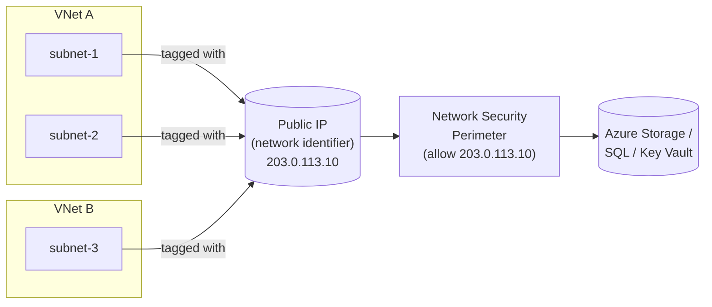

Azure service endpoints have always been the budget-friendly option for locking down PaaS access from a virtual network — no DNS changes, no private IPs to manage, just a route and an ACL. The catch is that they don't scale well. Each subnet gets its own entry in the storage account or SQL firewall, and when you have dozens of spoke VNets the ACL list becomes unmanageable.

The new **standard service endpoint**, now in public preview, fixes that. Instead of registering every subnet individually, you assign a single public IP address as a *network identifier* and use that one IP across all your subnets in a region. The PaaS resource sees one ACL entry, not one per subnet.

This is still service endpoint territory — traffic goes over the Azure backbone, not over a private endpoint — but the management story is dramatically simpler at scale.

<!-- truncate -->

## What it is

A standard service endpoint introduces a layer of indirection between your subnets and your PaaS ACLs. You create a Standard SKU, static public IP address and designate it as a *network identifier*. When you configure a service endpoint on a subnet, you attach that network identifier to it. Azure then uses the public IP to tag outbound traffic from any subnet that shares the identifier.

On the PaaS side, you don't manage per-subnet rules any more. Instead, you set up a [network security perimeter](https://learn.microsoft.com/en-us/azure/private-link/network-security-perimeter-concepts) and add an inbound rule that allows the network identifier's IP. One IP covers every subnet — across multiple VNets and even multiple subscriptions within the same tenant — as long as they're in the same region.

The public IP isn't used for routing. Traffic still goes directly from the VM to the PaaS service over the Azure backbone, just as with a basic service endpoint. The IP is purely an identity token.



## Supported services

Right now, four services support network identifiers on their service endpoints:

- **Azure Storage** — generally available in all regions
- **Azure Key Vault** — generally available in all regions
- **Azure SQL Database** — in public preview
- **Azure Cosmos DB** — in public preview

Billing is expected to start in August 2026. Until then, there's no charge for using the feature.

## Who should care

If you run hub-and-spoke in Azure with more than a handful of spokes, and you use service endpoints rather than private endpoints for PaaS access, this is relevant.

The core problem it solves is ACL sprawl. With basic service endpoints you add a subnet CIDR to every storage account, key vault, or SQL server that subnet needs to reach. Add a new spoke, update every ACL. Move a VNet's address space, update every ACL again. At around 10–20 spokes this becomes a maintenance headache. At 50+ it becomes a risk.

It's also useful if you want perimeter-style enforcement through [Network Security Perimeter](https://learn.microsoft.com/en-us/azure/private-link/network-security-perimeter-concepts) rather than per-resource ACLs. NSP lets you define access policy once and apply it across all your PaaS resources in a perimeter, which is a cleaner model than managing individual resource firewalls.

If you're already using private endpoints and private DNS, this probably doesn't change anything for you. Standard service endpoints still don't give you private routing from on-premises, data exfiltration protection, or a private IP on the PaaS side. Private Link remains the right answer for those requirements.

## How to use it

### Register the feature flag

The feature is behind a preview flag. Register it in your subscription first:

```bash
az feature register \
    --namespace Microsoft.Network \
    --name AllowServiceEndpointNetworkIdentifier

# Wait for Registered state
az feature show \
    --namespace Microsoft.Network \
    --name AllowServiceEndpointNetworkIdentifier \
    --query "properties.state" \
    --output tsv

# Refresh the provider
az provider register --namespace Microsoft.Network
```

### Create a network identifier

Create a Standard SKU, static public IP to act as your network identifier:

```bash
az network public-ip prefix create \
  --resource-group my-rg \
  --name service-ep-prefix \
  --length 31 \
  --location eastus2

az network public-ip create \
  --resource-group my-rg \
  --name service-ep-identifier \
  --public-ip-prefix service-ep-prefix \
  --sku Standard \
  --allocation-method Static \
  --location eastus2
```

Note that the public IP must be Standard SKU, static allocation, and IPv4. Azure rejects anything else.

### Attach the identifier to a subnet

When you add a service endpoint to a subnet, include the network identifier resource ID:

```bash
IDENTIFIER_ID=$(az network public-ip show \
  --resource-group my-rg \
  --name service-ep-identifier \
  --query id --output tsv)

az network vnet subnet update \
  --resource-group my-rg \
  --vnet-name my-vnet \
  --name my-subnet \
  --add serviceEndpoints "{\"service\":\"Microsoft.Storage\",\"networkIdentifier\":{\"id\":\"$IDENTIFIER_ID\"}}"
```

Repeat this for each subnet and each service type (`Microsoft.Storage`, `Microsoft.Sql`, `Microsoft.KeyVault`, `Microsoft.AzureCosmosDB`) you need. All subnets that share the same identifier IP will be represented by that one IP in your network security perimeter rules.

### Configure the network security perimeter

Create a network security perimeter, add a profile, associate your PaaS resource, and create an inbound access rule that allows traffic from the network identifier's public IP prefix range (not the individual `/32` — the prefix is what the perimeter matches on):

```bash
# Create the perimeter
az network perimeter create \
  --resource-group my-rg \
  --name my-nsp \
  --location eastus2

# Create a profile inside the perimeter
az network perimeter profile create \
  --resource-group my-rg \
  --perimeter-name my-nsp \
  --name my-profile

# Look up the IP prefix range you allocated for the identifier
PREFIX_RANGE=$(az network public-ip prefix show \
  --resource-group my-rg \
  --name service-ep-prefix \
  --query ipPrefix --output tsv)

# Add inbound rule matching the network identifier's prefix range
az network perimeter profile access-rule create \
  --resource-group my-rg \
  --perimeter-name my-nsp \
  --profile-name my-profile \
  --access-rule-name allow-service-endpoint \
  --direction Inbound \
  --address-prefixes "$PREFIX_RANGE"
```

You also need to associate your PaaS resource (storage account, key vault, etc.) with the perimeter using `az network perimeter association create` before the rule takes effect — see the Learn walkthrough for the full association command.

Once associated, the PaaS resource accepts service endpoint traffic from any subnet tagged with that identifier.

## Gotchas and limits

A few things worth checking before you start.

**All service endpoints on a subnet must share the same network identifier.** You can't mix — if subnet A has `Microsoft.Storage` with identifier IP-1 and `Microsoft.Sql` with identifier IP-2, the operation fails. Pick one identifier per subnet across all service types.

**The network identifier must exist before you attach it.** Azure validates the resource ID during the subnet update. Create the public IP first.

**Cross-region sharing isn't supported.** You can share the same network identifier across subscriptions within the same tenant, but only in the same region. A storage account in West Europe and a subnet in East US 2 can't share one identifier.

**Scale limits for network security perimeter.** Up to 100 perimeters per subscription, 200 profiles per perimeter, and 1,000 PaaS resources per perimeter. If you're managing a very large estate, you'll need to split across multiple perimeters.

**This is still a preview.** No SLA applies, and not every region or service configuration is supported. Don't run production traffic through it until it reaches GA.

**Billing starts in August 2026.** The feature is currently free, but Microsoft has indicated charges will begin after the public preview announcement, targeted for August 2026. Check the pricing page before deploying at scale.

## Quick takeaway

Standard service endpoints solve a real operational problem for anyone running hub-and-spoke at scale with service endpoints. One network identifier replaces dozens or hundreds of subnet ACL entries, and network security perimeter gives you a single place to manage access policy across all your PaaS resources.

It's not a replacement for Private Link if you need private routing, data exfiltration controls, or on-premises access. But if those aren't requirements and the ACL management of basic service endpoints is your pain point, this is worth evaluating now while it's free.

## Links

- Official announcement: [[In preview] Public Preview: Standard service endpoint](https://azure.microsoft.com/en-us/updates?id=561475)
- Learn: [What is an Azure standard service endpoint?](https://learn.microsoft.com/en-us/azure/private-link/service-endpoint-standard-overview)
- Learn: [Configure a standard service endpoint – Azure portal](https://learn.microsoft.com/en-us/azure/private-link/configure-service-endpoint-standard-portal)
- Learn: [Configure a standard service endpoint – Azure CLI](https://learn.microsoft.com/en-us/azure/private-link/configure-service-endpoint-standard-cli)
- Learn: [Configure a standard service endpoint – Azure PowerShell](https://learn.microsoft.com/en-us/azure/private-link/configure-service-endpoint-standard-powershell)
- Learn: [Network security perimeter concepts](https://learn.microsoft.com/en-us/azure/private-link/network-security-perimeter-concepts)
- Learn: [Virtual network service endpoints overview](https://learn.microsoft.com/en-us/azure/virtual-network/virtual-network-service-endpoints-overview)
