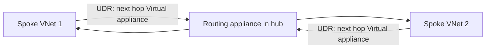

Azure Virtual Network routing appliances are now generally available. This is an Azure-native routing layer that runs on dedicated networking hardware rather than virtual machines, and it's now supported for production workloads.

The headline is throughput. Each instance offers a fixed bandwidth tier of 50, 100 or 200 Gbps, which is a big jump over what most VM-based network virtual appliances can push through a hub.

If you've ever watched a hub firewall or router VM become the bottleneck for spoke-to-spoke traffic, this is the sort of building block worth a look.
<!-- truncate -->

## What it is

A routing appliance is a managed forwarding layer that lives in a dedicated subnet called `VirtualNetworkApplianceSubnet` inside your virtual network. You point user-defined routes at its private IP with the **Virtual appliance** next hop type, and it forwards routed traffic for you.

Because it runs on specialised hardware rather than general-purpose VMs, you get lower latency and higher throughput than a typical NVA. It supports IPv4, IPv6 and dual-stack configurations, and it's live in more than 20 regions at launch, including UK South, North Europe and West Europe.

The official announcement is here: [Generally Available: Azure Virtual Network routing appliance](https://azure.microsoft.com/updates?id=568605). The how-to guide is on Microsoft Learn: [Create a Routing Appliance - Azure Virtual Network](https://learn.microsoft.com/en-us/azure/virtual-network/how-to-create-virtual-network-routing-appliance).

If you want the longer version, I wrote up a fuller take on what changed at GA, where it fits in a hub design, and why I still would not use it for internet egress in [Azure Virtual Network Routing Appliance goes GA](/azure-virtual-network-routing-appliance-ga).

## Who should care

If you run a hub-and-spoke design with heavy east-west traffic between spokes, this matters. The appliance gives you a scalable transit point without stitching together load balancers and NVA scale sets.

It's also useful if you're moving high-volume flows like data replication or analytics between virtual networks and your current routing layer can't keep up.

## How to use it

Create a virtual network with a subnet named `VirtualNetworkApplianceSubnet`, then create the routing appliance in the portal by searching for **routing appliance**. Pick a bandwidth tier of 50, 100 or 200 Gbps, and optionally attach an NSG and route table to the dedicated subnet.

The tiers scale like this:

| Bandwidth tier | Max connections per second | Max concurrent flows |
| --- | --- | --- |
| 50 Gbps | 250,000 | 2,000,000 |
| 100 Gbps | 600,000 | 4,000,000 |
| 200 Gbps | 1,500,000 | 8,000,000 |

Once it's running, update your route tables so traffic flows through it:

Metrics land in Azure Monitor with no diagnostic setup needed. You can watch bytes, packets, flow counts and flow creation rates, and set alerts on any of them.

## Gotchas and limits

You can't resize an instance. If you need a different bandwidth tier you delete the appliance and create a new one, so pick your tier with growth in mind.

There's a limit of two routing appliances per subscription per region, and per-flow logging isn't available yet. If you need flow-level detail, use virtual network flow logs on the workload subnets instead.

It's also a router, not a firewall. If you need inspection, you still need Azure Firewall or an NVA in the path.

## Quick takeaway

This is a solid option for high-throughput transit in hub-and-spoke designs. If your spoke-to-spoke traffic has outgrown VM-based routing, the 200 Gbps tier gives you plenty of headroom - just remember to size the tier up front, because you can't change it later.
