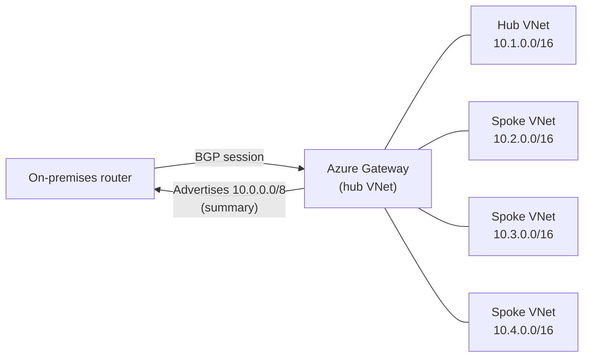

Summarised advertised gateway prefixes for Azure hybrid gateways is now generally available. Microsoft first put this into [public preview back in May 2026](/updates/public-preview-summarized-advertised-gateway-prefixes-for-route-advertisement), and it's now ready for production workloads.

The feature lets you tell Azure to advertise a single, tidy summary route to your on-premises network instead of dumping every hub and spoke prefix across your BGP session. If your hub-and-spoke estate has grown large enough that your route tables look like a phone book, this is the tidy-up you've been waiting for.

It applies to both VPN Gateway and ExpressRoute Gateway, and it's particularly useful when you're creeping towards the ExpressRoute advertised prefix limits — 1,000 IPv4 prefixes and 100 IPv6 prefixes for private peering.

<!-- truncate -->

## What it is

Azure virtual networks now support a property called `summarizedGatewayPrefixes`. You set this on the hub VNet — the one that contains the gateway subnet — and Azure advertises those summary CIDRs to your on-premises BGP peers instead of the full list of individual address spaces.

Think of it like summarising a postal address. Instead of listing every flat number in a block, you just give the building name and let the post office figure out the rest. Azure does the same with your routes.



Without the feature, Azure would advertise `10.1.0.0/16`, `10.2.0.0/16`, `10.3.0.0/16`, and `10.4.0.0/16` individually. With a summary of `10.0.0.0/8`, it advertises just one prefix.

## Who should care

If you run hybrid connectivity through ExpressRoute or VPN Gateway with a hub-and-spoke design, this is directly relevant. It's most valuable when you have a large number of spokes, when you're approaching advertised prefix limits, or when you want a simpler and more predictable routing view on the on-premises side.

If your deployment only has a handful of VNets, the benefit is smaller. But as scale grows, the operational value of a clean summary prefix becomes clear.

## How to use it

You set `summarizedGatewayPrefixes` on the hub VNet using the Azure CLI, PowerShell, Bicep, Terraform, or the portal. The setting takes effect as soon as a gateway exists in the VNet.

### Azure CLI

```bash
az network vnet update \
  --resource-group my-rg \
  --name my-hub-vnet \
  --set properties.summarizedGatewayPrefixes="['10.0.0.0/8']"
```

### Bicep

```bicep
resource hubVnet 'Microsoft.Network/virtualNetworks@2024-01-01' = {
  name: 'my-hub-vnet'
  location: resourceGroup().location
  properties: {
    addressSpace: {
      addressPrefixes: ['10.1.0.0/16']
    }
    summarizedGatewayPrefixes: ['10.0.0.0/8']
  }
}
```

### Terraform

```hcl
resource "azurerm_virtual_network" "hub" {
  name                = "my-hub-vnet"
  location            = azurerm_resource_group.example.location
  resource_group_name = azurerm_resource_group.example.name
  address_space       = ["10.1.0.0/16"]

  summarized_gateway_prefixes = ["10.0.0.0/8"]
}
```

> Note: Check your Terraform provider version supports this property. You may need `azurerm` 4.x or later.

## Gotchas and limits

A few things are easy to trip over:

The `summarizedGatewayPrefixes` property only reads from the hub VNet — the one with the gateway subnet. If you set it on a spoke VNet by mistake, Azure ignores it entirely.

Your summary CIDR must include the hub VNet's own address space. If it doesn't, Azure still advertises the uncovered hub prefixes individually. Design your IP addressing with this in mind.

Don't use overlapping prefixes within your summary list. Azure won't stop you, but it leads to unpredictable BGP behaviour. Overlap with peered spoke VNets is fine and expected — that's the whole point.

You can set the property before a gateway exists in the VNet. It won't do anything until the gateway is deployed, but pre-configuring it is harmless and a reasonable step when building out infrastructure.

## Quick takeaway

Moving from public preview to GA means this is now supported for production use, backed by SLAs, and safe to include in your standard hub-and-spoke templates. If you tested it in preview, this is the signal to roll it out properly. If you haven't looked at it yet and you run hybrid networking with Azure, it's worth a read.

## Links

- Official announcement: [GA: Summarized advertised gateway prefixes for route advertisement](https://azure.microsoft.com/updates?id=569743)
- Previous post: [Public Preview: Summarised advertised gateway prefixes](/updates/public-preview-summarized-advertised-gateway-prefixes-for-route-advertisement)
- Learn: [Advertised gateway prefixes in Azure virtual networks](https://learn.microsoft.com/azure/virtual-network/advertised-gateway-prefixes-overview)
- Learn: [About ExpressRoute virtual network gateways](https://learn.microsoft.com/azure/expressroute/expressroute-about-virtual-network-gateways)
- Learn: [VPN Gateway BGP overview](https://learn.microsoft.com/azure/vpn-gateway/vpn-gateway-bgp-overview)
